# Introduction

# Data - Quality Checks

## Missing Data

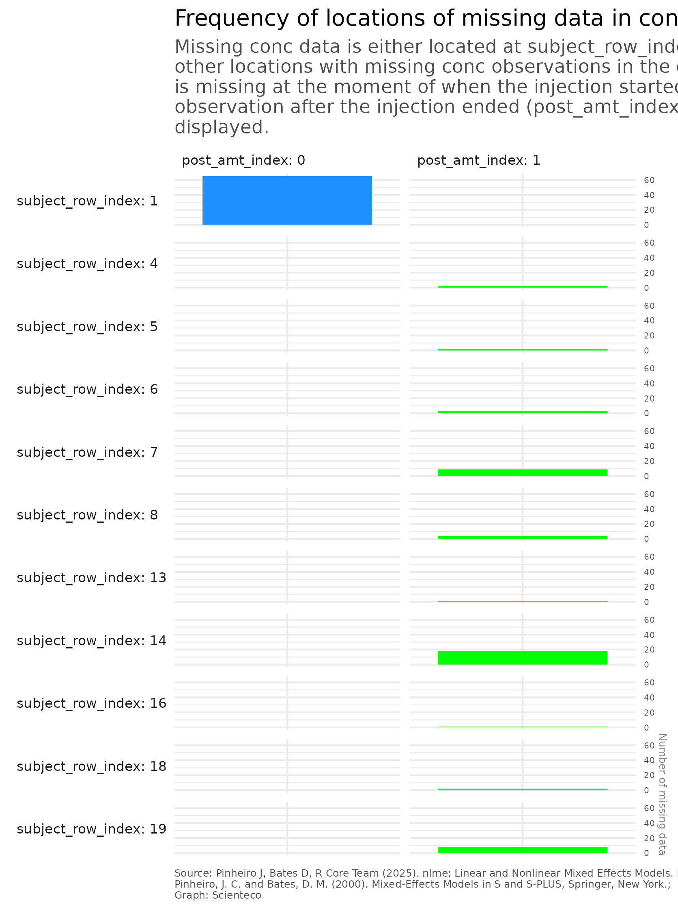

## EDA

### overall
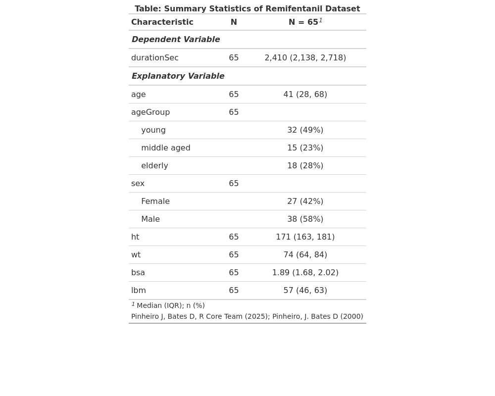

## by Age

## by Sex
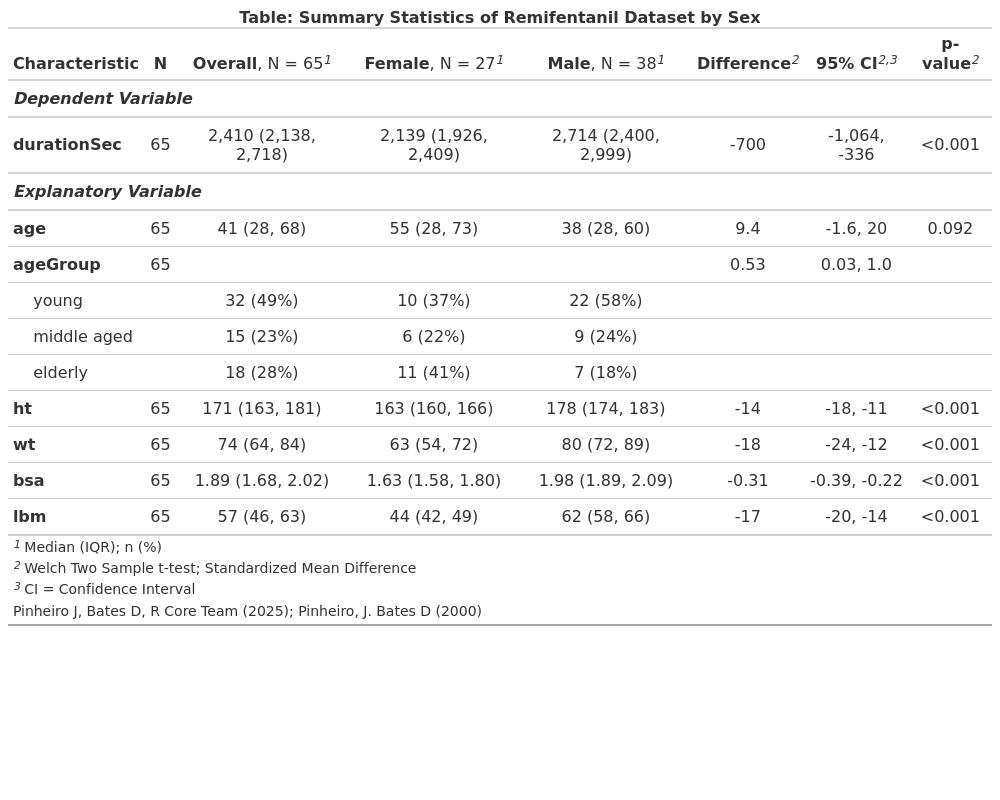

## Graph

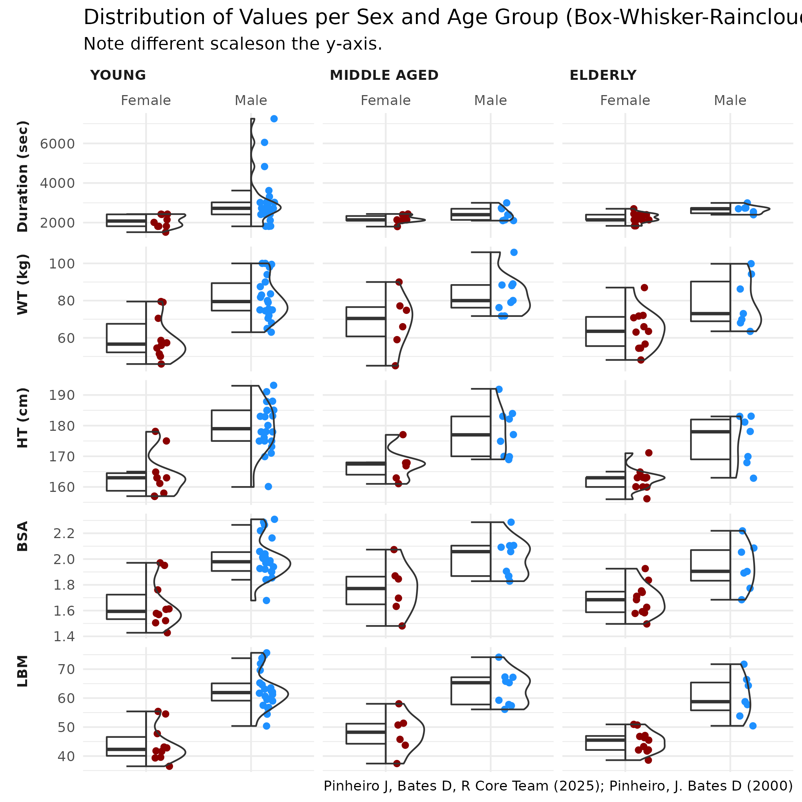

## Duration 

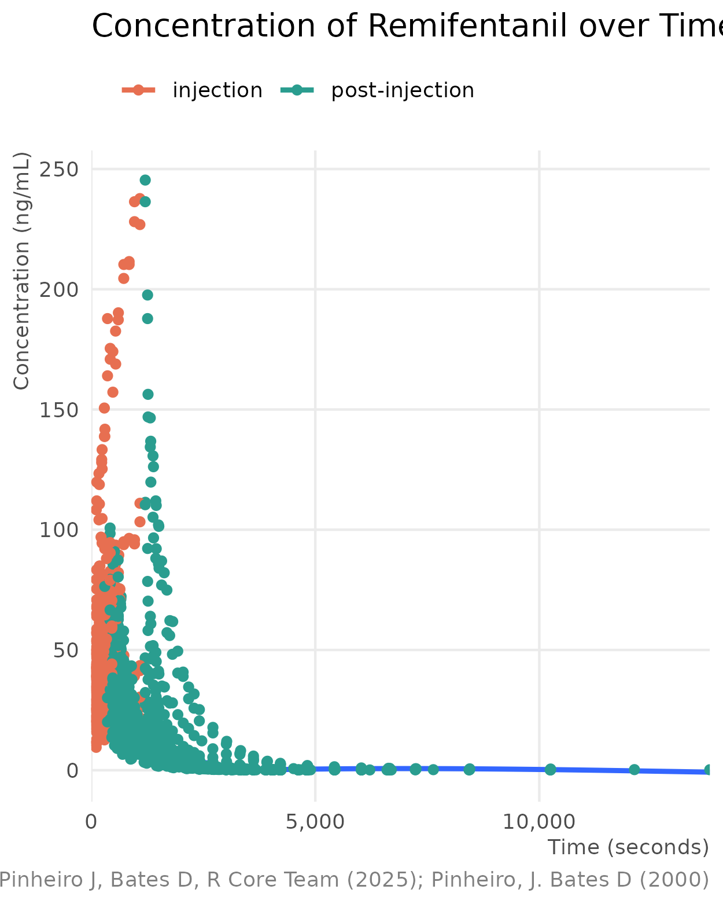

# Models

## Model 1: Duration ~ Wt
### Parameter Estimates

### Model diagnostics
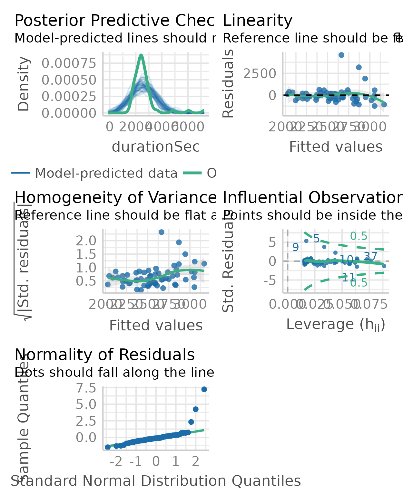

## Moodel 2: Duration ~ Wt + Sex

### Parameter Estimates
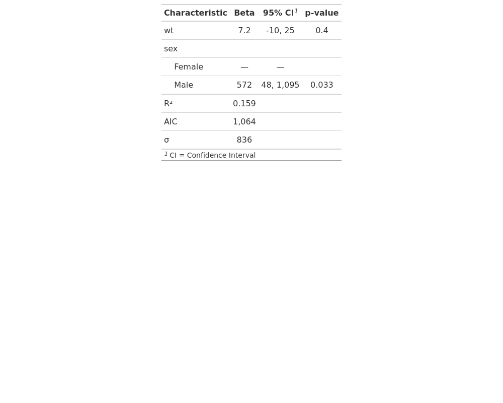

### Model diagnostics
 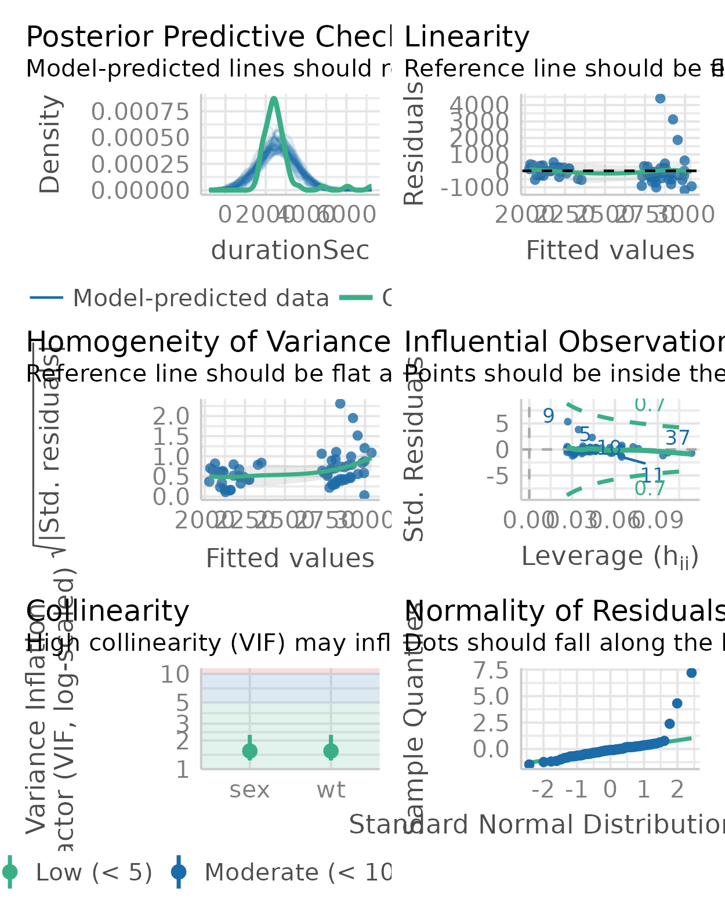

## Model 3: Duration ~ Wt + Age

### Parameter Estimates
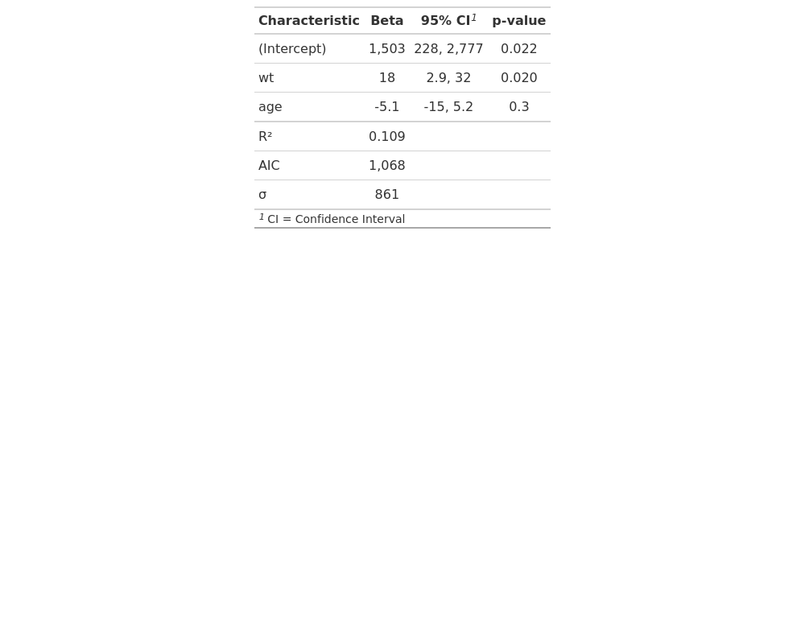

### Model diagnostics
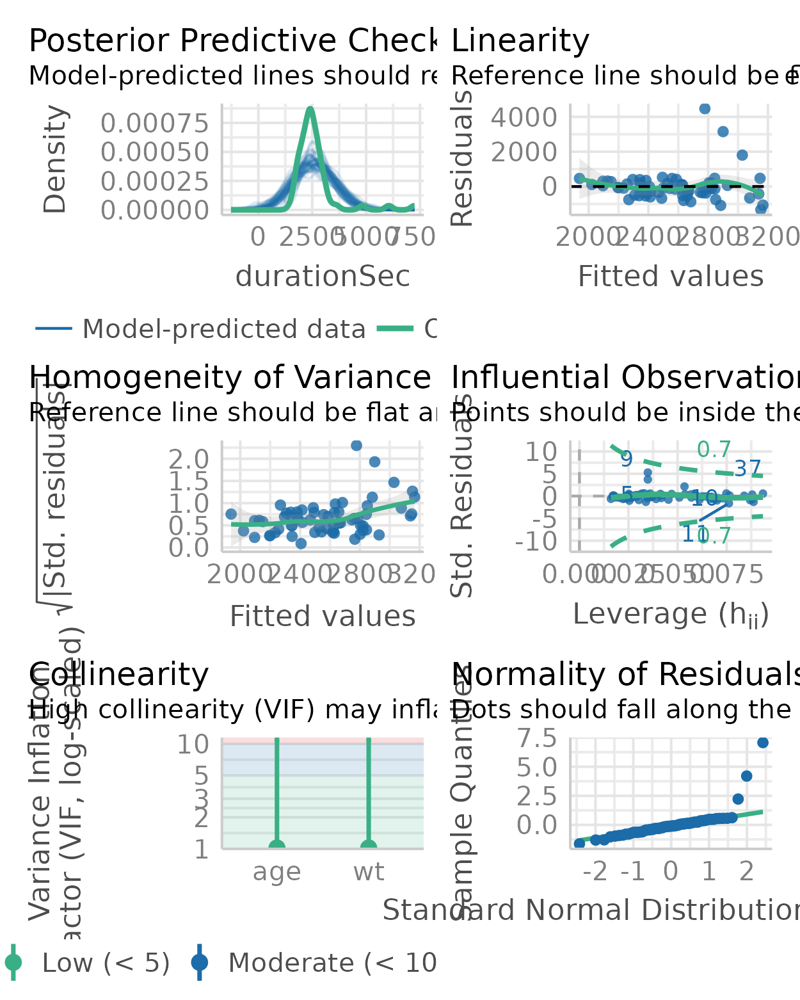

## Model 4: Duration ~ Wt + Age + Sex

### Parameter Estimates
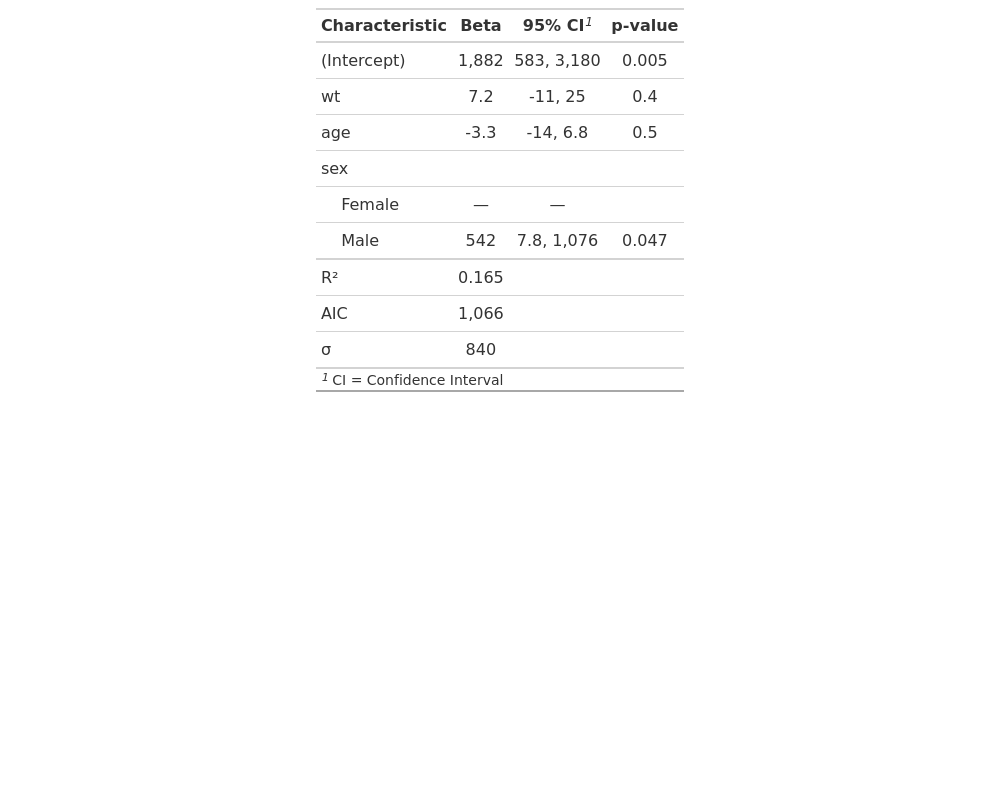

### Model diagnostics
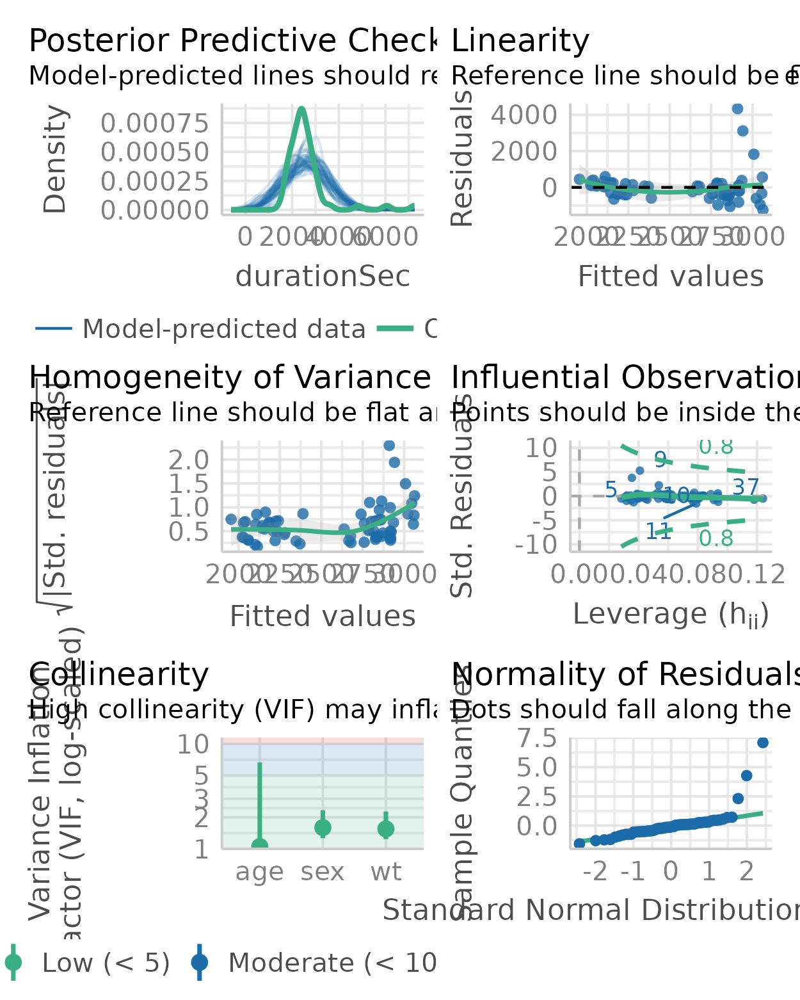

# Results Comparison

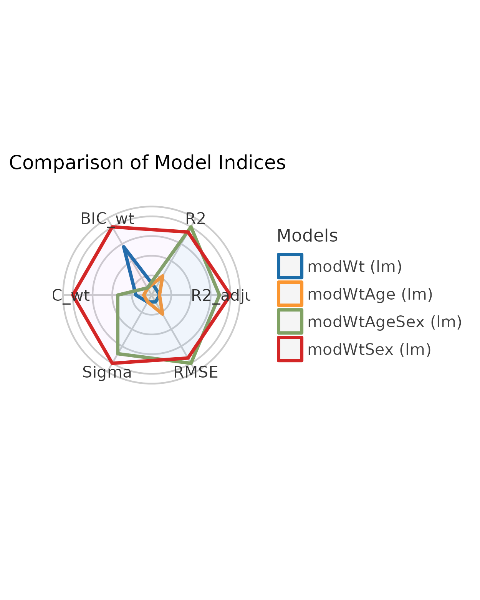

	