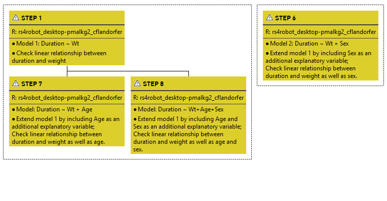
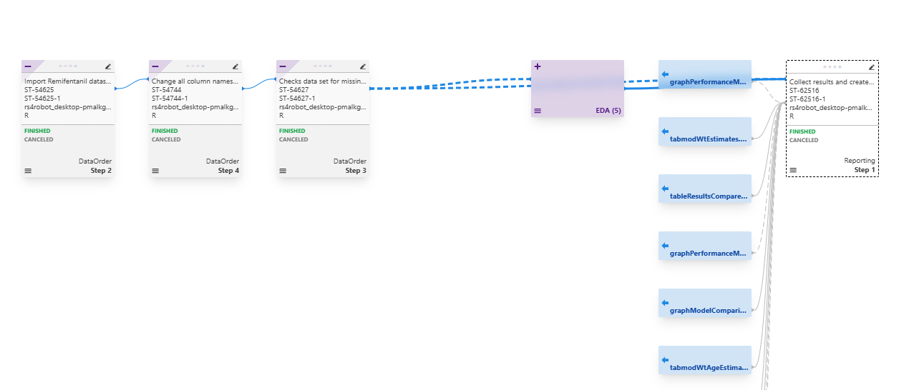
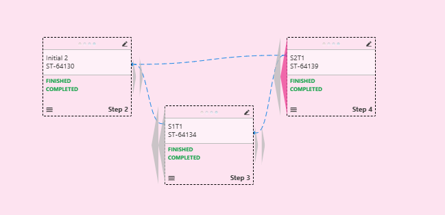

# Purpose

The purpose of this document is to describe improveR's capacities to handle workflows.

# Libraries
```{r}
#| code-summary: "Get packages"
#| code-fold: true
library(improveR)
packageVersion("improveR")
library(tidyverse, quietly = T)
library(tictoc) #time keeping of functions
options(width=10000) #make results window wide; horizontal scrollbar
```

To demonstrate improveR's pertaining functions the folder 'improve-tutorial'
under http://envhost1.hc.scintecodev.internal:5310/repository is used.

```{r}
#| code-summary: "Set environment variables to access repository"
#| code-fold: true

Sys.setenv(IMPROVER_REPO_URL="http://envhost1.hc.scintecodev.internal:5310/repository")

Sys.setenv(NONMEM_RUNSERVER="runserver")
Sys.setenv(NONMEM_TOOL_INSTANCE="nonmem_7.4")
Sys.setenv(NONMEM_TOOL="nonmem_7.5")

Sys.setenv(R_RUNSERVER="runserver")
Sys.setenv(R_TOOL_INSTANCE="rbatch")
Sys.setenv(R_TOOL="R_4.2")
Sys.setenv(TEST_SERVER="5310")

clearConnectionData()
improveConnect()
setEditable(T)
```


# getFullLineage()

`getFullLineage` returns a *workflow handle* for the lineage of a step, i.e. the sequence of steps and their resources preceding the target step. 
The lineage comprises all steps leading to the step ("to the left", including branches) and can span across multiple 
analysis trees. The argument `depth` controls the depth of the recursion, i.e. how many trees preceding the step's own tree should be included. The
default -1 includes all branches. Depending on the complexity of the lineage, the query may take up to a few minutes to execute.

The 'directional' counterpart to `getFullLineage` is `getFullUsage` (see @sec-getfullusage) which returns the tree starting from the step in question (in contrast to ending with it). For details see below

To demonstrate the use of `getFullLineage`, let's get the lineage of **repo 5310 > improve-tutorial > Reporting > Step 1** with the short EntityId `envhost1.hc.scintecodev.internal-5310:ST-62516`. 

```{r}
#| code-summary: "Get workflowHandle"
#| cache: false
#| eval: true

identTargetStep <- "envhost1.hc.scintecodev.internal-5310:ST-62516"

tic()
workflowHandleTargetStep <- getFullLineage(ident=identTargetStep, depth = -1)
toc()
```

```{r}
#| include: false
# write(workflowHandleTargetStep, "data/workflowHandleTargetStep.txt")
# workflowHandleTargetStep <- readLines("data/workflowHandleTargetStep.txt")
```

```{r}
class(workflowHandleTargetStep)
workflowHandleTargetStep
```

The workflow handle `workflowHandleTargetStep` is a character vector of length `r length(workflowHandleTargetStep)`.
The `workflowHandleTargetStep` is a unique identifier that represents the complete lineage up to and including the target step.
This handle can be used with other improveR functions to retrieve, manipulate, and execute the workflow.

**Important**: `workflowHandle` is not permanent. If you rerun the code from above or if you start a new session, the same workflow will get a new handle. The old workflow handle will no longer be a valid reference for a workflow.


## retrieveWorkflow
The `retrieveWorkflow` function retrieves the steps (and their details) which are associated
with the previsouly retrieved workflow handle and constitute the workflow.

**Important**: Currently, `retrieveWorkflow` returns only the elements to the left of the target step if the links
are not outdated. If the links are outdated, the workflow is incomplete and only contains the steps with an up to date
lineage to the target step. See below for an example of an incomplete workflow (@sec-incomplete-workflow). #@HACKLM

```{r}
#| code-summary: "Retrieve workflow"
workflowTargetStep <- retrieveWorkflow(workflowHandleTargetStep)
```

*direct path*: `getFullLineage()` > `retrieveWorkflow()` only returns those steps which are required to reach the target step. Leaves are not included in the workflow. 

#@HACKLM
In the repository, the analysis tree "EDA" contains five steps (three steps and two child steps). `retrieveWorkflow()`, however, returns only four steps; it does not include Step 17 (envhost1.hc.scintecodev.internal-5310:ST-59046; 'using Lancet theme').
Why? The targetStep of the workflow - Step1/Reporting - is linked to the EDA/Step17 via graphDistributionSexAge.png. 
Also, why are step 2 and 4 of AT DataOrder not included in the workflow?

```{r}
#| code-summary: "Content of workflowTargetStep"
class(workflowTargetStep) 
nrow(workflowTargetStep)
glimpse(workflowTargetStep)
```

`retrieveWorkflow` returns a data frame with the workflow details, i.e. the steps leading to the target step. Here `workflowTargetStep` is a data frame with `r ncol(workflowTargetStep)` columns and `r nrow(workflowTargetStep)` rows. Let's go through the individual elements of the returned data frame.

### handle 

`handle`: Is a character column containing a distinct id for each step, in this case `r length(workflowTargetStep$handle)`.

```{r}
#| code-fold: show
#| collapse: true
class(workflowTargetStep$handle)
workflowTargetStep[, c("description","handle")]
```

### processes

`processes` is a list column containing a data frame for a specific step. 
The nested data frame contains details on the tool used to run the step in 
improve. Below the details for one step (`r glimpse(workflowTargetStep$description[[1]])`; `r workflowTargetStep$entityId[[1]]`).
```{r}
#| code-fold: show
#| collapse: true
class(workflowTargetStep$processes[[1]])
glimpse(workflowTargetStep$description[[1]])
glimpse(workflowTargetStep$entityId[[1]])
glimpse(workflowTargetStep$processes[[1]])
```

### tree related info

`treeIdent`, `treeName`, and `treePath` detail in which Analysis Tree the workflow's steps are located.
```{r}
#| code-fold: show
#| collapse: true

workflowTargetStep %>%
select(description, entityId, contains("tree"))
```

### step related details
There are three additional details on each step within the lineage of the target step:

`description`: description, i.e. the name of the step, as provided under "comments".
`rationale`: the rational for the step, as provided under "comments".
`entityId`: entityId of the step

```{r}
#| code-fold: show
#| collapse: true
workflowTargetStep %>%
select(description, rationale, entityId)
```

### remoteFiles

The column `remoteFiles` within the dataframe returned by `retrieveWorflow` is a list column with 
`r ncol(workflowTargetStep$remoteFiles[[1]])` columns. It contains details on files which were
included into the step, e.g. data files included via link into the step, R script(s) as well as the files produced when executing the step. 

```{r}
class(workflowTargetStep$remoteFiles[[1]])
ncol(workflowTargetStep$remoteFiles[[1]])
names(workflowTargetStep$remoteFiles[[1]])

glimpse(workflowTargetStep$remoteFiles[[1]])
```
 
`stepHandle`: the handle of the step to which the file is linked to (the step's handle). Identical to for all files in the step.  
`ident`: short entity id   
`version` target revision (properties > general > target revision)  
`filehash`  
`maxVersion` Revision id (properties > general > revision)  
`asLink` Is the file linked or not   
`name` name of file   
`variableName` if file is bound as a variable   
`variableProcess` the process to which the file is bound as a variable  

Below the output for one specific step.
```{r}
workflowTargetStep$description[[1]]
workflowTargetStep$remoteFiles[[1]]
```

In the case of the here pertinent step 1 in the AT 'Reporting', the remoteFiles are predominantly png-image files which were included via a link (`asLink`) into the step.

```{r}
#| code-summary: "Display remoteFiles"
workflowTargetStep %>%
  slice(1) %>%
  select(remoteFiles) %>%
  unnest_longer(remoteFiles) %>%
  unnest_wider(remoteFiles) %>%
  select(ident, asLink, name, stepHandle)
```

The example below presents the files of the `remoteFiles` column of Step 6 in the AT EDA ('Analyse dynamics of concentration'). It demonstrates that `remoteFiles` not
only contains files which were included as input files (e.g. via link), but also output files created by the step as well as R files.
 
#@HACKLM: again, question regarding the wording: 
- what does 'remote' mean in this context?
- what is stored under `remoteFiles` are the files which we see in the
inventory in the improve client.
- the output files (.png) or the .r script are not 'remote'

```{r}
#| code-summary: "Check remote files of AT EDA, Step 6 Analyse dynamics of concentration"

remoteFiles_ATEDA_ST6 <- workflowTargetStep %>%
filter(str_detect(description, stringr::regex("Analyse dynamics of concentration", ignore_case = T))) %>%
select(remoteFiles) %>%
  unnest_longer(remoteFiles) %>%
  unnest_wider(remoteFiles) %>%
  select(ident, asLink, name, stepHandle)

remoteFiles_ATEDA_ST6 %>%
select(name, asLink) 
```


# getFullUsage() {#sec-getfullusage}

`getFullUsage()` is the 'directional' counterpart to `getFullLineage()`.
The function returns a workflowHandle (an alphanumeric string) for the usage workflow of a step, which may cover multiple trees. 
In other words, it captures all steps which are directly or indirectly to the right ('downstream') 
of the relevant step in the workflow .

```{r}
#| code-summary: "getFullUsage() - Function definition"
#| eval: false

getFullUsage <- function(ident,from=pwd(),workflowEnv=NULL,depth=-1) {
  userCall <- F
  if (is.null(workflowEnv)) { #workflowEnv is NULL in the function env;
    workflowEnv <- new.env() #env is created
    userCall <- T
  }
  targetStep <- loadResource(ident,from) #@HACKLM why is it called targetStep? It's a point of departure and not a destination (as in getFullLineage()); maybe sourceStep or dependencyStep?
    if (nrow(targetStep)==1) {     
    workflowHandle <- workflowEnv[[targetStep$parentId]]  #checks if targetStep$parentId is already in the workflowEnv
    if (is.null(workflowHandle)) { #if targetSTep$parentId is not in the workflowEnv, it creates a new handle
      workflowHandle <- handlesFromTree(targetStep$parentId,from,includeSelf = T) #workflowHandle returns only the new handle of the tree, but also stores the handles of the steps in the `stepCache` environment.
      workflowEnv[[targetStep$parentId]]<-workflowHandle #stores newly created handle under the resourceid of the Analysis Tree; its not replaceing the key
    }
    stepHandle <- getHandleForResource(workflowHandle,targetStep) #returns the handle of the step in question stored under the handle of the tree
    resultWorkflow <- addMultiTreeUsage(workflowHandle,stepHandle,workflowEnv=workflowEnv,depth)
    #result Workflow: dataframe with one row; last AT of the workflow (reporting); each (here one) is a step;
    #does not contain details on Analysis Trees in between; there is nothing on the AT EDA and Modeling
    if (userCall) {
      resultWorkflow <- deepWorkflowCopy(resultWorkflow,preserveEntityId = T)
    }
    return(resultWorkflow)
  }
}
```

Note that the execution of the function can take a few minutes (below around 90 seconds).

```{r}
#| code-summary: "getFullUsage() - Application"
startIdent <- "envhost1.hc.scintecodev.internal-5310:ST-54627" #AT Data Order Step 3
tic()
handleWorkflowUsage <- getFullUsage(ident = startIdent,from = pwd(),workflowEnv = NULL,depth = -1) #returns a data frame with one row; last AT of the workflow (reporting); each (here one) is a step;
toc()
handleWorkflowUsage #"d4ea0ac2-dad4-42e3-8b61-3082d1c85d99"
```

The workflowHandle `r handleWorkflowUsage` is stored in `stepCache` as key under which the handles of all the
individual steps which form part of the usage are stored. 

```{r}
#| code-summary: "Inspect stepCache for workflowHandle"

usageSteps <- improveR:::stepCache[[handleWorkflowUsage]] #inspect the stepCache environment for the workflowHandle
length(usageSteps) #number of steps in the usage workflow
```

Feeding the workflow handle obtained via `getFullUsage()` 
into `retrieveWorkflow()` returns a data frame
with all steps. 

```{r}
#| code-summary: "getFullUsage - retrieve all steps which form part of the usage"
elementsWorkflowUsage <- retrieveWorkflow(handleWorkflowUsage) 
elementsWorkflowUsage #retrieve the workflow from the handle
nrow(elementsWorkflowUsage) #number of steps in the usage workflow
```

Check: The steps returned by `retrieveWorkflow()` have indeed the 
step handles which were stored in the `stepCache` environment under the workflowHandle,
when using getFullUsage().

```{r}
#| code-summary: "Check"
elementsWorkflowUsage$handle %in% usageSteps #check if the step handles in the workflow are the same as the ones stored in stepCache
```


# makeStepsRelative

`makeStepsRelative` takes all steps constituting a workflow and makes them relative to each other, meaning it adds to each step information on its relation with other steps.
For this purpose two new columns are added to the dataframe: `dependenicies` and `usage`. 

#@HACKLM minor question on wording/consisteny: plural vs singular: "usage" and "dependency" vs "usages" and "dependencies".

`dependencies` contains the handle id of one or more steps on which the step in question depends on, e.g. by
linking to files created by the steps featured under `dependencies`. In other words, steps in `dependencies`
are `to the left` in the lineage of the respective step; they are 'upstream' in the data analysis workflow.

`usage` features those steps which use the output created by the step in question. In other words, these steps
are 'to the right' in the lineage of the respective step; they are 'downstream' in the data analysis workfow.

Steps which are at the end of a workflow (leaves) do not feature usage steps. Root steps do not feature dependencies.

By linking each step's own handle with the handles of its dependency and usage steps, it becomes possible to represent the complete
workflow.

```{r}
#| code-summary: "Make steps relative"

print(identTargetStep)

tic()
workflowLineage <- getFullLineage(ident=identTargetStep) %>%
improveR::makeStepsRelative() %>% 
improveR::retrieveWorkflow()
tic() 

class(workflowLineage) 
names(workflowLineage)
glimpse(workflowLineage)
```


```{r}
#| code-summary: "relative relations by dependencies and usage"
workflowLineage %>%
select(handle, entityId, description, dependencies, usage)
```

# 'detach' functions

When working with workflows it can be helpful to detach a workflow from its resources or trees. This facilitates the workflow's portability which is needed when it comes e.g. to execute the workflow with a  different source data set or modify its desired eventual outcome report.

In this context, there are three functions which come into play: `detachStep()`, `detachWorkflowFromResources()`, and`detachWorkflowFromTrees()`.

## detachStep()

`detachStep` removes a step from its parent step. A child step becomes a rootstep. The step remains located in the
its analysis tree. 

*Note*: The column `parentId` in the step data frame contains the resource id of the Analysis Tree in which the step is located. *`parentId` does not refer to the parent step of the step in question*.

To demonstrate the function's use, let's detach Step 10 in AT Modeling.

```{r}
#| include: false
#| eval: false

#IMPROVEMENT - add info on where workflowResourcesDetached/workflowTreeDetached are stored? include reference to stepCache?

```

```{r}
#| code-summary: "detachStep: Function definition"
#| eval: false
#| include: false

function (ident, from = pwd()) 
{
    stepEntity <- loadResource(ident, from) #returns a df
    tree <- stepEntity$parentId #resource id of the AT Modeling
    parentStep <- loadParentStep(stepEntity) #NULL since step 10 has no parent step 
    result <- authenticatedREST("/resources/{treeId}/steps/{stepId}/detachStepFromParent", 
        urlParams = list(stepId = stepEntity$resourceId, treeId = tree), 
        restType = "PUT") #sends PUT to API
    unloadChildSteps(parentStep) #unloads child steps of the parent step; here NULL
    unloadParentStep(ident, from) #unloads the parentStep; here NULL #QUESTION why do we need both unloadChildsteps and unloadParentstep
    return(updateResource(ident, from))
}
```


```{r}
#| include: false
#| code-summary: "Check loadParentStep"
#| eval: false

#AT Modeling - Step 6 (Parent Step is Step 1)

identStep6 <- "envhost1.hc.scintecodev.internal-5310:ST-54651"
step6ATModelingParentStep <- loadParentStep(ident=identStep6) 
improveR::updateResource(ident=identStep6) #update resource to get the latest version of the step
```


```{r}
#| code-sumamry: "Detach a step from its parent"

identStep6 <- "envhost1.hc.scintecodev.internal-5310:ST-54651"

step6ATModeling_beforeDetach <- loadResource(ident = identStep6) #load step 6 of AT Modeling

step6ATModeling_detached <- improveR::detachStep(ident = identStep6)
```
 
```{r}
#| include: false
#| eval: false
step6ATModeling_detached <- loadResource(ident = identStep6) #check if step is still there
names(step6ATModeling_detached)

# Check if all names from before detach are still present after detach
all_names_preserved <- all(
    names(step6ATModeling_detached) %in% names(step6ATModeling_detached)
)
cat("All names preserved after detach:", all_names_preserved, "\n")

# Show which names are missing (if any)
missing_names <- setdiff(
    names(step6ATModeling_beforeDetach),
    names(step6ATModeling_detached)
)
if (length(missing_names) > 0) {
    cat(
        "Missing names after detach:",
        paste(missing_names, collapse = ", "),
        "\n"
    )
} else {
    cat("No names were lost during detach operation\n")
}

# Compare the structures
cat("Names before detach:", length(names(step6ATModeling_beforeDetach)), "\n")
cat("Names after detach:", length(names(step6ATModeling_detached)), "\n")
```

After applying `detachStep`, the step - previously a child step - becomes a root step in its analysis tree. 

```{r}
#| echo: false
#| fig-cap: "Analysis Tree structure after detaching step"

```

Note that there is no information in the step data frame which would indicate that the step is no longer an 'attached' child step but a root step. The step's `parentId` is still the resource id of the analysis tree in which the step is located. However, 
a) checking for a parent step via `loadParentStep()` returns NULL, and 
b) checking the children of the parent step Step 1 reveals that Step 6 is no longer appearing among the child steps.


```{r}
#| code-summary: "Check (previous) parent step after detachStep"

loadParentStep(ident = identStep6) # returns NULL, no parentStep anymore

identStep1 <- "envhost1.hc.scintecodev.internal-5310:ST-54635"
step1AT <- loadResource(ident = identStep1)$parentId
step1ChildSteps <- loadChildSteps(ident = identStep1)

step1ChildSteps$data %>%
    list_rbind() %>%
    filter(parentId == step1AT) %>% # check only steps within the same AT
    select(entityId, name, description) # Step 1 no longer features Step 6 among its child steps
```

### attachStep()

The conceptual coutnerpart of `detachStep` is `attachStep()` which adds a step to a workflow data frame.

```{r}
#| code-summary: "attachStep"

#Step 1 of AT Modeling
identParentStep1 <- "envhost1.hc.scintecodev.internal-5310:ST-54635"

step6ATModeling_afterAtach <- attachStep(
    ident = identStep6,
    parent = identParentStep1
)
step6ATModeling_afterAtach
```

```{r}
#| echo: false
#| fig-cap: "Analysis Tree structure after detaching step"
knitr::include_graphics("img/detachStep_afterAttach.png")
```

```{r}
#| code-summary: "Check step after attachStep"
loadParentStep(ident = identStep6) # returns parent step, i.e. Step 1 of AT Modeling

identStep1 <- "envhost1.hc.scintecodev.internal-5310:ST-54635"
step1AT <- loadResource(ident = identStep1)$parentId #get resourceId of Analysis Tree
step1ChildSteps <- loadChildSteps(ident = identStep1)

step1ChildSteps$data %>%
    list_rbind() %>%
    filter(parentId == step1AT) %>% # check only steps within the same AT
    select(entityId, name, description) # Step 6 is features as a child step of Step 1
```

## detachWorkflowFromResources()

`detachWorkflowFromResources` deletes all entity ids from a workflow data dataframe.
After applying `detachWorflowFromResources` the dataframe no longer contains a column
with the name `entityId`. Note that the function only returns the workflowHandle as
an output to the console. The changes made to the dataframe are not visibly returned.

```{r}
#| eval: false
#| include: false
#| code-summary: "detachWorkflowFromResources: Function definition"

detachWorkflowFromResources <- function(workflowHandle) {
  workflow <- retrieveWorkflow(workflowHandle)
  workflow$entityId <- NULL
  workflow<- persistWorkflowChanges(workflow)
  return(workflowHandle)
}
```


```{r}
#| code-summary: "detachWorkflowFromResources: Apply function"

#Get names of workflow dataframe to demonstrate function's consequence
identTargetStep <- "envhost1.hc.scintecodev.internal-5310:ST-62516" #Step 1 of AT Reporting
#get workflow elements; df has entityId column
workflowHandle_demoDetach <- improveR::getFullLineage(identTargetStep) 

workflowResourceAttached <- workflowHandle_demoDetach %>%
improveR::retrieveWorkflow()

names(workflowResourceAttached)
"entityId" %in% names(workflowResourceAttached)

#Detach workflow from resources
#Note that the function prints the workflowHandleTargetStep as output.  
workflowHandle_demoDetach %>%
    detachWorkflowFromResources() 

workflowResourcesDetached <- workflowHandle_demoDetach %>%
improveR::retrieveWorkflow()

"entityId" %in% names(workflowResourcesDetached) #entityId column is no longer present
```

`detachWorkflowFromResources()` is a one-way function. There is no 'attach' equivalent to `detachWorkflowFromResources()` as with `detachStep()` and `attachStep()`.
Applying `detachWorkflowFromResources()` does not result in any changes visible in the editor area in the improve client (as it is the case with e.g. `detachStep()`).

## detachWorkflowFromTrees() 

The `detachWorkflowFromTrees` function is similar to `detachWorkflowFromResources` from above.
However, instead of setting the `entityId` to NULL, it sets the `treeIdent` to NULL and hence
removes the connection between a step and its tree(s).

*Note**: the column `treeName` remains in the data frame (retrieved via `retrieveWorkflow()`).
This is not an ommission, but ensures that steps still follow the original grouping into different trees.

```{r}
#| code-summary: "detachWorflowFromTrees: Apply function"

identTargetStep <- "envhost1.hc.scintecodev.internal-5310:ST-62516" #Step 1 of AT Reporting
workflowHandle_demoDetach <- improveR::getFullLineage(identTargetStep) 

workflowTreeAttached <- workflowHandle_demoDetach %>%
improveR::retrieveWorkflow()

names(workflowTreeAttached)
"treeIdent" %in% names(workflowTreeAttached)

#Detach workflow from resources
#Note that the function prints the workflowHandleTargetStep as output.  
workflowHandle_demoDetach %>%
    detachWorkflowFromTrees() 

workflowTreeDetached <- workflowHandle_demoDetach %>%
improveR::retrieveWorkflow()

names(workflowTreeDetached)
workflowTreeDetached
"treeIdent" %in% names(workflowTreeDetached)
```

`detachWorkflowFromTrees()` is a one-way function. There is no 'attach' equivalent to `detachWorkflowFromTrees()` as with `detachStep()` and `attachStep()`.
Applying `detachWorkflowFromTrees()` does not result in any changes visible in the editor area in the improve client (as it is the case with e.g. `detachStep()`).


# 'setWorkflow' functions

The improveR package provides for three 'workflow setting' functions: `setWorkflowTreeIdent()`, `setWorkflowTreeRootFolder()`, and `setWorkflowTreeName()`.


## setWorkflowTreeIdent()

`setWorkflowTreeIdent()` takes the ident of an analysis tree and assigns it to all elements (steps) of a workflow dataframe. In other words, steps which constitue a single workflow but are located in different trees are assigned to a single tree(Ident). The changes made to the workflow dataframe are subsequently saved
to the stepCache environment (`persistWorkflowChanges()`).

Note that the function does not create a new tree, but rather assigns the ident of an existing tree to the workflow's step. Also note that `setWorkflowTreeIdent()` only changes the `treeIdent` of a step, but leaves `treeName` unchanged.


#TODO - CHECKLIST
?when is this function used
?what is its purpose
ok ?what does it do
?relation to other functions

```{r}
#| code-summary: "setWorkflowTreeIdent(): Definition of function"
#| eval: false
setWorkflowTreeIdent <- function(workflowHandle,treeIdent) {
  tree <- loadResource(treeIdent) #loads a tree by its id; tree is of class data.frame; 1 row;
  workflow <- retrieveWorkflow(workflowHandle) 
  workflow$treeIdent <- tree$resourceId #the resource id of the tree is assigned to the treeIdent of the worklfow element; the original treeIdent is replaced; the original treeNames remains however unchanged;
  workflow<- persistWorkflowChanges(workflow) #
  return(workflowHandle)
}
```

```{r}
#| code-summary: "Function elements"
#get the resourceId of a specific Analysis Tree
treeIdent <- "envhost1.hc.scintecodev.internal-5310:AT-54614" #AT Data Order
treeATDataOrder <- loadResource("envhost1.hc.scintecodev.internal-5310:AT-54614") #AT Data Order
class(ATDataOrder)
treeATDataOrder$resourceId

#get the elements of a workflow/lineage
ident_ATDataOrderStep3 <- "envhost1.hc.scintecodev.internal-5310:ST-54627" #Step 3 of Data Order
workflowHandleATDataOrderStep3 <- getFullLineage(ident=ident_ATDataOrderStep3, depth = -1)
workflowATDataOrderStep3 <- retrieveWorkflow(workflowHandleATDataOrderStep3)

#assign ident of tree to workflow
workflowATDataOrderStep3$treeIdent <-treeATDataOrder$resourceId

#store the changes to stepCache
workflow<- persistWorkflowChanges(workflow)
```

## setWorkflowTreeRootFolder()

Function assigns the location of te root folder to the tree paths of a workflow's elements.
Subsequently, it stores the changes to the stepCache. All elements in the workflow will have the same root folder.
According to function documentation, only used if no treeIdent is set.

```{r}
#| code-summary: "Function definition"
#| eval: false

setWorkflowTreeRootFolder <- function(workflowHandle,rootFolder) {
  workflow <- retrieveWorkflow(workflowHandle)
  workflow$treePath <- rootFolder
  workflow<- persistWorkflowChanges(workflow)
  return(workflowHandle)
}
```

## setWorkflowTreeName()

According to function documentation, only used if no treeIdent is set.
Function assigns a new name to the tree of a workflowHandle and stores the changes to the stepCache.
Note that treeName can be freely chosen (unlike treeIdent in `setWorkflowTreeIdent()`).

```{r}
#| code-summary: "Function definition"
#| eval: false
setWorkflowTreeName <- function(workflowHandle,treeName) {
  workflow <- retrieveWorkflow(workflowHandle)
  workflow$treeName <- treeName
  workflow<- persistWorkflowChanges(workflow)
  return(workflowHandle)
}
```


```{r}
knitr::knit_exit()
```


# handleFromStep()

Converts a repository step (identified by stepId) into an in-memory step handle with all its metadata, processes, files, and dependencies.
Returns an in-memory step handle that contains everything needed to understand, modify, or execute the step independently of its original repository context.
New stepHandle is key with with step meta data etc is stored in stepCache environment.

```{r}
#| code-summary: "handleFromStep(): Function definition"
#| eval: false

handleFromStep <- function(stepId) {

  stepHandle <- uuid::UUIDgenerate() #generates new Universally Unique Identifiers. Can be either time-based or random.

  step <- loadResource(stepId) #loads step
  tree <- loadResource(step$parentId) #loads the AT of the step

  processes <- updateProcessesForStep(stepIdent = stepId) #updates and gets data on step's processes
  processes <- processes[order(processes$position),] #orders processes by their position in the step
  processDfs <- byNotEmptyAsDf(processes,function(process){fullProcess(process,stepHandle)}) #each process becomes a df

  newHandle <- data frame(handle=stepHandle,stringsAsFactors = F) #build new step handle
  newHandle$processes <- list(processDfs)
  newHandle$treeIdent<-step$parentId
  newHandle$treeName <- tree$name
  newHandle$treePath <- dirname(tree$path)
  newHandle$description<-step$description
  newHandle$rationale<-step$rationale
  newHandle$entityId<-step$entityId
  if (!startsWith(step$name,"Step ")) {
    newHandle$stepName <- step$name   }

     selectedProcesses <- processes[processes$selected,]
  runs <- data frame()
  if (nrow(selectedProcesses)>0) {
    runs <- loadProcessRuns(selectedProcesses[1,]$id)
  }

  inventory <- getStepResourceInventory(step,recurse=T)%>%strip()
  variables <- byNotEmptyAsDf(processes,
                              function(process) {
                                return(loadProcessVariables(process$id))
                              }
                                )

  # use DMG for files

  if (!is.data frame(runs) || nrow(runs)==0) {
    inputFiles <- inventory
  } else {
    inputFiles <- inventory[inventory$nodeType=="File",]
    inputFiles <- inputFiles[inputFiles$createdAt<max(runs$startedAt),]
  }
  storeStep(stepHandle = stepHandle,stepList = newHandle)

  # load folders

  links <- inventory[inventory$nodeType=="Link",]
  linkHandles <- byNotEmpty(links,function(link) {
    variableName <- NULL
    variableProcess <-NULL
    variable <- variables[variables$valueResourceId==link$resourceId,]
    if (nrow(variable)==1) {
      variableName<-variable$name
      variableProcess<-loadProcessesForStepById(variable$processId)$name
    }
    addStepRemoteFile(stepHandle=stepHandle,ident = link,name = link$inventoryPath,asLink = T,variableName = variableName,variableProcess = variableProcess)

  })
  fileHandles <- byNotEmpty(inputFiles,function(f) {
    variableName <- NULL
    variableProcess <-NULL
    variable <- variables[variables$valueResourceId==f$resourceId,]
    if (nrow(variable)==1) {
      variableName<-variable$name
      variableProcess<-loadProcessesForStepById(variable$processId)$name
    }
    addStepRemoteFile(stepHandle=stepHandle,ident = f,name = f$inventoryPath,asLink = F,variableName = variableName,variableProcess = variableProcess)
    })

  externalLinks <- inventory[inventory$nodeType=="ExtLink",]
  linkHandles <- byNotEmpty(externalLinks,function(link) {

    addExtLink(stepHandle=stepHandle,name=link$inventoryPath,url = link$url)

  })


  return(stepHandle)
}

```


```{r}
#| code-summary: "handleFromStep: Demonstrate function"

stepIdent <- "envhost1.hc.scintecodev.internal-5310:ST-54627" #Step 3 of Data Order
handleFromStep(stepIdent) 
"ea8b1ac4-18c6-4596-b29a-6a47a5d5c333"

View(as.list(improveR:::stepCache))
listviewer::jsonedit(as.list(improveR:::stepCache))
```


## related functions

### updateProcessesForStep()

-  reloads the processes for a step

```{r}
#| code-summary: "Function definition"
#| eval: false
updateProcessesForStep <- function(stepIdent) {
  unloadProcessesForStep(stepIdent)
  res <- loadProcessesForStep(stepIdent)
  return(res)
}
```

```{r}
#| code-summary: "Demonstrate updateProcessesForStep()"

stepId_ATDataOrder_Step3 <- "envhost1.hc.scintecodev.internal-5310:ST-54627"
res <- updateProcessesForStep(stepIdent=stepId_ATDataOrder_Step3)
class(res)
names(res)
glimpse(res) #QUESTION where is this data in improve client?
```


### loadProcessesForStep()
```{r}
#| code-summary: "Function definition"
#| eval: false
loadProcessesForStep <- function(stepIdent) {
  step <- loadResource(stepIdent) #loads a step via its ident
  if (is.null(step)) {
    return(NULL)
  }
  if (step$nodeType!="Step") {
    log_warn("loadProcessesForStep only possible for type Step.",stepIdent,"is of type",step$nodeType)
    return(NULL)
  }

  processes <- getFromCache(key=step$resourceId,func=actualLoadProcessesForStep,cacheList=processesForStepsCacheList,NULL)
  return(processes)
}
```


```{r}
#| code-summary: "Demonstrate loadProcessesForStep()"
stepId_ATDataOrder_Step3 <- "envhost1.hc.scintecodev.internal-5310:ST-54627" 
processes_ATDataOrder_Step3 <- loadProcessesForStep(stepIdent=stepId_ATDataOrder_Step3)
glimpse(processes_ATDataOrder_Step3) #@HACKLM not clear why result is not corresponding to data displayed inside improve client
```

### getFromCache()

- unexported function
- returns dataframe with details on process step
- key is the step's resourceId
- func is the function to load the step's processes
- cacheList is the list of caches to search in
- argument is the argument to write to the cache
- ... are additional arguments to pass to the function
- if the key is found in the cache, it returns the value
- if the key is not found, it calls the function to load the step's processes and writes the value to the cache
- if the value is NULL, it does not write to the cache

```{r}
#| eval: false
getFromCache <- function(key,func,cacheList,argument,...) {
  improveConnected()
  if (is.character(key)) {
    logging::logdebug(paste0("Retrieving ",key," from caches"))
  } else {
    logging::logdebug(paste0("Retrieving from caches by function"))
  }
  initialiseCache(cacheList)
  val <- searchInCache(cacheList,key)
  if (!is.null(val)) {
    logging::logdebug("Found")
    return(val)
  } else {
    logging::logdebug("Get for cache ")
    val <- func(key,...)
    if (!is.null(val)) {
      writeToCache(val,cacheList,argument)
    }
  }
  return(val)
}
```

```{r}
#| code-summary: "Demonstrate getFromCache()"

ident_ATDataOrder_Step3 <- "envhost1.hc.scintecodev.internal-5310:ST-54627" 

res_getFromCache <- improveR:::getFromCache(key=ident_ATDataOrder_Step3, func=improveR:::actualLoadProcessesForStep, cacheList=improveR:::processesForStepsCacheList, NULL)
class(res_getFromCache)             
glimpse(res_getFromCache)
```


### fullProcess()

`fullProcess` creates a data frame with the details of a process, including the step handle, process type, and other relevant information.
Returns a data frame

```{r}
#| code-summary: "Function definition"
#| eval: false

fullProcess <- function(process,stepHandle) {
  processId <- process$id
  newHandle <- data frame(handle=processId,stringsAsFactors = F)
  newHandle$runserverName <- process$runserverLabel
  newHandle$toolName <- process$toolLabel
  newHandle$runserverToolName<-process$toolInstance
  newHandle$toolArgs <- process$toolArgs
  newHandle$toolDeletePatterns <- process$toolDeletePatterns
  newHandle$toolStreamablePatterns <- process$toolStreamablePatterns
  newHandle$selected <- process$selected
  newHandle$gridTool <- process$gridTool
  newHandle$main <- process$main
  newHandle$name <- process$name
  newHandle$processType <- process$processType
  newHandle$position <- process$position
  newHandle$parentProcessId <- process$parentProcessId

  gridArguments <- updateProcessGridArguments(process$id)

  if (!is.null(gridArguments)) {
    newHandle$gridArguments <- list(
      byNotEmptyAsDf(gridArguments,function(ga) {
        gridHandle <- data frame(handle=stepHandle)
        gridHandle$argumentName<- ga$name

        if (ga$gridArgumentType=="LOV") {
          categoryValues <- ga$category[[1]]$values[[1]]
          gridHandle$argumentValue <- categoryValues[categoryValues$id==ga$lovValueId,]$text
        } else if (ga$gridArgumentType=="TEXT") {
          gridHandle$argumentValue <- ga$textValue
        } else if (ga$gridArgumentType=="DATE_TIME") {
          gridHandle$argumentValue <- round(as.numeric(ga$dateValue)/1000)
        }
        return(gridHandle)
      })
    )
  }
  return(newHandle)
}
```

# handlesFromTree()

`handlesFromTree` handlesFromTree reads a specific tree and creates handles for all steps.
Returns a workflowHandle (which is different from the workflowHanlde returned by `getFullLineage()`).
The new workflowHandle of the tree is the key under which the handles of the tree's stepsa are stored in the `stepCache` environment.

Note that `handlesFromTree` returns only the new handle of the tree, but not the handles of the steps. The latter are only stored in
the cache environment. 


```{r}
#|  code-summary: "handlesFromTree: Function definition"

handlesFromTree <- function(ident,from=pwd(),includeSelf=F) {
  workflowHandle <- uuid::UUIDgenerate()
  #TODO here load dmg
  steps <- loadChildResources(ident,from)$data[[1]]
  if (!includeSelf) {
    steps <- steps[steps$resourceId!=pwd()$resourceId,]
  }
  steps <- steps[steps$nodeType=="Step",]
  handleList <- byNotEmptyAsDf(steps,function(step) {
    handle <- handleFromStep(step)
    setStepWorkflow(handle,workflowHandle)
    df <- retrieveStep(handle)
    return(df)
  })

  storeWorkflow(workflowHandle,handleList)

  if (F &&  length(handleList)>0){

    entityIdIndex <- list()
    for (i in 1:length(handleList)) {
      handle <- handleList[i][[1]]
      entityIdIndex[handle$entityId]<-list(handle)
    }

    for (i in 1:length(handleList)) {
      handle <- handleList[i][[1]]
      remoteFiles <- handle$remoteFiles
      for (j in 1:length(remoteFiles)) {
        remoteFile <- remoteFiles[j][[1]]
        if ("ident" %in% names(remoteFile)) {
          parentStep <- findContainerStep(remoteFile$ident)
          if (!is.null(parentStep)) {
            filePath <- getRelativePath(parentStep,remoteFile$ident)
            relativeStep <- entityIdIndex[parentStep$entityId][[1]]
          }
        }
      }
    }

  }


  return(workflowHandle)
}
```


```{r}
#| code-summary: "Demonstrate function with AT Data Order"

identATDataOrder <- "envhost1.hc.scintecodev.internal-5310:AT-54614" #AT Data Order
# identATDataOrderStep <- "envhost1.hc.scintecodev.internal-5310:ST-54627" #Step inside of Analysis Tree "DataOrder"
testHandlesFromTree <- handlesFromTree(ident = identATDataOrder)
testHandlesFromTree

listviewer::jsonedit(as.list(improveR:::stepCache))
stepHandlesATDataOrder <- get0(testHandlesFromTree, envir = improveR:::stepCache) 
stepHandlesATDataOrder
length(stepHandlesATDataOrder) #5

get0(stepHandlesATDataOrder[1], envir = improveR:::stepCache) #get first step handle
```


# retrieveStep()

Gets a step's data as stored in the `stepCache` environment.
Essentially a wrapper for `get0` with stepCahe provided as a constant.

```{r}
#| code-summary: "Function definition"
#| eval: false

retrieveStep <- function(stepHandle) {
  get0(stepHandle,envir=stepCache)
}
```

```{r}
#| code-summary: "Use retrieveStep"
stepHandle_ATDataOrder_Step3 <- workflowTargetStep %>% filter(entityId=="ST-54627") %>% pull(handle) #get handle of AT Data Order Step 3
stepHandle_ATDataOrder_Step3

stepData <- retrieveStep(stepHandle=stepHandle_ATDataOrder_Step3) #Step 3 of Data Order
class(stepData)
glimpse(stepData)
```


# retrieveMainProcess()

Retrieves the main process data frame of a step by its handle 
#@HACKLM Is "main" simply a name of a process or a type?

```{r}
#| code-summary: "Function definition"
#| eval: false
retrieveMainProcess <- function(stepHandle) {
  stepData <- retrieveStep(stepHandle) 
  processes <- stepData$processes[[1]]
  if (nrow(processes)>0 && ("main" %in% processes$processType)) {
    return(processes[processes$processType=="main",])
  }
  return(NULL)
}
```

```{r}
#| code-summary: "Demonstrate retrieveMainProcess"

#get handle of AT Data Order Step 
stepHandle_ATDataOrder_Step3 <- workflowTargetStep  %>% filter(entityId=="ST-54627") %>% pull(handle) 

#use function
mainProcess_ATDataOrder_Step3 <- retrieveMainProcess(stepHandle=stepHandle_ATDataOrder_Step3) 

#check results
class(mainProcess_ATDataOrder_Step3)
glimpse(mainProcess_ATDataOrder_Step3)
mainProcess_ATDataOrder_Step3
```


# getHandleForResource()

Returns the stepHandle for a specific step resource.
Only works if a prepared step has been executed or a workflow was pulled from the repository and not detached via detachWorkflowFromResources

#@HACKLM why is column in workflow called "handle" and not "stepHandle"? For consistency might be good to harmonize names. 
Or can retrieveWorkflow return a dataframe with  elements other than steps?

```{r}
#| code-summary: "Function definition"
#| eval: false
getHandleForResource <- function(workflowHandle,ident,from=pwd()) {
  workflow <- retrieveWorkflow(workflowHandle) #get dataframe with workflow steps
  resource <- loadResource(ident,from) #load specified resource; allows for different ident types.
  if (nrow(resource)==1) {
      workflow <- workflow[workflow$entityId==resource$entityId,] #filter; keep only rows of workflow which have the same resourceId as the resource in question
    if (nrow(workflow)==1) { 
      return(workflow$handle) # return the handle (stepHandle) of the step which has the same resourceId as the resource in question
    }
  }
  return(NULL)
}
```

- Is this a different handle than the one obtained for a specific step after calling getfullLineage() > retrieveWorkflow()? No. It's the same. The function only filters the workflow elements for a specific resourceId and return the resource's handle.

```{r}
identStepResource <- "envhost1.hc.scintecodev.internal-5310:ST-54627" #Step 3 of Data Order

identTargetStep <- "envhost1.hc.scintecodev.internal-5310:ST-62516"
workflowHandleTargetStep <- getFullLineage(ident=identTargetStep, depth = -1)
workflowTargetStep <- retrieveWorkflow(workflowHandleTargetStep)

stepHandle_ATDataOrder_Step3 <- getHandleForResource(workflowHandle=workflowHandleTargetStep, ident=identStepResource)
```


# exportWorkflow() (not exported)

`exportWorkflow` exports a workflow to a folder. The exported workflow comprises 
- for each step two folders: one for the step inputs and one for the step's outputs; folder names start wit the step's handle;
- workflow.json with each step and its elements as an element.

```{r}
#| code-summary: "Apply function exportWorkflow"

improveR:::exportWorkflow(workflowTargetStep, "workflowATReportingStep1",targetFolder="./data/exportedWorkflows")
nrow(workflowTargetStep)
```

# getLineageLinkedStepsinOtherTrees 

Returns all steps in other trees that are referenced via link from a specific step.

```{r}
#| code-summary: "Function definition"
#| eval: false
getLineageLinkedStepsinOtherTrees <- function(ident,from=pwd()) {
  lineageStep <- loadResource(ident,from) #load step in question
  lineageTree <- loadResource(lineageStep$parentId) #get parent id of step
  inventory <- getStepResourceInventory(lineageStep,recurse=T)%>%strip()
  if (nrow(inventory)>0) {
    linksInInventory <- inventory[inventory$nodeType=="Link" ,]
    if (nrow(linksInInventory)>0) {
      linkTargets <- loadResource(linksInInventory$targetEntityId)
      externalLinkTargets <- linkTargets[!startsWith(linkTargets$path,lineageTree$path),]
      if (nrow(externalLinkTargets)>0) {
        externalSteps <- byNotEmptyAsDf(externalLinkTargets,function(target) {
          container <- findContainerStep(target)
        })
        if (nrow(externalSteps)>0) {
          return(externalSteps)
        }
      }
    }
  }
  return(NULL)
}

```

```{r}
#| code-summary: "Use getLineageLinkedStepsinOtherTrees function with Step 1 on AT Reporting"

#Step 1 of Reporting; there multiple graphs from steps outside of AT Reporting linked to Step 1.

identTargetStep <- "envhost1.hc.scintecodev.internal-5310:ST-62516"  #AT Reporting Step 1

linkedSteps <- getLineageLinkedStepsinOtherTrees(ident=identTargetStep)
class(linkedSteps)
glimpse(linkedSteps)
nrow(linkedSteps) #18

linkedSteps %>%
janitor::get_dupes(resourceId)
```

Does getLineateLinkedStepsinOtherTrees return only steps outside of the own tree? Yes.
How many steps are linked to Step 1 of AT Reporting? 18 steps are linked to Step 1 of AT Reporting.
#@HACKLM #BUG some steps are returned multiple times. There is one row for each linked resource (!),
and not a single row for each linked step.

Check additionally with another step:

```{r}
#| code-summary: "Use getLineageLinkedStepsinOtherTrees function with Step 10 on AT Modeling"

identTargetStep <- "envhost1.hc.scintecodev.internal-5310:ST-59463" #Step 10 of AT Modeling;
#using AT Modeling ST 10 returned NULL. Possibily because the step was outdated at this point;

identTargetStep <- "envhost1.hc.scintecodev.internal-5310:ST-54675" #Step 8 of AT Modeling

linkedSteps <- getLineageLinkedStepsinOtherTrees(ident=identTargetStep)
class(linkedSteps)
glimpse(linkedSteps)
```


## addMultiTreeUsage()

`addMultiTreeUsage` is an internal recursion function for getFullUsage
workflowHandle: handle of the tree where the step for which the usage is to be retrieved is located
stepHandle: handle for the step wfor which the usage is to be retrieved

```{r}
#| eval: false
#| code-summary: "addMultiTreeUsage: Function definition"

x <- improveR:::addMultiTreeUsage(workflowHandle="61fde958-65ea-47d6-8074-9f92dc91a366", 
stepHandle="b9d41edb-0dce-4f2d-b404-9452e7aa868b")

workflowHandle <- "61fde958-65ea-47d6-8074-9f92dc91a366" #of AT 
stepHandle <- "b9d41edb-0dce-4f2d-b404-9452e7aa868b" #of Step 3 of AT Data Order
depth <- -1


addMultiTreeUsage <- function(workflowHandle,stepHandle,workflowEnv=new.env(),depth=-1) {

  used <- usage(workflow = workflowHandle,stepHandle = stepHandle) #retrieves a data frame holding the usage of a step within the given workflow. One workflow can span multiple analsis trees, which are returned in a non-ordered way;
  #@HACKLM in used df columns is called handle; the input is called stepHandle; could be harmonized? 

  if (depth!=0) {
    depth<-depth-1
    externalUsage <- byNotEmptyAsDf(used,function(pullUsage) {
      otherSteps <- getUsageLinkedStepsinOtherTrees(pullUsage$entityId)
      return(byNotEmptyAsDf(otherSteps,function(otherStep) {
        return(getFullUsage(otherStep,workflowEnv=workflowEnv,depth=depth))
      }))
    })

    return(
      dplyr::distinct(plyr::rbind.fill(used,externalUsage),handle,.keep_all = T)
    )
  }
  return(used)
}

```

```{r}
#| code-summary: "Demonstrate addMultiTreeUsage()"

used <- improveR:::addMultiTreeUsage(workflowHandle=workflowHandleATDataOrder, stepHandle=stepHandleATDataOrderST3, workflowEnv=new.env(), depth=-1)
```

```{r}
class(used)
glimpse(used) #data frame with usage of Step 3 of AT Data Order
```


# persistWorkflowChanges()

`persistWorkflowChanges` takes all the changes made to a workflow data frame and makes them persitant them by storing each step, including its details, with its handle in the environment `stepCache`.

```{r}
#| code-summary: "persistantWorkflowChanges: Function definition"
#| eval: false

persistWorkflowChanges <- function(workflowDf) {
  i<-byNotEmpty(workflowDf,function(stepData) {
    storeStep(stepData$handle,stepData)
  })
  storeWorkflow(unique(workflowDf$workflowHandle)[1],workflowDf)
  return(workflowDf)
}
```

Overall, `persistWorkflowChanges()` stores data on the indiviudal steps (step details, under the step handle; cacheStep$handle)
and the entire workflow (details on steps inside the workflow, stored under the workflow handle; cacheStep$workflowHandle).

More specifically, `persistWorkflowChanges()`:
- it takes the workflow dataframe which contains in each row details on a specific step
- iterates over these rows - if not empty - and stores the step details into the environment `stepCache`
- each step's details are stored under the step's handle as the key
- Finally, it stores all step handles with the workflowHandle as the key in the environment `stepCache`

*Note*: `persistWorkflowChanges()` does not persisently/permanently store the data. They are only stored in a cache (`stepCache`) and hence lost once the session ends. To inspect `stepCache` use `ls(improveR:::stepCache)` (or `listviewer::jsonlite(improveR:::stepCache)`).

```{r}
#| code-summary: "persistWorkflowChanges: Demonstrate function"
result <- persistWorkflowChanges(workflowTreeDetached)

# reveal contents of cacheStep where workflow and step details are stored.
# when calling the environment, make sure the package is specified as well.
View(as.list(improveR:::stepCache))
#or
listviewer::jsonedit(as.list(improveR:::stepCache))
```


# deepWorkflowCopy()

The purpose of the function is to create a copy of a workflow.
However, the copy is not identical to the originial workflow, but
is modified in such a way that its elements (steps) are independent of the original workflow.
More specifically, this means that the function a) assigns to each step of the copied
workflow a new handle (alphanumeric strings), and b) assigns a new value to 
worklfowHandle, i.e. the alphanumeric string under which the steps of the
workflow are saved; c) the entityIds of the steps are removed. This modified copy is stored 
to the repository's `stepCache` environment. In sum, eventually, there two workflows which are 
identical with the exception of the values of their workflow and step handles.

```{r}
#| code-summary: "deepWorkflowCopy: Function definition"
#| eval: false

deepWorkflowCopy <- function(workflow,targetTree=NULL,createParentalRelation=F,preserveEntityId=F) {

  if (is.character(workflow)) {
    workflow <- retrieveWorkflow(workflow)
  }

  if (is.data frame(workflow) && nrow(workflow)>0) {
    if (!is.null(targetTree)) {
      targetTreeRes <- loadResource(targetTree)
      if (is.null(targetTreeRes) || nrow(targetTreeRes)>1 || targetTreeRes$nodeType != "Analysis Tree") {
        log_warn(targetTree," is not a single valid Analysis Tree")
        return(NULL)
      }
      workflow$treeIdent <- targetTreeRes$resourceId
    }
    workflowHandle <- paste0(uuid::UUIDgenerate())

    workflow$workflowHandle<-workflowHandle
    #adapt sourceHandles ?

    if (createParentalRelation) {
      workflow$parentIdent <- ""
      workflow$inheritFromParent <- F
    }
    for (i in 1:nrow(workflow)) {
      oldStepHandle <- workflow[i,]$handle
      stepHandle <- paste0(uuid::UUIDgenerate())
      workflow[i,]$handle <- stepHandle
      workflow <- updateHandles(workflow,oldStepHandle,stepHandle)
      if (createParentalRelation) {
        oldStep <- getStepResource(oldStepHandle)
        if (!is.null(oldStep)) {
          workflow[i,]$parentIdent <- oldStep$entityId
        } else {
          log_warn("no step in repository found for step handle")
        }

        #workflow[i,]$inheritFromParent <- F
      }

    }
    if (!preserveEntityId) {
      if (is.null(workflow$reuse) || !workflow$reuse) {
        workflow$entityId<-NULL
      }
    }


    for (i in 1:nrow(workflow)) {
      storeStep(stepHandle = workflow[i,]$handle,stepList = workflow[i,])
    }
    storeWorkflow(workflowHandle,workflow)

  return(workflowHandle)

  }
  else {
    log_warn("workflow",workflow,"not found")
    return(NULL)
  }

}
```

Below a demonstration of the function `deepWorkflowCopy()`. We create a copy of the workflow
leading from Step 3 of the Analysis Tree "Data Order" to Step 1 of the Analysis Tree "Reporting" (in
the repository envhost1.hc.scintecodev.internal-5310 > improve-tutorial).

```{r}
#| code-summary: "Demonstrate deepWorkflowCopy()"


#Workflow to be copied
tic()
workflowHandleTargetStep <- getFullLineage(ident=identTargetStep, depth = -1)
workflowHandleTargetStep # e.g. 8835e71-048a-4604-9b54-7fc768cf7f00"
toc()

stepHandlesOriginal <- retrieveWorkflow(workflowHandleTargetStep) #retrieve the workflow as a data frame
nrow(stepHandlesOriginal) #number of steps in the workflow

#Create copy
newWorkflowHandleCopy <- deepWorkflowCopy(workflow=workflowHandleTargetStep)
newWorkflowHandleCopy #e.g. "1d35c0f6-0c61-4d31-a39f-6911caf9eaeb" new workflow handle

stepHandlesCopy <- retrieveWorkflow(newWorkflowHandleCopy)
nrow(newStepHandlesCopy)

newStepHandlesCopy <- improveR:::stepCache[[newWorkflowHandleCopy]] #check if new workflow handle is stored in stepCache

#Contrast two workflows
library(diffdf)
diffdf::diffdf(
  stepHandlesOriginal,
  stepHandlesCopy
)
```

How to demonstrate that there are now two workflows which are identical with the exception of values of their workflow and step handles?

```{r}

```


# Special cases

## Outdated links between steps and missing workflow elements {#sec-incomplete-workflow}

#@HACKLM why are step 2 and step 4 of AT DataOrder not included in the workflow?



The image above shows the DMG with the elements depending on Step 3 (AT Data Order) being outdated.
The steps inside the Analysis Tree "Data Order" are updated.
Note that in this case, `retrieveWorkflow()` only returns the elements from the taregetStep (here Step 1 in 
the AT Reporting) down to Step 3 in the AT Data Order. The preceding steps in the AT Data Order are *not included in the workflow*!

```{r}
workflowIncompleteDMG <- readr::read_csv("data/specialCase_workflowTargetStep_outdatedLink_incompleteWorkflow.csv") %>%
  # select(handle, entityId, description, treeIdent, treeName, treePath) %>%
  arrange(treeName) %>%
  select(treeName, everything())
workflowIncompleteDMG
```

*Check*: Even if all Steps are related via uptodate links, the workflow is incomplete.
The rupture in the workflow seems to have been caused because Step 3 had no variable bound to it.

Check workflow only for AT Data Order to see why workflow is incomplete.
Result: Even when looking only at the lineage and workflow inside of the AT Data Order, the workflow is incomplete.
The workflow only contains Step 3, i.e. the target step, and no preceding steps.
```{r}
ident_ATDataOrder_Step3 <- "envhost1.hc.scintecodev.internal-5310:ST-54627" #Step 3 of Data Order
workflowHandle_ATDataOrder_Step3 <- getFullLineage(ident=ident_ATDataOrder_Step3, depth = -1)
workflow_ATDataOrder_Step3 <- retrieveWorkflow(workflowHandle_ATDataOrder_Step3)
```

Check whether cacheStep is uptodate
```{r}
View(as.list(improveR:::stepCache))
```


## other special cases


Below a few other steps which lead to surprising results:

**runSteps > DMG L1 > Step 4 (ST-64139)**

This is how to DMG looks inside the improve client.



```{r}
#| cache: false
identStepTarget_check <- "envhost1.hc.scintecodev.internal-5310:ST-64139" #runSteps > DMG L1 > Step 3 
workflowHandle_myTargetStep <- getFullLineage(ident=identStepTarget_check)
workflow_myTargetStep <- retrieveWorkflow(workflowHandle_myTargetStep)
glimpse(workflow_myTargetStep)
```

Surprisingly, the data frame workflow_myTargetStep contains only one row, i.e. one step - `r workflow_myTargetStep$description` with the entityId `r workflow_myTargetStep$entityId`, which is the targetStep itself. Looking at the DMG in the improve client, however, suggests that there are two steps which preced the step, e.g. Step 2 and Step 3.


# EXAMPLE OF WORKFLOW MANAGMENT 

## Define target step

```{r}
targetStep <- "envhost1.hc.scintecodev.internal-5310:ST-62516" #AT Reporting Step 1
```

## 1. Get existing workflow
```{r}
tic()

multiTreeWorkflow <- getFullLineage(ident=targetStep) 
class(multiTreeWorkflow)
multiTreeWorkflow #a single string
multiTreeWorkflow <- multiTreeWorkflow %>% makeStepsRelative()  #@HACKLM wouldn't it be good to get some sort of warning if 
class(multiTreeWorkflow)
multiTreeWorkflow #a single string; as above
multiTreeWorkflow <- multiTreeWorkflow %>% detachWorkflowFromResources()  
class(multiTreeWorkflow)
multiTreeWorkflow #a single string; as above
multiTreeWorkflow <- multiTreeWorkflow %>% detachWorkflowFromTrees()  
class(multiTreeWorkflow)
multiTreeWorkflow #a single string; as above

workflowElements <- multiTreeWorkflow %>%
retrieveWorkflow() 


toc()
```

-  mutliTreeWorkflow is a single workflow handle as character string.
-  there string is not changed by calling makeStepsRelative, detachworkFromResources, or detachWorkflowFromTrees.
-  did something happen in stepCache? 

```{r}
improveR::stepCache
```


```{r}
class(multiTreeWorkflow)
multiTreeWorkflow

getFullli

```
