```{r, include = FALSE}
knitr::opts_chunk$set(
  collapse = TRUE,
  comment = "#>"
)
```

```{r setup}
library(improveR)
```

# Objective

This tutorial demonstrates the complete roundtrip workflow for developing analysis steps within RStudio using the improVerse integration. The workflow illustrates how to:

- Access existing analysis trees and datasets from the improve repository
- Create consumer steps that process repository data
- Develop and test R scripts locally within RStudio
- Execute steps in the validated run environment
- Build multi-step workflows for data processing and visualization

# Prerequisites

**Required Packages:**

-   improveR >= 4.4.0
-   improveRcontributions >= 4.4.0
-   improveRstudio >= 4.4.0

**Environment Configuration:**

- Connected improve repository with appropriate access permissions
- RStudio with improVerse addins installed (improveRstudio)
- Configured runserver for step execution

# Workflow Overview

This tutorial demonstrates a two-step workflow for concentration analysis:

1. **Data Cleaning Step**: Processes raw concentration data and generates a cleaned dataset
2. **Visualization Step**: Creates concentration plots from the cleaned data

The workflow showcases local development within RStudio integrated with repository-managed version control and validated execution environments.

# Launching the improVerse Integration

## Starting the Addin

Access the improVerse integration through the RStudio Addins menu:

::: {#fig-start layout-ncol=1}
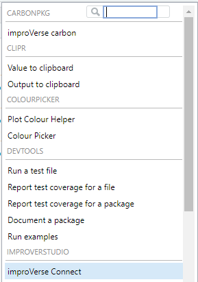

Launch the improVerse Connect addin from the RStudio Addins menu
:::

The improVerse integration opens in the RStudio Viewer pane, providing access to repository resources and step management functionality.

## Selecting an Analysis Tree

Navigate to the target analysis tree containing the source data:

::: {#fig-select-tree layout-ncol=1}
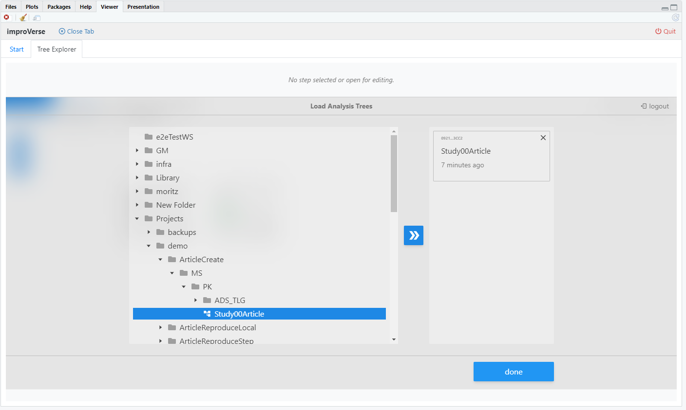

Select the analysis tree from the Tree Explorer and confirm with Done
:::

The selected tree becomes the active context for subsequent operations. The integration displays the tree structure and available steps.

# Step 1: Data Cleaning Workflow

## Inspecting Source Data

### Viewing Step Details

Before creating a consumer step, examine the available data outputs from existing steps:

::: {#fig-step-details layout-ncol=1}
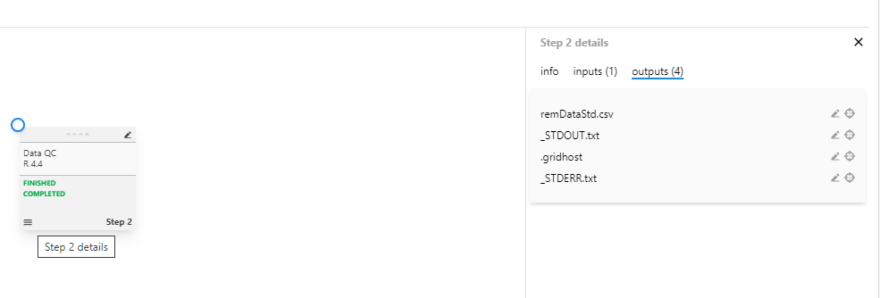

View Step 2 details showing available outputs including remDataStd.csv
:::

The Step Details panel displays three tabs:

- **info**: Step metadata, description, and rationale
- **inputs**: Files and data provided to the step
- **outputs**: Generated files including datasets, logs, and results

In this example, Step 2 contains the dataset `remDataStd.csv` which will serve as input for the data cleaning step.

## Creating a Consumer Step

### Initiating Step Creation

Consumer steps process outputs from existing steps, establishing dependencies within the workflow:

::: {#fig-create-task layout-ncol=1}
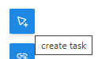

Click "create task" to initiate a new consumer step, append it at the right side of Step 2
:::

### Configuring the Consumer Step

Assign the source dataset and configure step execution parameters:

::: {#fig-consumer-task layout-ncol=1}
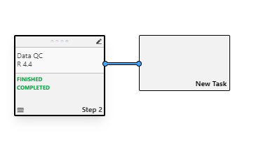

Consumer task creation interface
:::

::: {#fig-consumer-details layout-ncol=1}
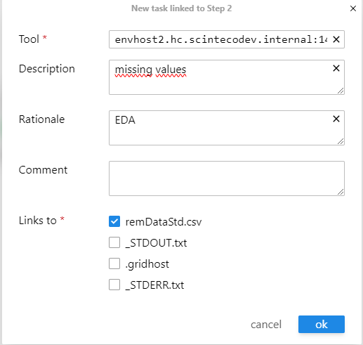

Configure the consumer step with dataset assignment, tool specification (Rscript), description, and rationale
:::

**Key Configuration Elements:**

- **Input Assignment**: Link `remDataStd.csv` from Step 2 as the input dataset
- **Tool**: Set to `Rscript` for R script execution
- **Description**: Provide a concise summary of the step's purpose
- **Rationale**: Document the scientific or analytical justification

## Attaching RStudio Control

### Enabling RStudio Integration

The improVerse integration can control RStudio IDE operations when attached:

::: {#fig-attach layout-ncol=1}
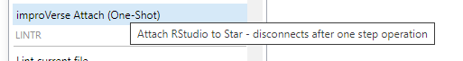

Attach RStudio to enable IDE control from the improVerse integration
:::

**Attach Mode Capabilities:**

- Navigate to workspace directories
- Switch working directory context
- Manage global environment
- Open files in the source editor
- Synchronize IDE state with step context

This integration enables seamless transitions between repository-managed steps and local development.

## Opening the Step Workspace

### Checking Out Step Files

The "open step" operation checks out the step to a dedicated workspace directory:

::: {#fig-open-step layout-ncol=1}
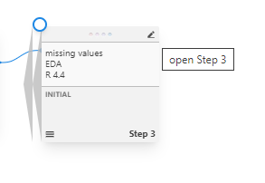

Open the step to check out files to the local workspace
:::

**Workspace Structure:**

```
workspace/
└── [tree-name]/
    └── [step-name]/
        ├── remDataStd.csv    # Input dataset
        └── [working files]    # Scripts and outputs
```

::: {#fig-files-pane layout-ncol=1}
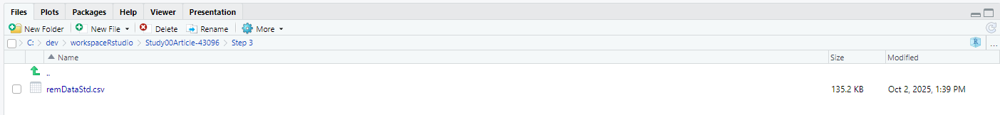

RStudio switches to the step workspace directory, displaying checked-out files
:::

RStudio automatically:

- Navigates to the step workspace directory
- Updates the Files pane to show step contents
- Sets the working directory to the step location

The workspace provides an isolated environment for script development with direct access to step input data.

## Local Development

### Script Development and Testing

Develop the data cleaning script within RStudio using standard development workflows:

::: {#fig-work layout-ncol=1}
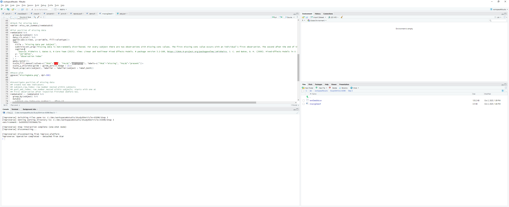

Develop, execute, test, and debug the R script locally within RStudio
:::

**Development Workflow:**

1. **Script Creation**: Write R code to process `remDataStd.csv`
2. **Execution**: Run the script interactively within RStudio
3. **Testing**: Verify outputs and intermediate results
4. **Debugging**: Use RStudio debugging tools as needed
5. **Iteration**: Refine the script until desired results are achieved

**Local Execution Benefits:**

- Immediate feedback during development
- Access to RStudio debugging tools
- Interactive exploration of data
- Rapid iteration without repository overhead

The script generates a cleaned dataset for downstream analysis.

## Pushing and Executing

### Uploading to Repository

After local development completes, push the script to the repository and execute in the validated environment:

::: {#fig-push layout-ncol=1}
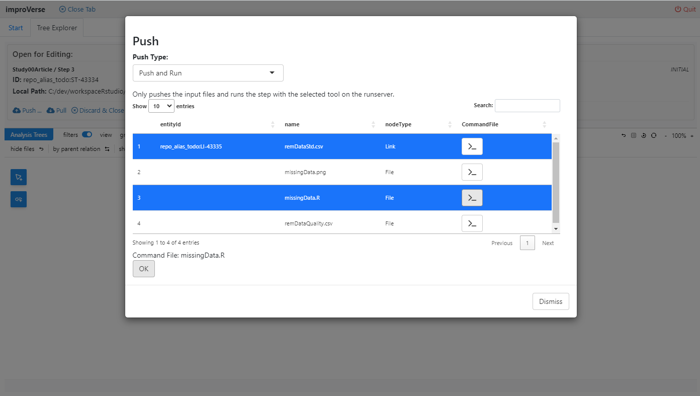

Select "Push and Run" to upload files and execute the step
:::

**Push and Run Process:**

1. **File Selection**: Choose input files to upload (script and dataset)
2. **Upload**: Transfer files to the repository step
3. **Validation**: Verify file integrity and completeness
4. **Execution**: Submit the step to the configured runserver
5. **Environment**: Execute in the validated, controlled run environment

This operation ensures reproducibility by executing the step in a standardized environment independent of the local development machine.

### Monitoring Execution

::: {#fig-running layout-ncol=1}
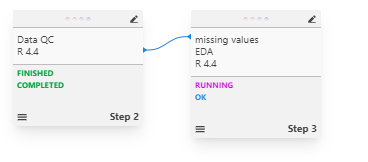

Step execution status displayed during processing
:::

The integration displays execution status and provides access to real-time logs during step processing.

## Verifying Outputs

### Checking Generated Files

After execution completes, verify that expected outputs were created:

::: {#fig-check-outputs layout-ncol=1}
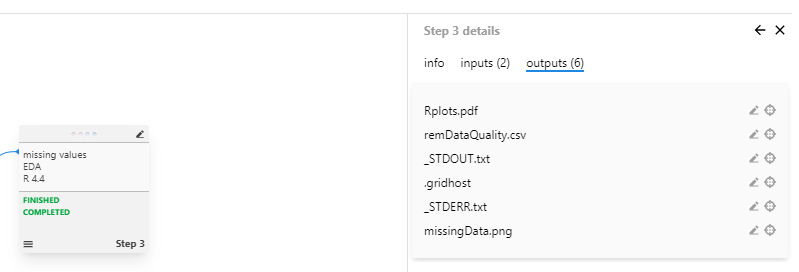

Verify that output files were successfully generated
:::

The outputs tab lists all files generated during step execution, including:

- Cleaned datasets
- Processing logs (STDOUT, STDERR)
- Intermediate results
- Generated visualizations

### Inspecting Results

Preview generated outputs directly within the integration:

::: {#fig-display-outputs layout-ncol=1}
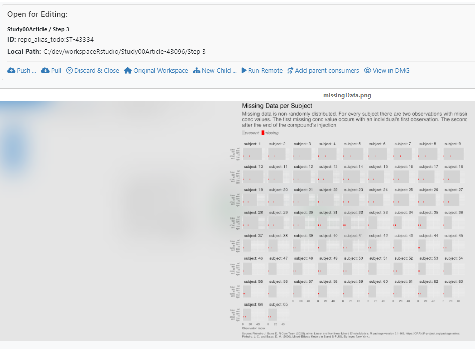

Preview generated outputs in the improVerse integration editor
:::

The integrated editor provides immediate visualization of results without requiring file downloads, enabling rapid validation of step outputs.

# Step 2: Concentration Visualization

## Creating the Visualization Step

The second step follows the same workflow pattern, consuming the cleaned dataset from Step 1:

::: {#fig-consumer-task2 layout-ncol=1}
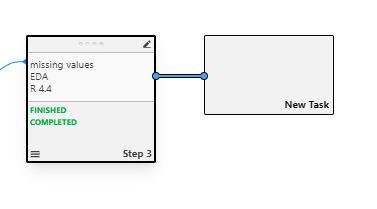

Create a second consumer step for concentration visualization
:::

### Configuration

::: {#fig-consumer-details2 layout-ncol=1}
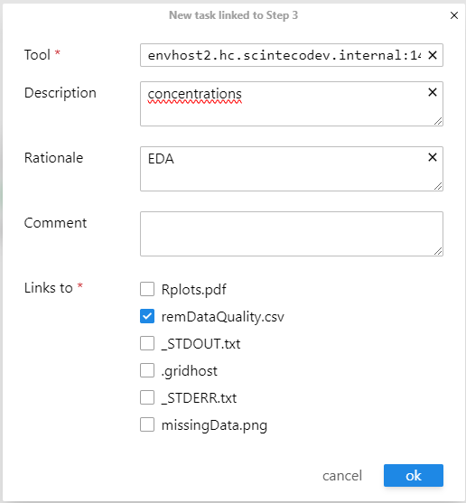

Configure the visualization step with the cleaned dataset as input
:::

**Step Configuration:**

- **Input**: Cleaned dataset from Step 1
- **Tool**: Rscript
- **Purpose**: Generate concentration visualizations
- **Rationale**: Visualize temporal and spatial concentration patterns

## Development and Execution

### Local Script Development

::: {#fig-work2 layout-ncol=1}
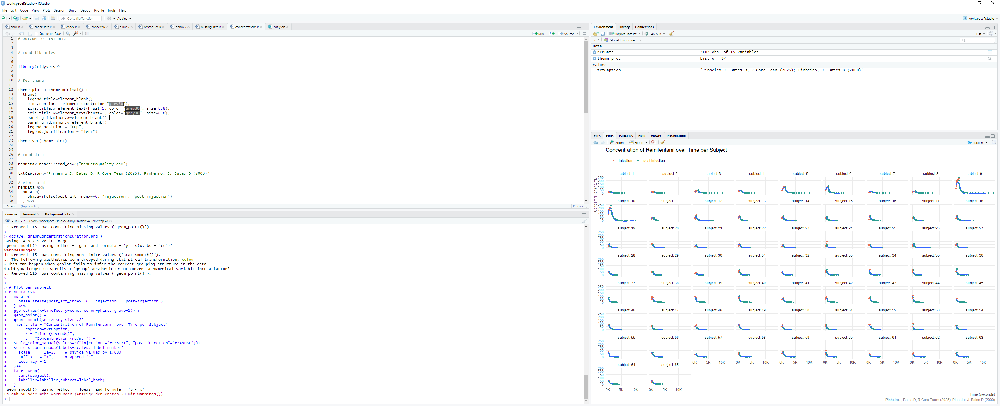

Develop the visualization script locally
:::

The development process mirrors Step 1:

1. Open the step workspace
2. Develop plotting script
3. Test visualization locally
4. Refine plot parameters and aesthetics
5. Verify output quality

### Push and Execute

::: {#fig-push2 layout-ncol=1}
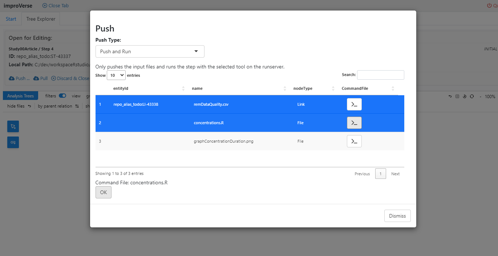

Upload and execute the visualization step
:::

The script and cleaned dataset are pushed to the repository, and the step executes in the validated environment, generating the final concentration plots.

# Workflow Completion

## Final Result

::: {#fig-result layout-ncol=1}
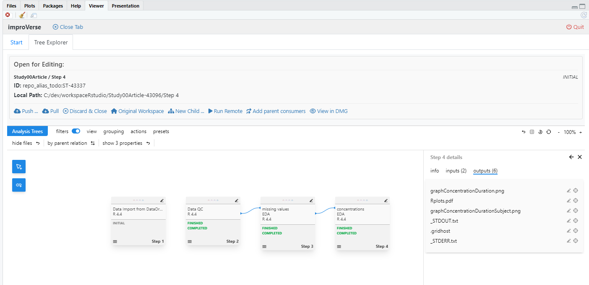

Completed two-step workflow with data cleaning and visualization
:::

The completed workflow demonstrates:

- **Step Dependencies**: Step 2 consumes output from Step 1
- **Validated Execution**: All steps executed in controlled environments
- **Reproducibility**: Complete execution history and versioned inputs
- **Traceability**: Clear dependencies from raw data through cleaning to visualization

# Workflow Architecture

## Key Concepts

### Local Development vs. Validated Execution

The RStudio integration implements a hybrid development model:

**Local Development Environment:**

- Unrestricted RStudio IDE access
- Interactive execution and debugging
- Rapid iteration and testing
- Access to local computing resources

**Validated Execution Environment:**

- Controlled runserver environment
- Versioned tool dependencies
- Standardized execution parameters
- Reproducible results independent of developer machine

### Workspace Management

**Workspace Directory Structure:**

```
workspace/
└── [tree-name]/          # Analysis tree name
    ├── [step-1-name]/    # First step workspace
    │   ├── inputs/       # Input data and files
    │   ├── script.R      # Development script
    │   └── outputs/      # Generated outputs
    └── [step-2-name]/    # Second step workspace
        ├── inputs/       # Input from step 1
        ├── script.R      # Visualization script
        └── outputs/      # Generated plots
```

Each step maintains an isolated workspace with explicit input/output separation.

### Step Lifecycle

1. **Creation**: Define step parameters and dependencies
2. **Checkout**: Download input files to local workspace
3. **Development**: Create and test script locally
4. **Push**: Upload script and files to repository
5. **Execution**: Run in validated environment
6. **Validation**: Verify outputs and execution logs
7. **Completion**: Step outputs become available for downstream steps

## Best Practices

### Step Organization

**Granularity:**

- Create focused steps with single, well-defined purposes
- Avoid monolithic scripts that perform multiple unrelated operations
- Balance step granularity with workflow complexity

**Documentation:**

- Provide clear descriptions summarizing step objectives
- Document rationale explaining scientific or analytical justification
- Include comments within scripts for implementation details

**Dependencies Management:**

- Explicitly declare all input dependencies
- Use consumer steps with links to establish clear data dependencies
- Avoid implicit dependencies on global state or external resources

### Development Workflow

**Local Testing:**

- Thoroughly test scripts locally before pushing to repository
- Verify all edge cases and error conditions
- Validate outputs against expected results

**Version Control:**

- Use meaningful commit messages when updating steps
- Document changes in step rationale when modifying existing steps
- Maintain backward compatibility when possible

**Resource Management:**

- Consider computational requirements when developing scripts
- Optimize for execution in the runserver environment
- Handle large datasets efficiently

### Reproducibility

**Explicit Inputs:**

- All input data must be explicitly declared and versioned
- Avoid reading files from arbitrary paths
- Use relative paths within the step workspace

**Environment Independence:**

- Scripts should execute identically in local and validated environments
- Avoid dependencies on user-specific configurations
- Explicitly specify all required packages and versions

**Output Documentation:**

- Generate self-documenting outputs when possible
- Include metadata describing processing parameters
- Create README files for complex output structures

# Advanced Features

## RStudio Attach Mode

The attach functionality enables bidirectional integration between RStudio and the improVerse system:

**IDE Control:**

- Programmatic navigation to workspace directories
- Automatic working directory synchronization
- File opening in source editor
- Global environment management

**Use Cases:**

- Streamlined workflow navigation across multiple steps
- Consistent development environment setup
- Integration with custom addins and extensions

**Session Management:**

- One-shot attach: Disconnects after single step operation
- Persistent attach: Maintains connection across operations

## Multi-Step Workflows

Complex analyses may require multiple sequential or parallel steps:

**Sequential Dependencies:**

```
Step 1 (Data Import)
  └─> Step 2 (Data Cleaning)
       └─> Step 3 (Statistical Analysis)
            └─> Step 4 (Report Generation)
```

**Parallel Processing:**

```
Step 1 (Data Import)
  ├─> Step 2a (Analysis A)
  ├─> Step 2b (Analysis B)
  └─> Step 2c (Analysis C)
       └─> Step 3 (Combine Results)
```

**Branch and Merge:**

```
Step 1 (Data Preparation)
  ├─> Step 2a (Method A)
  └─> Step 2b (Method B)
       └─> Step 3 (Comparison)
```

## Step Templates and Reuse

For repetitive analysis patterns:

**Template Steps:**

- Create generic step/workflow templates for common operations
- Parameterize inputs and configuration
- Reuse across multiple projects

**Workflow Extraction:**

- Extract proven workflows from completed projects
- Apply to new datasets with minimal modification
- Maintain consistency across analyses

# Troubleshooting

## Common Issues

### Step Execution Failures

**Symptom**: Step fails in the validated environment but succeeds locally

**Causes**:

- Missing package dependencies in runserver environment
- Hard-coded paths specific to local machine
- Reliance on interactive input or user intervention
- Insufficient memory or computational resources

**Resolution**:

- Review execution logs (STDERR.txt) for error messages
- Verify all dependencies are declared
- Use relative paths within workspace
- Ensure non-interactive execution

### File Synchronization Issues

**Symptom**: Files do not appear in the workspace after checkout

**Causes**:

- Network connectivity issues
- Insufficient local disk space
- Permission errors on workspace directory

**Resolution**:

- Verify repository connection status
- Check available disk space
- Verify workspace directory permissions

### Output Validation Failures

**Symptom**: Expected outputs are not generated after execution

**Causes**:

- Script errors during execution
- Incorrect output file paths


**Resolution**:

- Review STDOUT.txt and STDERR.txt logs
- Verify script generates files in working directory


# Summary

This tutorial demonstrated the complete RStudio workflow integration for developing validated, reproducible analysis steps. The key concepts include:

**Development Model:**

- Local development with full RStudio IDE capabilities
- Validated execution in controlled runserver environments
- Seamless transition between development and production

**Workflow Management:**

- Consumer steps establishing clear data dependencies
- Isolated workspaces for each step
- Explicit input/output management

**Reproducibility:**

- Versioned inputs and execution environments
- Complete execution history and logs
- Standardized tool configurations

The improVerse RStudio integration enables data scientists to leverage familiar development tools while maintaining the rigor and reproducibility required for validated analytical workflows.
