```{r}
#| code-summary: "Get packages"
#| code-fold: true
#| include: false
library(improveR)
#packageVersion("improveR")
library(tidyverse, quietly = T)
library(tictoc) #time keeping of functions
options(width=10000) #make results window wide; horizontal scrollbar

fn_connect <- function() {
  Sys.setenv(
    # IMPROVER_REPO_URL = "http://envhost1.hc.scintecodev.internal:5310/repository"
    IMPROVER_REPO_URL = "http://envhost1.hc.scintecodev.internal:6110/repository"
    
  )
  Sys.setenv(IMPROVER_AUTO_AUTH = TRUE)

  improveR::clearConnectionData()
  # improveR::improveConnect()
  improveRtestsupport::improveConnect()

  setEditable(TRUE)
  print(Sys.getenv("IMPROVER_REPO_URL"))
}

fn_connect()

improveConnected()
```

# Overview

This document provides an overview of {improveR}'s functions focused on working with steps. 

Steps are the fundamental building blocks of every analytical workflow within the improve framework. Each step contains

- at least one R script containing the relevant code
- linked or embedded resources (e.g., links, input files) and any output files (e.g., reports, graphs) stored in the step's inventory
- tools and their definitions to orchestrate the script's execution and file creation

Grouped by their role in the overall analysis, they constitute an analysis tree (e.g., analysis tree 'Exploratory Data Analysis').

Critically, by linking one step's output as an input to another step, steps can be *'horizontally' chained together to an integrated workflow*. This workflow can span across the entire or only parts of the analytical pipeline from the initial import of raw data (e.g., originating from a data order specification), via the exploratory data analysis, statistical modeling, to the reporting and eventual review. This integration of steps is instrumental when it comes to streamlining
the entire workflow and ensuring reproducibility of the final results.

Equally important is improve's ability to organize steps in a *vertical hierarchy by introducing parent-child relationships* between them. A *child step* can be a modified copy of a parent step, e.g., created to inquire into the consequences of a specific modification within the step (e.g., use of a different model specification). Similarly, a step can be attached to a parent step due to substantive considerations by the researcher, reflecting a thematic or conceptual hierarchy between them.

The above outlined two perspectives are central when it comes to the understanding of the concepts of *dependencies* and *usage* on one hand, and *child* and *parent* on the other hand. These terms
are ubiquitous when working with the improve framework in general and step-related functions in particular. 

The hierarchical parent-child relationship is conceptually different to the horizontal relationship between two steps within a workflow. Step A can produce results which are 'used' by Step B. But this does not make Step A a parent of Step B. Similarly, Step B is not a child of Step A even if Step A is within the dependencies of Step B. Keeping this conceptual distinction in mind is central.


- **Workflow, or input/output-centered perspective**: Looks horizontally at how a chain of steps (in analysis trees) transforms a distinct input into a distinct output. This view is visualized in improve's Data Manipulation Graph (DMG).

- **File-centric perspective**: Focuses on how files inside different steps are related in terms of their creation, which is more akin to a vertical angle. This perspective is visualized in improve client's editor view when displaying an analysis tree (as below in @fig-overview-analysis-tree).


With this as the background, the current document goes beyond the primarily technical focus of the function references/help files, and seeks to demonstrate the actual application of the step-function family. To do so, throughout the document references to various examples are included.

::: {#fig-overview-analysis-tree layout="[[1,1], [1]]"}

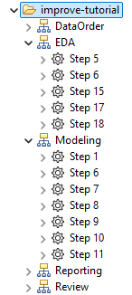

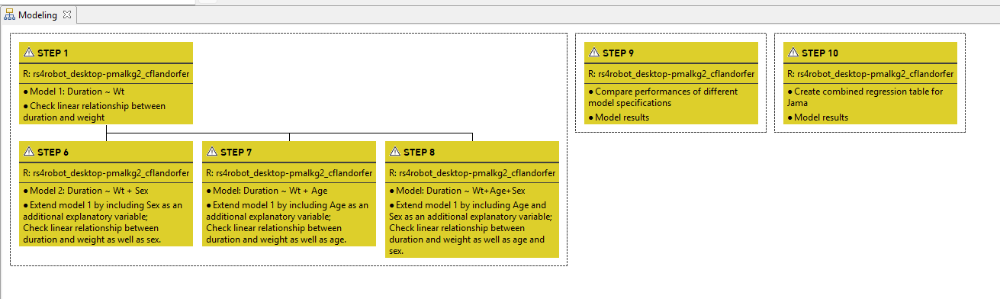

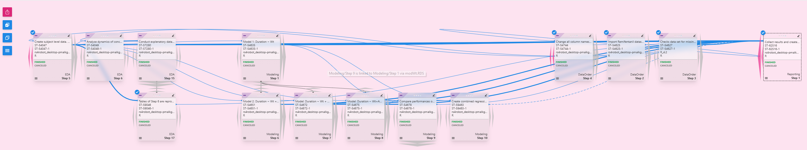

:::


# getStep

## Purpose of the function

The `getStep` function is central when it comes to working with steps specifically and the wider {improveR} ecosystem generally. Calling the function on a step returns a detailed environment object which not only encompasses information on the the step's own properties, but also on its relation with other steps within the wider workflow as well as additional function definitions to work with this information. The environments generated by `getStep()` provide the foundational data structures and operational interfaces that enable complex workflow operations, dependencies tracking, and coordinated multi-step analytical pipeline execution.

## Relation to other functions 

In the broader {improveR} ecosystem, `getStep` serves as a critical integration point. It connects individual step management with workflow-level orchestration through `getWorkflow`. The function supports execution coordination with functions like `finishRunResource` and `runStepResource`. It interfaces with the distributed resource management system through authenticated REST API calls and intelligent caching strategies. The step environment created by `getStep()` includes several functions which further facilitate working with the step: `createTemplate()`, `getStepInventory()`, `getStepResource()`, `getStepState()`, `getStepWithoutCache()`, and `retrieveMainProcess` (for details see [below](#details)).

## Under the hood

In broad terms, the function works in three steps: First, it loads the step's information from the server (`getStepDf`). This confirms the step exists and retrieves its settings, files, and history. Second, it creates a workflow environment (`createWorkflow`). This sets up tracking for how steps connect and depend on each other. Third, it builds the complete step environment (`createStepEnv`). This creates a comprehensive structure with all step data, relationships, and methods ready to use.

## Example

### Start
To demonstrate the application of `getStep()` see the example below. As an input the function takes a step's ident, which can be its path,
resource (version) id, full entity (version) id, or short entitiy (version) id. 

```{r}
#| code-summary: "Example `getStep()`: Apply function"
identATModelingStep1 <- "/improve-tutorial/Modeling/Step 1" 
envATModelingStep1 <- getStep(identATModelingStep1)
class(envATModelingStep1)
```

The returned result is an environment with multiple bindings of
different classes.

```{r}
#| code-summary: "Example `getStep()`: Overview of obtained elements' class"
#| eval: true

tibble(
  name = ls(envATModelingStep1),
  class = purrr::map_chr(name, \(x) class(get(x, envir = envATModelingStep1)))
) %>% arrange(class)
```

To inspect each of the returned environment's bindings, click on the elements in the viewer below.

`getStepInventory()`, `getStepState()`, `getStepWithoutCache()`, `getStepResource()`, `retrieveMainProcess()` and
`createTemplate()` contain all function definitions, meaning these functions can be called on the obtained
environment to get additional details or trigger other actions. 

```{r}
#| echo: false
#content of step's environment
listviewer::jsonedit(as.list(envATModelingStep1))
```

## Details

For a thorough understanding of the output of `getStep()`, the sections below will look into each
element of the obtained step environment.

<details>

<summary>Show details</summary>
<div>

<details>
### <summary>children</summary>
<div>
The environment of the loaded step contains the
element `children` which is again of class `environment`. Checking its content reveals 
that at this point it contains only a single element: the function `load()`. Once this function 
is called, `children` becomes additionally populated by four steps, i.e. the child steps.

```{r}
#| code-summary: "Call load() function in 'children'"

#content of children binding with only 'load' function
ls(envATModelingStep1$children)

#call function load()
envATModelingStep1$children$load()

#show children
listviewer::jsonedit(as.list(envATModelingStep1$children))
```

This result is consistent with the output returned by improveR's `getChildSteps()` or
the pertaining graph in the improve client. Note that in this case, the step has one child in 
a different analysis tree (`Review/Step 1`).

```{r}
#| code-summary: "Get Step 1's children via loadChildStep"
childATModelingStep1 <- improveR::loadChildSteps("/improve-tutorial/Modeling/Step 1")$data[[1]]
nrow(childATModelingStep1)
childATModelingStep1 %>% select(path, description)
```

::: {#fig-child-steps-modeling-step1 layout-nrow=2}

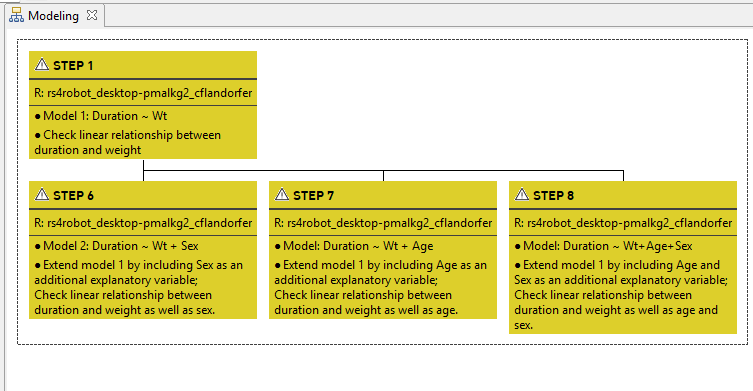

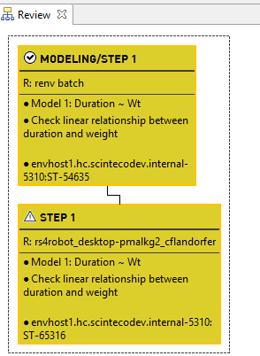

:::

Once loaded, navigating from the step to its children can be conveniently done by simply adding the
step's location to the call, e.g., `envATModelingStep1$children$'Modeling/Step 7/54672'`. The
navigation is facilitated by autocompletion when used in the terminal of RStudio or Positron IDEs (or VS Code with radian extension).

::: {#fig-autocomplete layout-ncol=1}
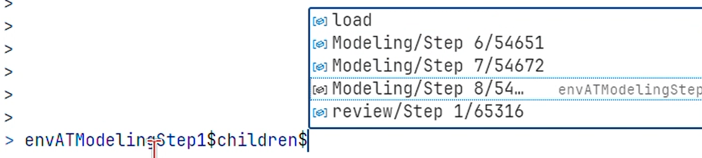{width="50%"}
:::

In terms of its structure, the obtained environment of the child step
is identical to the one previously obtained for Step 1
and contains again `r length(ls(envATModelingStep1$children$"Modeling/Step 7/54672"))` elements,
including `children` and `parent`.

Below the elements of `Modeling/Step 7/54672`'s environment.

```{r}
#| code-summary: "Structure and Content of child environment"
class(envATModelingStep1$children$`Modeling/Step 7/54672`)
listviewer::jsonedit(list(envATModelingStep1$children$`Modeling/Step 7/54672`))
```
</div>
</details>
<details>
### <summary> parent</summary>
<div>
As with the above described element `children`, the nested environment `parent`
initially also contains only the function `load()`.

Calling the function here, on `/improve-tutorial/Modeling/Step 1`, does not return a step since
Step 1 does not have a parent (see the image of the analysis tree 'Modeling' above, @fig-overview-analysis-tree).
Consequently, the function `load()` remains the only element of the environment `parent`.
```{r}
#| code-summary: "Trying to load the parent of Step 1 which has no parent"

#content of 'parent'
ls(envATModelingStep1$parent)

#trigger function 'load()'
envATModelingStep1$parent$load()

#content of 'parent' is unchanged
ls(envATModelingStep1$parent)
```
To properly demonstrate the use of the `parent` element, let us get a different step, i.e. `/improve-tutorial/Modeling/Step 8` which has Step 1 as a parent (see again above, @fig-overview-analysis-tree).

```{r}
#| code-summary: "Load parent of Step 8"

#get Step 8
envATModelingStep8 <- getStep("/improve-tutorial/Modeling/Step 8") 

#function load() is initially the only element of the parent environment
ls(envATModelingStep8$parent)

#call function load()
envATModelingStep8$parent$load()

#`parent` is is now featuring a new element, Step 1
ls(envATModelingStep8$parent)
```

As shown above, after calling the `load()` function on the parent environment of Step 8, a
new element is added: `Modeling/Step 1/54635`, which - as we know from above - is the parent of
Step 8.

</div></details>
<details>
### <summary>usage</summary>
<div> 

The `usage` binding is important when it comes to working with existing workflows. For details see [here](workingWithWorkflows.html#retrieving-an-existing-workflow).

The element `usage` in Step 1's environment refers to those steps which are directly ('consumers') or indirectly ('indirect consumers') depending on 
this step within a specific workflow. 'Depending' means in this context that the results produced by the step are *used* by the subsequent steps. The covered steps are 'to the right' or 'downstream' in the analysis.

Let's demonstrate this with the specific example of Step `/improve-tutorial/Modeling/Step 1`. 

After having obtained a step's environment, its usage related data is not yet available. Solely the function `load()` is available in `envATModelingStep1$usage`.
Only after having called the function, `envATModelingStep1$usage` contains details on the downstream steps. 

```{r}
#| code-summary: "Load `usage` of Step 1"

ls(envATModelingStep1$usage) #function `load()` sole element of `usage`

envATModelingStep1$usage$load(stepDepth=-1, treeDepth=-1) #call `load()`

ls(envATModelingStep1$usage) 
listviewer::jsonedit(as.list(envATModelingStep1))
```

The `usage` element provides insights into all steps that directly or indirectly depend on the current step within a workflow. After calling `load()`, the environment is populated with downstream step information, allowing the user to trace how the step's results propagate through the analysis.

How encompassing a step's usage is loaded, i.e. how far downstream steps should retrieved, is specified by the `load()` function's `stepDepth` and `treeDepth` parameters. A value of `stepDepth`==1 covers all steps which are directly following the step in question. A value of 2 casts the net wider and returns also those steps which are directly following the steps which were retrieved with the value 1. The value can be increased as deemed useful. A value of -1 is the most far-reaching and returns *all* steps which make use of the initially retrieved step.

Similarly, the function argument `treeDepth` defines over how many analysis trees a step's usage should be loaded. 

```{r}
#| code-summary: "Parameter `stepDepth` and `treeDepth`"
#| eval: true

envATModelingStep1 <- getStep("/improve-tutorial/Modeling/Step 1")
listviewer::jsonedit(as.list(envATModelingStep1))

envATModelingStep1$usage$load(stepDepth=1, treeDepth=1)
envATModelingStep1$usage$load(treeDepth=0)

listviewer::jsonedit(as.list(envATModelingStep1$usage)) 
```

</div></details>

<details>
### <summary>dependencies</summary>
<div>

The element `dependencies` inside Step 1's environment is the counterpart to `usage`. It includes steps which are
upstream or 'to the left' of Step 1. In other words, it refers to those steps of which the step in question, 
i.e. here Step 1 of the analysis tree 'Modeling', is depending on. The parameter `stepDepth` and `treeDepth` again define
the scope (or width) of the function call `load()`.

```{r}
#| code-summary: "Get dependencies - PENDING/CURRENTLY NOT WORKING"
#| eval: true

envATModelingStep1 <- getStep("/improve-tutorial/Modeling/Step 1")
ls(envATModelingStep1$dependencies) #shows only fn load, OK

```
 
```{r}
envATModelingStep1$dependencies$load(stepDepth=-1, treeDepth=-1)
x <- envATModelingStep1$workflow$df()

envATModelingStep1$dependencies$load(treeDepth=-1)
ls(envATModelingStep1$dependencies) 


```
</div>
</details>
<details>
### <summary>stepDf</summary>
<div>

`stepDf` is another element included in the environment which was returned by `getStep()`.
It is a data frame and contains metadata on the step. Two columns in `stepDf` should
be highlighted here: `processes` and `remoteFiles.` 

`processes` is a list column (a nested data frame) which provides details on the tool 
and related processes steering the execution of the pertaining step. This data reflects the information 
shown in the tool tab of the step in improve's client.

```{r}
#| code-summary: "Details of stepDf"

class(envATModelingStep1$stepDf)
names(envATModelingStep1$stepDf)
listviewer::jsonedit(as.list(envATModelingStep1$stepDf))

envATModelingStep1$stepDf$processes[[1]]
```

::: {#fig-processes layout-ncol=1}
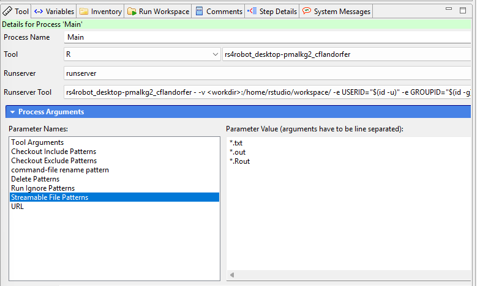
:::

The second column of `stepDf` which needs highlighting is `remoteFiles`. It is again
a list-column containing a data frame. This data frame presents details on those files which
are inputs into step 1, and get further processed when the step is executed. Critically, it also
features the column `asLink` which indicates whether the file is stored inside the step's inventory or linked from
another step.

```{r}
class(envATModelingStep1$stepDf$remoteFiles)

envATModelingStep1$stepDf$remoteFiles[[1]][c("name", "variableName", "ident", "asLink", "variableProcess")]
```
</div>
</details>
<details>
### <summary>getStepInventory</summary>
<div>

The binding `getStepInventory` stored inside Step 1's environment is of class `function`
and contains the function's definition. 

```{r}
#| code-summary: "Definition of getStepInventory"
class(envATModelingStep1$getStepInventory)
```

Calling the function returns the inventory of the step. Note that in contrast to the above described `load()` functions
related to children and parent, the `getStepInventory()` function does not load the inventory into the step's environment, but returns it 
as a data frame. In other words, while `envATModelingStep1$children$load()` triggers a 'side-effect' to modify the step's environment,
`getStepInventory()` does not modify the environment but returns its output. 
The returned data frame contains the list column `data` which provides the details on each of the inventory's files.

```{r}
#| code-summary: "Apply function"

#apply function to Step 1's environment
stepInventory <- envATModelingStep1$getStepInventory()

stepInventoryData <- stepInventory %>%
unnest_longer(data) %>%
unnest_wider(data, names_sep="_")

class(stepInventory)
glimpse(stepInventoryData)

stepInventoryData %>% 
select(
  data_name
)

```

To demonstrate `getStepInventory()`'s connection to the improve client, below is the pertaining inventory represented in the client.

::: {#fig-inventory layout-ncol=1}
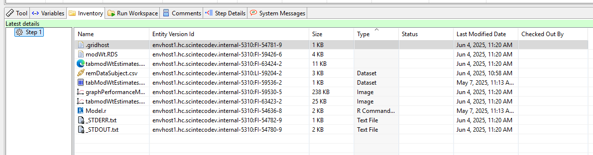
:::

</div>
</details>
<details>
### <summary>getStepResource()</summary>
<div>

Similar to `getStepInventory()`, `getStepResource()` is a binding in `envATModelingStep1` of class `function`.
Calling it returns a data frame containing the resource details on Step 1. Under the hood, it calls 'improveR::loadResource()'.

```{r}
#| code-summary: "Get step resources"

listviewer::jsonedit(as.list(envATModelingStep1))
stepResource <- envATModelingStep1$getStepResource()
glimpse(stepResource)
```
</div>
</details>

<details>
### <summary>retrieveMainProcess</summary>
<div>

`retrieveMainProcess` is of class `function`. When called it extracts the process of type 'main' from 
the step's processes.

```{r}
#| code-summary: "Call function retrieveMainProcess"

envATModelingStep1$retrieveMainProcess()
```

The output is the filtered result of the processes stored in the `stepDf` binding. In the present case of Step 1, there is only the main process.

```{r}
#| code-summary: "Get process 'Main' from stepDf"
envATModelingStep1$stepDf %>%
select(processes) %>%
unnest_wider(processes) %>%
select(processType, name)
```
</div>
</details>
<details>
### <summary>getStepState</summary>
<div>

The binding `getStepState` inside the obtained step environment holds a function which
returns the state of the step: "Initial", "Running", "Terminated", "Finished", "Error", 
"Outdated Link", or "Outdated".

```{r}
#| code-summary: "Call getStepState"
envATModelingStep1$getStepState() 
```
</div>
</details>
<details>
### <summary>getStepWithoutCache</summary>
<div>

The function `getStepWithoutCache()` loads the step resource directly from the server (using `improveR:::internalLoadResourceFromServer()`), bypassing any local cache.
It returns up-to-date information about a step from the server, ignoring any cached or potentially stale local data.

```{r}
#| code-summary: "Call getStepWithoutCache"

envATModelingStep1$getStepWithoutCache()

```
</div>
</details>
<details>
### <summary>this</summary>
<div>

The `this` binding is a self-reference of the step's environment. It enables function calls
to make a reference to the environment itself.

```{r}
#| code-summary: "Use of 'this' binding "

x <- envATModelingStep1$this$getStepInventory()
y <- envATModelingStep1$getStepInventory()
identical(x, y)
```
</div>
</details>

</div>
</details>

# attachStep

## Purpose of the function

The `attachStep` function establishes hierarchical relationships between steps in {improveR} workflows by attaching a step to another step that serves as its parent. This function is essential for creating structured hierarchies that reflect the logical flow and dependencies between analytical steps. It provides flexibility to reorganize existing workflows, insert new steps into established processes, or correct relationships that were initially configured incorrectly, while maintaining workflow integrity and enabling proper execution planning and dependencies tracking. 

## Relation to other functions

Within the step functions family, `attachStep()` forms a complementary pair with `detachStep()` for managing step hierarchy, working together with `createStep()` to provide complete workflow structure control. The function integrates closely with navigation functions like `getStep()`, `loadParentStep()`, and `loadChildSteps()` by ensuring cached relationships are updated through `unloadParentStep()` calls. In the broader {improveR} ecosystem, it connects with the resource management system via `loadResource()`.

## Under the hood

In broad terms, the function works in three steps: First, it validates both the step and parent exist (`loadResource()`). This confirms the entities are valid and retrieves the workflow context information. Second, it creates the parent-child relationship through an API request. This updates the hierarchy on the server by linking the step to its new parent. Third, it clears cached relationship data (`unloadParentStep()`). This ensures that subsequent navigation operations see the updated hierarchy instead of outdated information.

## Example

```{r}
#| code-summary: "Attach Step 2 to Step 1"
#| eval: true

step1Parent <- "/improve-tutorial/demoSteps/Step 1"
step2Child <- "/improve-tutorial/demoSteps/Step 2"

attachStep(ident=step2Child, parent=step1Parent)

#Verify new structure
loadResource(ident=step1Parent)

step1ParentChild <- loadChildSteps(ident=step1Parent)
step1ParentChild$data[[1]]$name #'Step 2' is shown as child
```

::: {#fig-stepAttach layout-ncol=2 .no-margin .left-caption}

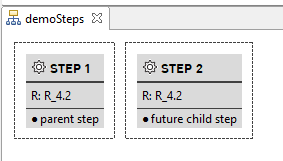{#fig-detached .text-align-left}

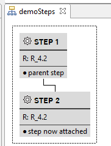{#fig-attached .left-caption}

Steps before and after calling 'attachStep'

:::

# detachStep

## Purpose of the function

The `detachStep()` function is the counterpart to `attachStep()` and removes the hierarchical relationship between a step and its parent. This function is essential for workflow reorganization, allowing users to isolate steps that were incorrectly attached, flatten complex hierarchies, or prepare steps for reassignment to different parents. It provides the flexibility to modify workflow structures without deleting steps or losing their content, while maintaining data integrity and ensuring that cached relationships are properly updated throughout the system.

## Relation to other functions

Within the step functions family, `detachStep()` works as the complementary counterpart to `attachStep()`, providing the opposite operation for managing step hierarchies. It integrates with navigation functions like `loadParentStep()` and `loadChildSteps()` by updating cached parent-child relationships through `unloadChildSteps()` and `unloadParentStep()` calls. The function works seamlessly with `createStep()` and other step management functions to provide complete control of the analysis' structure. In the broader {improveR} ecosystem, it connects with the resource management system via `loadResource()` for step validation and uses the authentication infrastructure to make REST API calls that persist structural changes across the distributed system.

## Under the hood

In broad terms, the function works in three steps: First, it validates the step exists and retrieves parent information (`loadResource()`). This confirms the step is valid and retrieves the workflow context and current parent relationship. Second, it removes the parent-child relationship through an API request. This updates the hierarchy on the server by breaking the link between step and parent. Third, it clears cached relationship data on both sides (`unloadChildSteps()` and `unloadParentStep()`). This ensures that subsequent navigation operations see the updated hierarchy instead of outdated information.

## Example

```{r}
#| code-summary: "Detach step from parent step"

#Check presence of child step
loadChildSteps(ident=step1Parent)$data[[1]] #data framew ith nrow 0


step2Child <- "/improve-tutorial/demoSteps/Step 2"
detachStep(ident=step2Child)

#Verify new structure
loadChildSteps(ident=step1Parent)$data[[1]] #data framew ith nrow 0
```

Note that when calling loadChildStep, the details on the child step(s) are stored in the list column `data` and not on the dataframe's top level.


::: {#fig-attachDetach layout-ncol=2 .no-margin .left-caption}

{#fig-attached .left-caption}

{#fig-detached .text-align-left}

Steps before and after 
:::


# changeStepDescription

## Purpose of the function

The `changeStepDescription` function modifies the description field of an existing step, allowing users to update documentation and clarify the purpose of analytical steps after they have been created. This function is essential for maintaining clear and accurate documentation as analyses evolve, requirements change, or when steps need better descriptions for collaboration and reproducibility. It enables dynamic updating of step metadata without requiring recreation of the entire step or disruption of existing workflow structures and dependencies.

## Relation to other functions

Within the step functions family, `changeStepDescription()` works alongside `changeStepRationale()` to provide comprehensive metadata editing capabilities for workflow steps. Both functions share similar implementation patterns and complement `getStep()` for retrieving step information before modification. The function integrates with improveR's resource management system through `loadResource()` and `updateResource()`, ensuring that description changes are properly persisted and cached correctly. It connects to the broader {improveR} package's authentication and REST API infrastructure, making authenticated calls to update step metadata on the server while maintaining data consistency across the distributed system.

## Under the hood

The function follows a straightforward workflow: First, it retrieves the current step information (`loadResource()`). This confirms the step exists and loads its current metadata. Second, it modifies the description property directly on the step entity object. This prepares the updated step data. Third, it sends the modified step to the server via an API request. This persists the new description in the central repository. Finally, it refreshes the local cache (`updateResource()`). This ensures subsequent operations see the updated description rather than stale data.

## Example

```{r}
#| code-summary: "Change description of Step 1"

stepIdent <- "/improve-tutorial/demoSteps/Step 1"

loadResource(stepIdent)$description

changeStepDescription(ident=stepIdent, description="First step in the linear analysis.")

loadResource(stepIdent)$description
```


```{r}
#| include: false
#| code-summary: "reset step description"

changeStepDescription(ident=stepIdent, description="First step in the analysis.")
```


# changeStepRationale

## Purpose of the function

The `changeStepRationale` function modifies the rationale field of an existing step, allowing users to update the reasoning and justification for why analytical steps were created and included in the workflow. This function is essential for maintaining clear analytical documentation that explains the scientific or methodological rationale behind each step, supporting reproducible research practices and regulatory compliance. It enables dynamic updating of step justification without requiring recreation of the entire step or disruption of existing workflow structures and dependencies, ensuring that analytical decisions remain well-documented as projects evolve.

## Relation to other functions

Within the step functions family, `changeStepRationale()` works as a companion to `changeStepDescription()` to provide comprehensive metadata editing capabilities for steps. Both functions share identical implementation patterns and complement `getStep()` for retrieving step information before modification. The function integrates seamlessly with {improveR}'s resource management system through `loadResource()` and `updateResource()`, ensuring that rationale changes are properly persisted and cached correctly. It connects to the broader {improveR} package's authentication and REST API infrastructure, making authenticated calls to update step metadata on the server while maintaining data consistency and version control across the distributed system.

## Under the hood

The implementation follows the same load-modify-save pattern as `changeStepDescription()`: first calling `loadResource()` to retrieve the current step entity and validate it exists, then directly modifying the rationale property of the step entity object. The function makes an authenticated PUT request to the `/resources/{resourceId}/` endpoint, sending the modified step as the request payload to persist changes on the server. Finally, it calls `updateResource()` to refresh the local cache with the updated step information, ensuring that subsequent operations work with the most current data and maintaining consistency between local and server state.

## Example


```{r}
#| include: false
#| code-summary: "hidden: reset step rationale"

stepIdent <- "/improve-tutorial/Modeling/Step 1"

changeStepRationale(ident=stepIdent, rationale="Investigate relationship")
```

```{r}
#| code-summary: "Change rationale of Step 1"

stepIdent <- "/improve-tutorial/Modeling/Step 1"
loadResource(stepIdent)$rationale

changeStepRationale(ident=stepIdent, rationale="Investigate linear relationship")

loadResource(stepIdent)$rationale
```

# createStepEnv

The `createStepEnv()` function constructs a specialized R environment object that encapsulates a step's complete context and provides programmatic access to all step-related data and operations. This environment serves as a comprehensive interface containing the step's metadata, file relationships, navigation capabilities, and workflow context in a structured, object-like format. The function creates an environment that includes nested sub-environments for children, parent, usage, and dependencies relationships, along with functional bindings for operations like `getStepInventory()`, `getStepResource()`, and `getStepState()`. This environment-based approach enables intuitive navigation through workflow hierarchies using R's `$` operator and provides a unified API for step manipulation and introspection that supports both interactive analysis and programmatic workflow management.

## Relation to other functions

Within the step functions family, `createStepEnv` serves as the foundational building block that underlies `getStep()`, which calls `createStepEnv` internally to generate the rich environment objects that users interact with. The function works closely with navigation functions like `loadChildSteps()`, `loadParentStep()`, and workflow analysis functions by providing the structured environment that contains lazy-loading mechanisms for these relationships. It integrates with resource management functions through embedded `loadResource()` calls and connects with the broader {improveR} ecosystem by creating environments that interface with authentication systems, caching mechanisms, and REST API endpoints. The environments created by `createStepEnv()` also support workflow execution functions by providing access to process definitions, file dependencies, and execution state information necessary for step orchestration and dependencies tracking.

## Under the hood

The function builds a step environment in stages. First, it loads the step's basic information and confirms it exists. Then it creates organized sections for the step's relationships: children, parent, usage, and dependencies. These sections load their data only when needed to improve performance.

The function adds helpful methods like `getStepInventory()` and `getStepWithoutCache()` that you can call directly on the step. It also sets up a workflow environment for managing execution and dependencies. The result contains both the step's data and the tools you need to work with it.

## Example

```{r}
stepIdent <- "/improve-tutorial/Modeling/Step 1"

# First, get the stepDf (step metadata) using the internal function
# Note: Users typically use getStep() instead of calling createStepEnv directly
stepDf <- improveR:::getStepDf(stepIdent)
workflow <- createWorkflow()

# Create the step environment with the stepDf
step_env <- createStepEnv(stepDf, workflow)

# Examine the environment structure
ls(step_env)
```

```{r}
#| include: false
knitr::knit_exit()
```

# createStepTemplateEnv

## Purpose of the function

The `createStepTemplateEnv()` function takes an existing step as an input and uses it as a blueprint for the creation of new steps.
The created template can further be adapted to its actual use case by modifying all the step properties — like description, rationale, parent relationships, input files, and tool settings — using simple setter methods. These setter methods are part of the environment created by the `createStepTemplateEnv()` call. 
Once everything is configured, a new step will eventually be created by calling the `realise()` function. This approach is essential for automated workflows, batch step creation, and reproducible analyses where you want to script the entire process.

## Relation to other functions

Within the step function family, `createStepTemplateEnv()` is the constructor counterpart to `getStep()`. While `getStep()` retrieves existing steps, `createStepTemplateEnv()` builds new ones. The template's `realise()` method calls `createStep()` internally to save the configured step on the server.
The setter methods use `loadResource()` to validate file references and parent step identifiers. The function also supports workflow import and export operations through `importWorkflow()` and `exportWorkflow()`. This allows you to save workflow definitions and recreate them in different repository instances.
For the creation of workflow templates see [here](workingWithWorkflows.html#workflow-templates).


## Under the hood

`createStepTemplateEnv()` builds a template through several stages: First, it generates a unique identifier and creates a data frame to store the step configuration. This provides the foundation for tracking all step properties. Second, it creates an environment containing setter methods for every configurable property. These methods update the internal data frame without contacting the server. Third, it attaches a `realise()` method that transforms the template into an actual step. When called, `realise()` validates the configuration, prepares process definitions, creates the step via an API request, uploads any local files, and returns a complete step environment. The template stays inactive until you call `realise()`, letting you build the complete configuration first.

## Example

### Create template

```{r}
#| code-summary: "Create and configure a step template"
#| eval: true

# get StepDf of the step for which a template environment should be created
stepStepDf <- getStep(ident="/improve-tutorial/Modeling/Step 1")$stepDf

# create step template environment
stepTemplateEnv <- createStepTemplateEnv(
  treeIdent = "/improve-tutorial/Modeling/",
  stepDf=stepStepDf
)

# show class of environment's bindings
tibble(
  name = ls(stepTemplateEnv),
  class = purrr::map_chr(name, \(x) class(get(x, envir = stepTemplateEnv)))
) %>%
  arrange(class) 
```

### Use setter functions to adapt step template

For each property of a step, there is are corresponding setter functions:

```{r}
#| code-summary: "Overview setter functions by purpose"
#| code-fold: show
#| collapse: true
#| echo: false

# "add" functions
str_subset(ls(stepTemplateEnv), regex("^add")) %>% str_c(., collapse=", ")

# "change" functions
str_subset(ls(stepTemplateEnv), regex("^change")) %>% str_c(., collapse=", ")

# "remove" functions
str_subset(ls(stepTemplateEnv), regex("^remove")) %>% str_c(., collapse=", ")

# "set" functions
str_subset(ls(stepTemplateEnv), regex("^set")) %>% str_c(., collapse=", ")
```

Modify the template as needed, e.g., by defining a new description, a new rationale, or adding remote files.

```{r}
#| include: false
#| eval: false
#| # Set basic properties
stepTemplateEnv$getStepEnv() #errors Error in `httr::content()` at improveR/R/getStep.R:122:3: ! is.response(x) is not TRUE
```
```{r}
#| code-summary: "Use of setter functions - change name of template step"

# change description and rationale
stepTemplateEnv$setStepDescription(description="Step template")

stepTemplateEnv$setStepRationale(rationale="Step for new analysis")

```


```{r}
#| code-summary: "Add remote file as link to template step"

dfRemoteFiles <- stepTemplateEnv$stepDf$remoteFiles[[1]]


# add a new remote file; use file from a preceding step ()
envStepEDA15 <- getStep("/improve-tutorial/EDA/Step 15")

graphIdent <- loadChildResources("/improve-tutorial/EDA/Step 15")$data[[1]] %>%
  filter(name=="tableStatsAll.png") %>%
  select(resourceId)
graphIdent

# add table "tableStatsAll.png" from Step 15 of the Analysis Tree EDA to the new step template which is based on Step 1 of Analysis Tree Modeling
stepTemplateEnv$addStepRemoteFile(ident=graphIdent) #use setter function addStepRemoteFile
#check whether file was added
stepTemplateEnv$stepDf$remoteFiles[[1]] %>%
  select(name, asLink)

#remove remote file again
stepTemplateEnv$removeStepRemoteFile(ident=graphIdent)
stepTemplateEnv$stepDf$remoteFiles[[1]] 

```
 
### Realise step

Calling `realise()` transforms the template to an actual step.

```{r}
#| eval: false
stepTemplateEnv$realise(run=FALSE)
```

It is also possible to 'realize' the step template into a different analysis tree than that of the step's origin.

```{r}
#| code-summay: "Realising step template in new analysis tree"

#Create new analysis tree
createAnalysisTree(targetIdent="/improve-tutorial/", treeName="newTree", comment="created by improveR")
#Show folder with all its analysis trees; 'newTree' is among them
loadChildResources(ident="/improve-tutorial/")$data[[1]] %>% arrange(desc(createdAt)) %>% select(nodeType, name, path)

#Check analysis tree "newTree"; does not contain any steps
loadChildResources(ident="/improve-tutorial/newTree")$data[[1]] 

#Define analysis tree in stepTemplateEnv call
stepTemplateEnv$setStepTree(treeIdent="/improve-tutorial/newTree")
stepTemplateEnv$stepDf$treeIdent #confirm the changes made
loadResource(stepTemplateEnv$stepDf$treeIdent)$path #confirm that treeIdent is equivalent to the tree's path

stepTemplateEnv$realise(run=FALSE) #realise the step with modified treeIdent

#Check analysis tree "newTree" for presence of new step
loadChildResources(ident="/improve-tutorial/newTree")$data[[1]] %>%
    select("name", "entityId", "path")

#Check contained step for step description and rationale
getStep("/improve-tutorial/newTree/Step 1")$stepDf %>%
  select(description, rationale) 
```

```{r}
#| code-summary: "remove analysis tree created above/reset folder so that analysis tree works"
#| include: false
#| eval: true
delete(res="/improve-tutorial/newTree")
```

# getToolInstances

## Purpose of the function

Tools are engines that orchestrate the execution of steps. They define how scripts are run, which external software to use (like R, NONMEM, or Monolix), and how to handle inputs and outputs. The `getToolInstances()` function returns an environment containing all available tool instances. For each tool instance, the environment contains a specific data frame with pertaining details (e.g., toolId, runserverId, url, gridArguments, parameters). `getToolInstances()` is instructive for understanding which computational tools are available in the system, their configurations, and their associated parameters and grid arguments. 

## Relation to other functions

Within the step functions family, `getToolInstances()` contributes the tool configuration data that underlies step execution and workflow orchestration. The function connects with `getMainProcess()` which retrieves the specific tool instance assigned to a step.

The relevant tool instances returned by `getToolInstances()`  are also referenced in the `stepDf$processes` data structure within step environments created by `getStep()`. In the broader {improveR} ecosystem, the function loads available computational resources and their configurations, including parameters and grid arguments for tools that support distributed computing. When tool configurations change, calling `resetToolInstances()` clears the cache.

In the improve client the relevant information is displayed as shown below.

::: {#fig-client-tools layout-ncol=1}

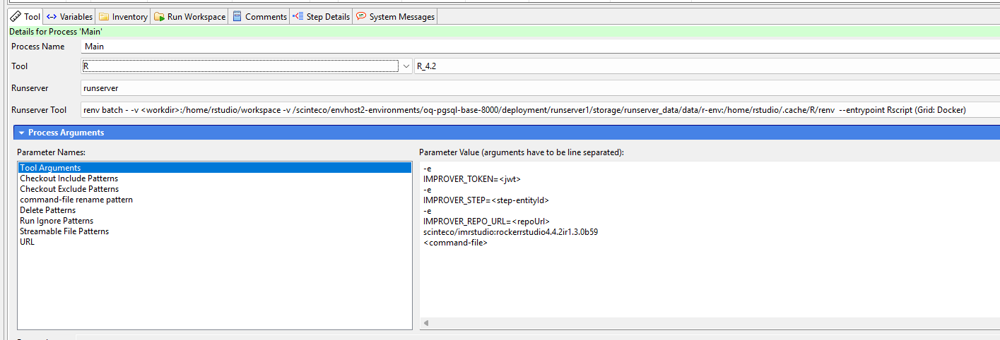

:::

## Under the hood

Under the hood the function checks for cached tool instances first, returning them immediately if available. Otherwise, it loads tool configuration data from the server, including runservers, tools, parameters, and grid arguments. It creates a structured environment where each tool instance is accessible by its full name, caches the result, and returns it for use. 

## Example

```{r}
#| code-summary: "Retrieve all tool instances"
#| eval: true

#Get the tool instances environment
toolInstances <- getToolInstances()
#Check class
class(toolInstances)

#Get names of tools
toolNames <- ls(toolInstances)
toolNames
```

To access a specific tool instance and examine its configuration, address it e.g., via its name.
```{r}
#| code-summary: "Inspect specific tool"

#Inspect one specific tool
toolNonmem <- toolInstances$`Nonmem nonmem_7.5 nonmem_7.4 runserver` 
class(toolNonmem)

#Retrieve tool's parameters
toolNonmem$parameters[[1]]
```

The tool instances retrieved by `getToolInstances()` are referenced when steps define their execution processes. In the improve client's tool tab (as shown in @fig-client-tools), users configure which tool instance to use for each step. This configuration is stored in `stepDf$processes` and determines how the step will be executed when called.

If we are interested in the tooling of a specific step calling `getMainProcess` is straightforward.

```{r}
#| code-summary: "Get tooling of specific step"
mainProcessModelingStep1 <- getMainProcess("/improve-tutorial/Modeling/Step 1")
mainProcessModelingStep1
```

Using the step's `toolId`, as returned by `getMainProcess()`, allows retrieving the pertaining data from the environement returned by `getToolInstances()`.
```{r}
#| code-summary: "Match step's main process with tool data"

#Get all tools...
toolInstances <- getToolInstances()
#... and combine them into one single data frame
toolInstancesCombined <- dplyr::bind_rows(as.list(toolInstances), .id = "source")

# return all tool instances with the same toolId, here R instances.
toolInstancesCombined %>%
  filter(toolId == mainProcessModelingStep1$toolId)
```


# runStepResource

## Purpose of the function

The `runStepResource()` function initiates the execution of a step on the server. When you call this function, it triggers the step to start running asynchronously, meaning the step's code and processes begin executing on the improve platform without blocking your R session. This function is essential for starting computational workflows, whether they involve R scripts, NONMEM models, or other tool-based analyses. The function performs a quick validation to ensure the repository is in an editable state, confirms the step exists, and then sends a command to the server to begin execution. Once the execution has been triggered, control returns immediately to your R session, allowing you to continue working or chain additional commands while the step runs in the background on the server.

## Relation to other functions

Within the step functions family, `runStepResource()` forms a fundamental execution pair with `finishRunResource()`. While `runStepResource()` initiates execution, `finishRunResource()` monitors and waits for completion, together enabling complete control over step execution workflows. The function integrates with `getStep()` for step identification and uses `loadResource()` internally to validate that the specified step exists before attempting execution. It connects with `getToolInstances()` and the step's process configuration stored in `stepDf$processes`, as the server uses this configuration to determine which computational tool and runserver should execute the step. In the broader {improveR} ecosystem, `runStepResource()` relies on the authentication infrastructure through `authenticatedREST()` to make secure API calls, and it requires `improveEditable()` to verify that the repository state allows modifications. The function is commonly used in workflow orchestration scenarios where multiple steps need to be executed sequentially or in parallel.

## Under the hood

The function operates through a straightforward three-step process. First, it calls `improveEditable()` to verify that the repository is in an editable state, ensuring that step execution is permitted. Second, it loads the step resource using `loadResource(ident)` to confirm the step exists and retrieve its resource ID. Third, it makes an authenticated POST request to the server endpoint `resources/{stepId}/run`, passing the step's resource ID as a URL parameter. This API call instructs the server to begin executing the step according to its configured processes and tools. The function then returns the original step identifier invisibly, allowing it to be used in piped operations while not cluttering console output. The actual step execution happens asynchronously on the server, managed by the improve platform's execution infrastructure.

## Example

```{r}
#| code-summary: "Execute a single step"
#| eval: false

# Trigger execution of a step
runStepResource(ident="/improve-tutorial/Modeling/Step 9")

# Execution has started on the server
# Your R session is immediately available for other work
```


