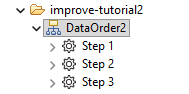
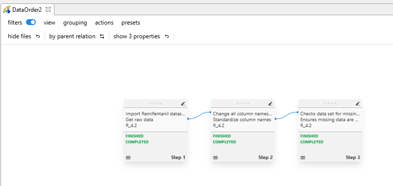

```{r}
#| code-summary: "Get packages"
#| code-fold: true
#| include: false
library(improveR)
#packageVersion("improveR")
library(tidyverse, quietly = T)
options(width=10000) #make results window wide; horizontal scrollbar

fn_connect <- function() {
  Sys.setenv(
    IMPROVER_REPO_URL = "http://envhost1.hc.scintecodev.internal:5310/repository"
    
  )
  Sys.setenv(IMPROVER_AUTO_AUTH = TRUE)

  improveR::clearConnectionData()
  improveRtestsupport::improveConnect() #new
  #  improveConnect()

  setEditable(TRUE)
  print(paste("IMPROVER_REPO_URL:",Sys.getenv("IMPROVER_REPO_URL")))
  print(paste("IMPROVER_STEP:", Sys.getenv("IMPROVER_STEP")))
  print(paste("pwd$path:", pwd()$path))
}

fn_connect()

improveConnected()
```


# Overview

On a very general level, in the context of {improveR}, a workflow is a distinct sequence of steps, grouped by analysis-trees, which transforms a distinct input into a distinct output. The precise definition of a workflow is the foundation of the analysis' reproducibility and general replicability. {improveR} workflow capabilities simplify the creation of such formulations and facilitate the chaining of individual steps into a robust framework encompassing the entire analytical process from the data ingestion, EDA, modeling, and reporting to the result's audit.

Furthermore, {improveR} provides  the ability to take an already created workflow and to transfer it to another research context, while keeping inter-step relationships, file input and output specifications as well as tools and their definitions in order. By this, researchers can easily apply an available analytical workflow in a different context and investigate, e.g., how outcomes differ due to different inputs while keeping the chain of steps unaltered. Rather than re-creating each individual step from scratch, portability ensures an efficient application of the workflow in a new context.

This article provides an overview of {improveR}'s most relevant functions for working with workflows. The examples are based on the demo repository 'improve-tutorial' containing mock data.

::: {#fig-folder layout-ncol=1 fig-cap="Improve client - DMG across all steps, grouped by analysis trees"}

:::

The graph above depicts improve's Data Manipulation Graph (DMG) for
the entire folder. Step `Reporting/Step 1` (ST-62516) in the Analysis Tree 'Reporting' is its final step
in the overall workflow.

# Retrieving an existing workflow

If one is interested in obtaining the workflow leading to a specific step, the function `getStep()` is key. The function takes the ident^[An ident can be an entityId, entityVersionId, a resourceId or a resource's dataframe containing an entityId", or a path.] of the step of interest as an argument and returns an environment containing all the elements describing the step. From this environment, the workflow leading to the step can be extracted via the **dependencies** binding.  The dependencies of a step are all upstream steps creating output which is directly or indirectly used by the step of interest.

The parameters `treeDepth` and `stepDepth` limit the upstream reach of the call, i.e. they define a cut-off point for the retrieved dependencies of the step in question. Once loaded, the workflow can be accessed via the `workflow` binding.


::: {#fig-folder layout-ncol=1 fig-cap="Improve client - Lack of arrows to the right indicates absence of usage"}

:::


## treeDepth

In the example below, let's request the full workflow leading to step `/improve-tutorial/Reporting/Step 1`. With an `treeDepth` input value of -1, the entire workflow is extracted. Note that the returned data frame also includes step 1 of the reporting analysis tree, i.e. the actual step for which the workflow is retrieved. The binding `df()` returns a data frame containing all steps constituting the workflow.

<!-- ::: {.column-margin}

::: -->
 
```{r}
#| code-summary: "Get complete workflow leading to Step 1 of AT Reporting"
#| cache: true
#| message: false

# get step environment
envATReportingStep1 <- getStep("/improve-tutorial/Reporting/Step 1")

# load the steps dependencies with desired depth
envATReportingStep1$dependencies$load(treeDepth=-1)

# show steps constituting the workflow with df()
envATReportingStep1$workflow$df() %>% select(fullName)

```

@fig-workflow-all shows the data manipulation graph of the improve client for the workflow leading to `Reporting/Step1.` It is the visual representation of the relations between the steps which were extracted via `getStep()` and subsequent function calls. 

::: {#fig-workflow-all layout-ncol=1, fig-cap="Improve client DMG - Complete workflow leading to Step 1 of AT Reporting"}

:::

When contrasting this result with the 'full' folder as depicted in @fig-folder, it can be noticed that step `EDA/Step 18` is missing. This is because the step does not form part of the workflow leading to our 'destination' step `Reporting/Step 1`.

To demonstrate this aspect, let's obtain the **usage** of `EDA/Step 18`. With a step's usage all those
steps are captured which depend further downstream in the analytical workflow on at least one file generated by the step of origin, i.e. `EDA/Step 18`. Again, `getStep()` is the required method.

```{r}
#| code-summary: "Get usage of step outside of workflow"
#| cache: true

# get step environment
envATEDAStep18 <- getStep(ident="/improve-tutorial/EDA/Step 18")

# load usage with desired depth
envATEDAStep18$usage$load(treeDepth=-1)

# reveal content of usage
ls(envATEDAStep18$usage)
```

The result above reveals that step `EDA/Step 18` has no usage, i.e. there are no other steps which would depend on any file produced by it. The `load()` function remains the sole element even after calling it. This result is in line with the earlier finding, that `EDA/Step 18` is no element of the workflow or dependencies leading to `Reporting/Step 1`. Would `EDA/Step 18` be
within the dependencies of `Reporting/Step 1`, the latter would also have to be within the usage of
the former.

## stepDepth

Similar to the argument `treeDepth`, `stepDepth` also allows setting the reach of the workflow of interest.
However, rather than delimiting its reach by analysis trees, it sets the workflow's boundaries by steps. The example below extracts the workflow leading to `Reporting/Step 1` with `stepDepth` of 1.

```{r}
#| code-summary: "Get only workflow starting at adjacent AT leading to Step 1 of AT Modeling"
#| cache: true

# get step environment 
envATReportingStep1 <- getStep("/improve-tutorial/Reporting/Step 1")

# load dependencies with desired depth
envATReportingStep1$dependencies$load(stepDepth=1)

# extract workflow
envATReportingStep1$workflow$df() %>% 
select(treeName, fullName)
```


:::{#fig-ATReportingStep1WorkflowStepDepth1 layout-ncol=1 fig-cap="Improve client - DMG workflow with stepDepth 1"}

:::


## Identifying files linked across steps

Note that the result presented in the chunk above includes also steps from the 'first' Analysis Tree, 'Data Order'. This is due to a direct link between Step 3 in 'Data Order' and Step 1 in 'Reporting'. If we want to check which files link the two steps, we can easily find this out via workflow's `internalLinks`. *internalLinks* are links within a workflow which establish the connection between one step's output and another step's input.

```{r}
#| code-summary: "Check for files connecting Step 3 of AT Data Order with Step 1 of AT Reporting"

filesATDOS3ATReprotingS1 <- envATReportingStep1$workflow$internalLinks %>% 
  dplyr::filter(str_detect(sourceStep, regex("DataOrder"))) %>%
  dplyr::filter(str_detect(targetStep, regex("Reporting"))) %>%
  select(name, sourceInventoryPath, sourceStep, targetStep)

filesATDOS3ATReprotingS1
```


In `Reporting/Step 1` these files show up in the `remoteFiles` binding with `asLink` set to `TRUE`.
```{r}
#| code-summary: "Get remote files of `Reporting/Step 1` and check for files"
#| cache: true
envATReportingStep1$stepDf$remoteFiles[[1]] %>%
  as_tibble() %>%
  select(name, ident, asLink) %>%
  filter(name %in% filesATDOS3ATReprotingS1$name)  
```

Conversely, the files are also part of the inventory of Step 3 in the AT Data Order. 
```{r}
#| code-summary: "Check inventory of `DataOrder/Step 3`"
#| cache: true

envATDOStep3 <- getStep(ident="/improve-tutorial/DataOrder/Step 3/")

inventoryATDOStep3 <- envATDOStep3$getStepInventory()$data[[1]] %>%
  select(name, entityId) %>%
  filter(name %in% filesATDOS3ATReprotingS1$sourceInventoryPath)

inventoryATDOStep3
```

# Removing a step from a workflow

There can be situations where an analyst comes to the conclusion that a step within a workflow is no longer needed and has to be removed. With the `removeStep()` function which forms part of the step's workflow binding, {improveR} offers a convenient way to do so. This is particularly useful if a step should be excluded from an exported workflow, e.g., because it contains sensitive information or because it is not relevant in the context of the new repository.

In the example below, step `Modeling/Step 10` will be removed.

```{r}
#| code-summary: "Remove Step /improve-tutorial/Modeling/Step 10"
#| cache: true

# get workflow of `Reporting/Step 1`
envATReportingStep1 <- getStep("/improve-tutorial/Reporting/Step 1")

# get the workflow and show details on Step 'Modeling/Step 10'
envATReportingStep1$dependencies$load(treeDepth=-1)

# show step 10 in the workflow
envATReportingStep1$workflow$df() %>%
  filter(str_detect(fullName, regex("Step 10"))) %>%
  select(fullName, sourceEntityId, rationale, description)
 
# remove step
envATReportingStep1$workflow$removeStep('Modeling/Step 10/59463')

# check whether step is still present in workflow
envATReportingStep1$workflow$df() %>%
  filter(str_detect(fullName, regex("Step 10"))) %>%
  select(fullName, sourceEntityId, rationale, description) 
```

The last output above confirms that the step was removed from the workflow.
Importantly, however, note that the step is not deleted. It is still present in its analysis tree.
The step was only removed from the workflow leading to `Reporting/Step 1` as revealed in the
output below. Applying `loadChildResources()` to an analysis tree's ident returns, inter alia, all of its steps.

```{r}
#| code-summary: "Get steps in Analysis Tree 'Modeling"
#| cache: true

#loadChildResources()` allows loading all steps of an analysis tree.
stepsATModeling <- improveR::loadChildResources(ident='/improve-tutorial/Modeling/') %>%
  select(data) %>%
  unnest(data) %>%
  select("name", "path")

#reveals that step 10 is still present
stepsATModeling
```

# Updating outdated workflow elements

In the event that elements of a workflow get outdated, these and all other steps in their usage need updating.
The function `rerunChangedAndOutdated()` performs incremental workflow execution by only rerunning steps with changed or outdated files as well as their consumers. It is hence a powerful function to keep the workflow in sync, without having to rerun it entirely.

To demonstrate this, the following steps are implemented below:

1. Get the workflow of step `Reporting/Step 1`
2. Check for the presence of any changed or outdated files with `changedAndOutdatedFiles()`
3. Call `rerunChangedAndOutdated`.

```{r}
#| code-summary: "Change step to render workflow outdated"
#| eval: true
#| cache: true

#get workflow 
envATReportingStep1 <- getStep("/improve-tutorial/Reporting/Step 1")
envATReportingStep1$dependencies$load(treeDepth=-1, stepDepth=-1)

#get changed and outdated files
changedAndOutdatedFiles <- envATReportingStep1$workflow$changedAndOutdatedFiles()
nrow(changedAndOutdatedFiles)
changedAndOutdatedFiles %>% 
  select(fileName, stepEntityId, outdatedLink, targetId) %>%
  arrange(fileName)
```
 
```{r}
#| code-summary: "Rerun changed and outdated files"
#| eval: false

envATReportingStep1$workflow$rerunChangedAndOutdated()
```

The result above reveals that there are `r nrow(changedAndOutdatedFiles)` outdated files or links in the workflow leading (directly or indirectly) to `Reporting/Step 1`. Note
that a file can appear multiple times in `changedAndOutdatedFiles`. This is because the same file is linked multiple times to different steps. The `targetId` refers to the file
to which the link is direct to. However, since the link is outdated the returned `targetId` refers to the previous, i.e. outdated id of the file.

```{r}
#| code-summary: "Workflow up to Step 18 - Change step to render workflow outdated"
#| eval: false
#| include: false

envATEDAStep18 <- getStep("/improve-tutorial/EDA/Step 18")
envATEDAStep18$dependencies$load(treeDepth=-1)

#steps forming part of the workflow
envATEDAStep18$workflow$df() %>%
  select(treeName, fullName)
#no outdated or changed files
changedAndOutdatedFiles <- envATEDAStep18$workflow$changedAndOutdatedFiles()
nrow(changedAndOutdatedFiles)
changedAndOutdatedFiles$fileName

envATEDAStep18$workflow$changedAndOutdatedFiles()
envATEDAStep18$workflow$rerunChangedAndOutdated() 
envATEDAStep18$workflow$changedAndOutdatedFiles()
```


```{r}
#| code-summary: "Change step to render workflow outdated (pending)"
#| eval: false
#| include: false

envATDAOStep6 <- getStep("/improve-tutorial/DataOrder/Step 6")
envATDAOStep6$dependencies$load(treeDepth=1, stepDepth=-1)
envATDAOStep6workflow <- envATDAOStep6$workflow$df()
envATDAOStep6workflow %>% select(fullName, description)

changedAndOutdatedFiles <- envATDAOStep6$workflow$changedAndOutdatedFiles()
nrow(changedAndOutdatedFiles)

#modify a file importData.R in DataOrder/Step2
## get entityId of R file of Step 2 in AT Data Order
rFileToModify <- loadChildResources(ident="/improve-tutorial/DataOrder/Step 2")$data[[1]] %>%
  filter(str_detect(name, regex("\\.R$", ignore_case=TRUE)))
rFileToModify$entityId

#load R file via entityId
rFile <- loadFile(rFileToModify$entityId)
#get its local path
filePathLocal <- rFile$data[[1]]
#load the content of the file via its local path
fileContent <- readLines(filePathLocal)
length(fileContent)
# add a comment a the end of the file to render the file changed
fileContentUpdated <- c(fileContent, "#Comment to render file outdated")
#write the modified content to the local file
writeLines(fileContentUpdated, filePathLocal)
#update the file on the server
updateFileContent(ident=rFileToModify$entityId, localPath=filePathLocal)


changedAndOutdatedFiles <- envATDAOStep6$workflow$changedAndOutdatedFiles()
nrow(changedAndOutdatedFiles)
#node type == "LIV" LINK; outdatedLink=TRUE
#tableResultsCompared.png; Step: envhost1.hc.scintecodev.internal-5310:ST-62516 (Reporting/Step1)

changedAndOutdatedFiles %>%
  select("nodeType","fileName", "entityId", "outdatedLink", "stepEntityId")

envATDAOStep6$workflow$rerunChangedAndOutdated() #does not work
```

# Exporting and Importing Workflows

## Exporting

*Calling exportWorkflow()*

To export an already existing workflow, the following steps have to be taken:

1. Get the step environment of the step to which the workflow leads.
2. Load its dependencies (or usage) and define its scope using `treeDepth` and `stepDepth`. The workflow becomes available in the `workflow` binding.
3. Call `exportWorkflow()` on the `workflow` element and assign a name to the export file.

```{r}
#| code-summary: "Export workflow"

# Get step environment
stepEnv <- getStep("/improve-tutorial/Reporting/Step 1")
# Load workflow
stepEnv$dependencies$load(treeDepth=-1, stepDepth=-1)

# Export workflow
exportWorkflow(stepEnv$workflow, "workflowReportingStep1")
```

The `exportWorkflow()` function creates a portable, self-contained archive of a workflow.
This ensures portability across different improve repositories and installations while maintaining regulatory compliance and data dependencies tracking.
Unlike the [`toJSON()`](#exporting-a-workflow-template) method which saves only the workflow structure and parameter definitions to a single JSON, `exportWorkflow()` produces all files needed to reconstruct and run the workflow in a new environment.

**Files created by exportWorkflow()**

More specifically, executing `exportWorkflow()` creates

1) `<workflowName>.zip`: e.g., 'workflowReportingStep1' 
2) `<workflowName>LinkMapping.json`: Configures how external resource references should be mapped
3) `<workflowName>ToolMapping.json`: Configures how computational tool configurations should be mapped when importing into a target environment with different servers, tools, or resources

Peeking into *content of the extracted .zip file*, we can see that it contains 

- several folders with hashed names
- `workflow.json`
- `internalLinks.json`
- `links` folder

<details>
<summary>Content of zip file</summary>
<div>
Each of the *folders with a hashed name* represents one specific step of the exported workflow. Each of them contains
subfolders with the files that are inputs to or outputs from the step's execution.

<details>
<summary>Show structure of zip file content</summary>
```{r}
#| echo: false
#| code-summary: "Content of zip-file"
#| code-fold: false
library(fs)
unzip("workflowReportingStep1.zip")
fs::dir_tree("workflowReportingStep1")
```

The *`workflow.json`* file is the core metadata file that contains complete      
definitions for every step in the workflow. It serves as the blueprint       
for reconstructing the entire workflow structure in a new environment.   
Each element in the JSON array represents one workflow step.
Unlike `internalLinks.json` which only tracks step-to-step connections, 
`workflow.json` contains the complete specification of each individual step 
including all its configuration, tool settings, and external file
references. Together with the step folders (containing actual files) and 
internalLinks.json (defining dependencies), it provides everything needed 
to fully reconstruct and execute the workflow.

<details>
<summary>Show content of workflow.json</summary>
```{r}
#| code-summary: "Content of workflow.json"
#| code-fold: false
#| echo: false
workflow <- jsonlite::read_json("workflowReportingStep1/workflow.json")
length(workflow)
listviewer::jsonedit(workflow)
```
</details>

The file *`internalLinks.json`* captures step-to-step dependencies within the workflow. Each element of the JSON file describes the link of one specific resource (e.g., a file) from a specific source step to a specific target step. 

<details>
<summary>Show content of internalLinks.json</summary>
```{r}
#| code-summary: "Show link description inside internalLinks.json"
#| code-fold: true
#| echo: false

internalLinks <- jsonlite::read_json("workflowReportingStep1/internalLinks.json")
listviewer::jsonedit(internalLinks)
```
</details>

The unpacked zip file also contains a `links` folder. This folder stores external file dependencies that are referenced      
by workflow steps but originate from outside the workflow itself (i.e., they are not outputs from other workflow steps).
Since there are no external resources imported in the presented workflow, this folder is empty.
</div>
</details>

To sum up, `exportWorkflow()` creates a complete, self-contained archive of the requested workflow, which can be easily transferred to another repository.

## Importing

The `importWorkflow()` function reconstructs a complete workflow from an exported zip archive into a target repository folder, recreating all steps, dependencies, and file relationships in the new environment.

**What it processes:**

- **Workflow structure**: Reads `workflow.json` to reconstruct all step definitions with their complete metadata and configuration
- **Step dependencies**: Processes `internalLinks.json` to restore step-to-step connections and execution order
- **External files**: Uploads files from the `links/` folder to the target repository or maps them to existing resources
- **Step files**: Recreates each step with its `inputFiles/` and `outputFiles/` in the correct repository location
- **Parent relationships**: Restores hierarchical step relationships when present

**Environment adaptation:**

The function uses optional mapping files to adapt the workflow to the target environment:

- `<workflowName>LinkMapping.json`: Maps external file references to resources that already exist in the target repository, avoiding duplicate uploads
- `<workflowName>ToolMapping.json`: Remaps computational tool configurations (servers, tool versions, instances) to match what is available in the target environment

These mappings are validated before import begins, and the import will abort if any mapped resources or tools cannot be found.

**Import process:**

The function systematically recreates the workflow by processing steps in dependencies order, ensuring that any step's dependencies are created before the step itself. Each step is uploaded with its complete file inventory and execution history, maintaining data dependencies and regulatory compliance in the target repository.

```{r}
#| include: false

knitr::knit_exit()
```

### Example

The example below imports the above exported workflow into a newly created folder.

```{r}
improveR::importWorkflow()
```

```{r}
#| code-summary: "Import workflow"

createFolder(targetIdent = "/improve-tutorial/", folderName = "newWorkflowFolder")

importWorkflow(workflowFile="workflowReportingStep1.zip", importRepoFolder="/improve-tutorial/newWorkflowFolder")
```


```{r}
#| include: false
#| code-summary: "Clean up files created by import"
delete("/improve-tutorial/newWorkflow")
delete("/improve-tutorial/newWorkflow/Step 46")

delete("/improve-tutorial/FolderForImportedWorkflow") #deleting folder works; deleting steps works

```


```{r}
newWorkflow <- loadFullChildResources("/improve-tutorial/newWorkflow")
newWorkflow$data[[1]]
```


## Difference to exporting and importing workflow templates


```{r}
#| include: false
#| code-summary: "Set the home directory to status ante; remove files created by calling exportWorkflow"
fs::file_delete(c("workflowReportingStep1.zip", "workflowReportingStep1", "workflowReportingStep1ToolMapping.json"))
```

```{r}
knitr::knit_exit()
```


# Workflow templates

Working with workflows in {improveR} is not limited to the creation and (re)execution of workflows, but
also allows for using already existing workflows as a template which can then be adapted as needed.

```{r}
#| code-summary: "Create a template based on an existing workflow"

envATReportingStep1 <- getStep("/improve-tutorial/Reporting/Step 1")
envATReportingStep1$dependencies$load(treeDepth=-1)
workflowDf <- envATReportingStep1$workflow$df()

fullDependenciesWFTemplate <- envATReportingStep1$workflow$createTemplate()
fullDependenciesWFTemplate
```

```{r}
#| code-summary: "Alternative "
#| eval: false
#| include: false

#Alternatively, a workflow template can also be created with `createWorkflowTemplateEnv()`.
fullDependenciesWFTemplate2 <- improveR::createWorkflowTemplateEnv(envATReportingStep1)
fullDependenciesWFTemplate2$workflow$df()
identical(fullDependenciesWFTemplate2, fullDependenciesWFTemplate)

```


## Modifying steps of a workflow template 

Once the template has been created, it is possible to modify various attributes of the template workflow.

For steps, the modifications are specified by using the template's `stepTemplates` binding and addressing the
relevant step. The IDE's autocompletion expedites this process.

```{r}
#| code-summary: "Get details on step inside the created workflow template"
fullDependenciesWFTemplate$stepTemplates$`Reporting/Step 1/62516`$stepDf
```

::: {#fig-folder layout-ncol=1 fig-cap="Improve client - DMG across all steps, grouped by analysis trees"}

:::

Below an example, where a step's description inside of the workflow template is changed.

```{r}
#| code-summary: "Modifying steps of a workflow template"
#| eval: true

# show original description of step
fullDependenciesWFTemplate$stepTemplates$`Reporting/Step 1/62516`$stepDf$description

# change description
fullDependenciesWFTemplate$stepTemplates$`Reporting/Step 1/62516`$setStepDescription(description="Description in new workflow template")

# show new description
fullDependenciesWFTemplate$stepTemplates$`Reporting/Step 1/62516`$stepDf$description

```

Similarly, attributes pertaining to the entire workflow can be specified. Below, the root folder of the
template workflow is defined. The value is stored in `treePath` of each of the template's steps.
Similarly, a tree name for the workflow template can be defined. The pertaining value is stored in `treeName`.


```{r}
#| code-summary: "Set attributes for template workflow"

#Workflow root folder
fullDependenciesWFTemplate$setWorkflowTreeRootFolder("newTreeRootFolder") 
fullDependenciesWFTemplate$stepTemplates$`Reporting/Step 1/62516`$stepDf$treePath

#Workflow tree name
fullDependenciesWFTemplate$setWorkflowTreeName("newTreeName")
fullDependenciesWFTemplate$stepTemplates$`Reporting/Step 1/62516`$stepDf$treeName
```

Overall, there is a comprehensive set of additional functions within the `stepTemplates` binding of
the workflow template to add, change, get, remove, or set the various properties of a template's step. This allows tailoring each of the template's step to the specific requirements 


```{r}
#| code-summary: "Additional functions to specify steps of a workflow template"
#| collapse: true
#| echo: false

# add functions
str_subset(ls(fullDependenciesWFTemplate$stepTemplates$`Reporting/Step 1/62516`), regex("^add")) %>% str_c(., collapse=", ")

# change functions
str_subset(ls(fullDependenciesWFTemplate$stepTemplates$`Reporting/Step 1/62516`), regex("^change")) %>% str_c(., collapse=", ")

# get functions
str_subset(ls(fullDependenciesWFTemplate$stepTemplates$`Reporting/Step 1/62516`), regex("^get")) %>% str_c(., collapse=", ")

# remove functions
str_subset(ls(fullDependenciesWFTemplate$stepTemplates$`Reporting/Step 1/62516`), regex("^remove")) %>% str_c(., collapse=", ")

# set functions
str_subset(ls(fullDependenciesWFTemplate$stepTemplates$`Reporting/Step 1/62516`), regex("^set")) %>% str_c(., collapse=", ")
```


## Realizing a workflow template

Until this point, the workflow template has been existing only in the workflow's environment.
To move from a workflow template to an actual new workflow, the template has to be 'realized'. 
Below an example which 

1. creates a workflow template for the step `DataOrder/Step 6`.
2. creates a pertaining template
3. sets the root folder of the template to the same folder as the initial workflow
4. sets the analysis tree, in which the realised workflow template will be located to 'newWorkflow'
5. Realises the workflow

```{r}
#| code-summary: "Realize workflow template"

# get the workflow
envATDOStep6 <- getStep("/improve-tutorial/DataOrder/Step 6")
envATDOStep6$dependencies$load(treeDepth=-1)
workflowDf <- envATDOStep6$workflow$df()

# create the template
fullDependenciesWFTemplate <- envATDOStep6$workflow$createTemplate()

# define the folder/path and the tree of where the template should be realized
pathFolder <- loadResource("/improve-tutorial")$path
fullDependenciesWFTemplate$setWorkflowTreeRootFolder(pathFolder) 
fullDependenciesWFTemplate$setWorkflowTreeName("newWorkflow")

# realize the template
fullDependenciesWFTemplate$realise()

```

After the code's execution the elements of the new workflow appear in the newly created analysis tree.
The chunk below loads the analysis tree 'newWorkflow' and presents the contained steps. 

```{r}
#| code-summary: "Show elements of newly 'realized' workflow template"

loadChildResources(ident="/improve-tutorial/newWorkflow") %>%
  select(data) %>%
  unnest(data) %>%
  select(name, path, entityId)
```

For example, contrasting the
content of two inventories shows that they are equal when it comes to the files' names.
```{r}
#| code-summary: "Steps are identical"

dataNewWorkflowStep3 <- loadChildResources("/improve-tutorial/newWorkflow/Step 3")$data[[1]]
nrow(dataNewWorkflowStep3)
dataOrderStep3 <- loadChildResources("/improve-tutorial/DataOrder/Step 3")$data[[1]]
nrow(dataOrderStep3)

setequal(dataNewWorkflowStep3$name, dataOrderStep3$name)
```

```{r}
#| code-summary: "Clean up files"
#| include: false

improveR::delete("/improve-tutorial/newWorkflow/")
improveR::delete("/improve-tutorial/newWorkflow/Step 5") #step deletion works;

improveR::delete("envhost1.hc.scintecodev.internal-5310:AT-111611")
```

## Exporting a workflow template

To export a workflow into a file the function binding `toJSON` can be called. 

```{r}
#| code-summary: "Export workflow to json"

fullDependenciesWFTemplate$toJSON("fullDependenciesWF.json")

```

Below the json file's structure.

```{r}
#| echo: false
fullDependenciesWFJson <- jsonlite::read_json("fullDependenciesWF.json")
listviewer::jsonedit(fullDependenciesWFJson)
```

## Import a workflow template

When it comes to importing a previously exported workflow template, {improveR}'s `workflowTemplateFromJSON()` does the job.

```{r}
#| code-summary: "Import workflow template"
fullDependenciesWFImported <- workflowTemplateFromJSON(
  filepath = "fullDependenciesWF.json"
)
```

### Is the imported workflow identical to its source 

Note that the content and structure of this new object is not identical to the previously exported
workflow. 

```{r}
#| eval: false
#| include: false
#| #CHECK WHY IS THE IMPORTED WORKFLOW NOT IDENTICAL TO THE SOURCE OF THE EXPORT; CLARIFY THE DIFFERENCES
identical(fullDependenciesWFImported, fullDependenciesWFTemplate)
# fullDependenciesWFImported$realise()
library(waldo)
envDiff <- waldo::compare(fullDependenciesWFTemplate, fullDependenciesWFImported)
```

### Specify destination 

This workflow template is again transformed into an actual workflow by calling the `realise()` function of the template's
environment. To specify the location (folder, analysis tree) of the new workflow, the template's setter functions are used.
Beware that the function calls will fail, unless the desired location already exists.

```{r}
#| code-summary: "Set folder and analysis tree where workflow template should be 'realised' to"

fullDependenciesWFImported$setWorkflowTreeRootFolder("/improve-tutorial/FolderForImportedWorkflow/")

fullDependenciesWFImported$setWorkflowTreeName("DataOrder2")
```
 
```{r}
#| code-summary: "Realising workflow template fails due to non-existing destination"
#| error: true
fullDependenciesWFImported$realise()
```

```{r}
#| code-summary: "Create new folder and analysis tree and realise workflow template again"

# create destination folder and analysis tree
createFolder(folderName="FolderForImportedWorkflow", targetIdent="/improve-tutorial/") 
createAnalysisTree(targetIdent="/improve-tutorial/FolderForImportedWorkflow", treeName="DataOrder2")

# realising teplates succeeds now
fullDependenciesWFImported$realise()
```

Now, with the specified destination created the reaslisation of the workflow works.
The DMG in the client reveals the correct worklfow relations of the steps.
Note that the newly realised workflow features a continuous numbering of the steps, and hence
may differ from the 'original', i.e., the exported workflow. This behavior is on purpose and
intends to offer a clean slate as to the steps' names. 

::: {#fig-importWorkflow layout-ncol=2 fig-cap="Improve client - imported workflow templated realised to new folder 'improve-tutorial2' and new analysis tree 'DataOrder2'"}





:::


```{r}
#| include: false
#| code-summary: "Set folder and analysis tree for workflow template import/realisation to status ante"

delete("/improve-tutorial/FolderForImportedWorkflow")

```

```{r}
knitr::knit_exit()
```


### danger of duplication

Note that the imported workflow has to be assigned to a variable/name.

If no alternative destination is specified, calling `realise()` re-creates the workflow
in the same folder and analysis trees from where its export was created. (Without any
changed parameters, this will lead to a duplication of steps within original analysis trees).

```{r}
#| code-summary: "Realise imported workflow into original analysis tree(s)"

fullDependenciesWFImported <- workflowTemplateFromJSON(
  filepath = "fullDependenciesWF.json"
)

#get content of analysis tree 'DataOrder' before imported workflow is realised
dfStepsPresent <- loadChildResources("/improve-tutorial/DataOrder")$data[[1]] %>%
  select(path, entityId, createdAtDate) %>%
  arrange(desc(createdAtDate))
dfStepsPresent

#realise imported workflow
fullDependenciesWFImported$realise()

#get content of analysis tree 'DataOrder' after imported workflow is realised
dfStepsAfterImport <- loadChildResources("/improve-tutorial/DataOrder")$data[[
  1
]] %>%
  select(path, entityId, createdAtDate) %>%
  arrange(desc(createdAtDate))
dfStepsAfterImport

```

```{r}
#| include: false
#| code-summary: "Remove steps which were added to AT Dataorder by realising the workflow"

#delete those steps in the analysis tree DataOrder which were not present before the realisation
#of the imported workflow; resets the analysis tree to the status ante;
newSteps <- dfStepsAfterImport %>%
    filter(!(entityId %in% dfStepsPresent$entityId)) %>%
    pull(entityId)
delete(newSteps)
```


```{r}
#| include: false
knitr::knit_exit()
```


 dependencies$load() - like arrow in dmg


# create workflow template from scratch
```{r}
#template from scratch
stepEnv <- createStepTemplateEnv(treeIdent=testTree)   
stepEnv$setStepRunserverLabel(r_runserver)   
stepEnv$setStepToolLabel(r_tool)   
stepEnv$setStepToolInstance(r_tool_instance)

```

```{r}
toolInstances <- getToolInstances()
toolInstances$ #(autocomplete)
```

Templage - everything can be changed

You can change any setting of a workflow and by realise every step is recreated, it is parallelized if possible but   
waiting for dependencies if needed.  
Therefore a workflow is best executed in a step. The current state of a workflow can then always be persisted,   
so run recovery is possible.  
The result of realise -> a workflow

```{r}
fullDependenciesTemplate$setWorkflowTreeRootFolder(fullDependenciesFolder$path)  
```

# parameters
reusable workflows (still changing)  

```{r}
fullDependenciesTemplate$addParameter(name=“dataset”,function=changeStepRemote  
File,args=list(name=“dataset.csv”,newIdent=StringParameter))  

```

workflowTemplates realises into a new workflow

# Workflow export:  

The workflow description and all input files and links are exported  
Workflow needs to be (optionally parametrised) and executed to be imported  

Full Export  
All files and also outputs are exported, so it can be fully imported with push run.  
If needed then reexecuted


```{r}
knitr::knit_exit()
```

# getWorkflow

`getWorkflow` takes the ident of a tree and creates environments for all of its contained steps.

```{r}
#| code-summary: "Example: getWorflow - Analysis Tree 'Modeling'"
#| eval: true

#create workflow object
identATModeling <- "/improve-tutorial/Modeling"
workflowATModeling <- getWorkflow(identATModeling) 

#show class of elements
tibble(
  name = ls(workflowATModeling),
  class = purrr::map_chr(name, \(x) class(get(x, envir = workflowATModeling)))
) %>%
arrange(class)

#reveal content of elements
listviewer::jsonedit(as.list(workflowATModeling))

```

To get a more detailed understanding of the individual elements 
of the workflow's environment, unfold the chunk's below.

<details>
<summary>See details on getWorkflow's bindings</summary>
<div>


## internalLinks

<details>

<summary>Show details</summary>
<div>

`internalLinks` contains a data frame which reveals how different files
are linked between a source step and a target step *within* the analysis
tree. In other words, it details how one step's output is another step's input.

*Note that `internalLinks` contains at this stage duplicates, which will be removed at the later stage in the export/import process.*

<!-- internalLinks contains duplicates #TODO -->

```{r}
#| code-summary: "Content of internalLinks"
#| code-fold: false

workflowATModeling$internalLinks %>%
select("name", "sourceStep", "targetStep", everything()) %>%
distinct()
```
</div>
</details>

## files

<details>
<summary>Show details</summary>
<div>

`files`: an empty environment

```{r}
#| code-summary: "Content of 'files'"
#| code-fold: false

ls(workflowATModeling$files)
```
</div>
</details>


## outputfile

<details>
<summary>Show details</summary>
<div>

`outputfile`:  an environment with a character of length(0) as a binding
```{r}
#| eval: false
#| code-fold: false
class(workflowATModeling$outputFiles)
ls(workflowATModeling$outputFiles)
```

</div>
</details>


## steps

<details>
<summary>Show details</summary>
<div>

```{r}
ls(workflowATModeling$steps)
length(ls(workflowATModeling$steps))
ls(workflowATModeling$steps$'Modeling/Step 7/54672')
```

Looking at the environment's binding `steps` reveals `r length(ls(workflowATModeling$steps))` bindings, each for the
analysis tree's steps. This result is consistent with the analysis tree's representation in the improve client.

::: {#fig-steps-of-AT-modeling layout-ncol=1, fig-cap="Improve client - Steps of Analysis Tree 'Modeling'"}

:::


`steps`: an environment with nested environments for each step of the exported analysis tree.
```{r}
#| eval: false
#| code-fold: false
ls(workflowATModeling$steps)
class(workflowATModeling$steps)
```

Example of a nested step's environment. Contains the same elements describing a step one gets when using `getStep()`.
```{r}
#| eval: false
#| code-fold: false
ls(workflowATModeling$steps$`Modeling/Step 7/54672`)
class(workflowATModeling$steps$`Modeling/Step 7/54672`)
listviewer::jsonedit(as.list(workflowATModeling$steps$`Modeling/Step 7/54672`))
names(as.list(workflowATModeling$steps$`Modeling/Step 7/54672`))
```

```{r}
#| eval: false
#| code-fold: false
envATModelingStep7 <- getStep("/improve-tutorial/Modeling/Step 7")
identical(ls(envATModelingStep7), ls(workflowATModeling$steps$`Modeling/Step 7/54672`))
```
</div>
</details>

## this

<details>
<summary>Show details</summary>
<div>

The this binding in envATModelingStep1 is a self-reference of the step’s environment. It enables function calls to make a reference to the environment itself.

```{r}
#| eval: false
#| code-fold: false

class(workflowATModeling$this)
ls(workflowATModeling$this)
```

</div>
</details>

## createTemplate

<details>

<summary>Show details</summary>
<div>

The function `createTemplate` creates a reusable workflow template from 
an existing workflow. It extracts all steps, relationships, parameters, and files from a live
workflow and converts them into a reusable template that can be instantiated
multiple times.

```{r}
#| eval: false
#| code-fold: false
workflowTemplate <- workflowATModeling$createTemplate()
class(workflowTemplate)
```

Below the content of the newly created workflow template, which is based on 
`workflowATModeling`. This workflow environment can subsequently be
exported into a different repository. 
<!-- #TODO add cross reference -->

```{r}
#| eval: false
#| code-fold: false
listviewer::jsonedit(as.list(workflowTemplate))
```

</div>
</details>

## createReexecutionPlan [PENDING]

<details>
<summary>Show details</summary>
<div>

The `createReexecutionPlan` function creates a detailed execution plan determining which steps need
re-execution. With the attribute `includeDownstream` set to TRUE, all steps which are downstream and
depend on the changed results are also included into the reexecution plan. With `includeAllSteps` all
steps are included.  

<!-- #TODO code execution triggers error  -->

```{r}
#| code-fold: false
#| eval: false

workflowATModeling$createReexecutionPlan()

```

</div>
</details>

## createFullExecutionPlan

<details>
<summary>Show details</summary>
<div>

The function `createFullExecutionPlan` is identical to `createReexecutionPlan` with th difference that
`createFullExecutionPlan` has set the attribute to include all steps to TRUE.

```{r}
#| code-fold: false
#| eval: false
workflowATModeling$createFullExecutionPlan()
```
</div>
</details>


## changedAndOutdatedFiles
<details>
<summary>Show details</summary>
<div>

`changedAndOutdatedFiles` identifies files that have been modified or have broken
dependencies since the last step execution, requiring re-execution and returns
the result as a dataframe.

<!-- #TODO include example revealing how changed files/borken upstream dependencies are
identified by changedAndOutdatedFiles -->


```{r}
#| code-summary: "Apply function changedAndOutdatedFiles"
#| eval: false

workflowATModeling$changedAndOutdatedFiles()

```
</div>
</details>


## executePlan

<details>
<summary>Show details</summary>
<div>

`executePlan` orchestrates the actual execution of workflow steps according to a predefined execution plan, handling dependencies, link updates, and 
parallel execution coordination. During its execution the function ensures that
the individual steps in a sequence which which takes up- and downstream dependencies
into consideration.

This enables both incremental workflow execution (via rerunChangedAndOutdated()) and full workflow rebuilds (via rerunAll()) with proper orchestration.
```{r}
#| eval: false
workflowATModeling$executePlan()
```

</div>
</details>


## rerunAll

<details>
<summary>Show details</summary>
<div>

`rerunAll` re-executes all steps in the workflow from scratch in the correct dependencies order.
 This is useful when you want to rebuild an entire workflow cleanly, ensuring all outputs are fresh and up-to-date.   

```{r}
#| code-summary: "Application of rerunAll"
#| code-fold: false
#| eval: false

workflowATModeling <- getWorkflow(ident="/improve-tutorial/Modeling")
workflowATModeling$rerunAll()
```

```{r}
#| eval: false
exportWorkflow(workflowTemplate, workflowName = "Modeling")
```

</div>
</details>

## df

<details>
<summary>Show details</summary>
<div>

The function `df` lists all steps in the workflow as a consolidated data frame with step metadata.

```{r}
#| code-summary: ""

dfWorkflowATModeling <- workflowATModeling$df()
dfWorkflowATModeling

```

</div>
</details> 

</div>
</details>

```{r}
knitr::knit_exit()
```

```{r}
u <- getStep("/improve-tutorial/Modeling/Step 1")
listviewer::jsonedit(list(u))
ls(u$dependencies)
u$dependencies$load()
ls(u$dependencies)
listviewer::jsonedit(as.list((u$dependencies)))
listviewer::jsonedit(as.list((u$dependencies$`EDA/Step 5/54047`)))
listviewer::jsonedit(as.list((u$dependencies$`EDA/Step 5/54047`$workflow)))
```


```{r}
u <- getStep("/improve-tutorial/Modeling/Step 1")
u$dependencies$load(treeDepth=-1)
ls(u$dependencies)
library(lobstr)
lobstr::tree(u)

u$usage$load(treeDepth=-1)
ls(u$usage)
```


In the not unlikely case that an analysis workflow should be transferred from one repository to another the following steps are required:

1) Feed the ident of a specific analysis tree into `getWorkflow()`.

# getWorkflow

```{r}
#| code-summary: "Create workflow object for one analysis tree"
#| eval: false
identAT <- "/improve-tutorial/Modeling"
workflowATModeling <- getWorkflow(identAT) 
```

```{r}
#| code-summary: "Inspect workflow object for the analysis tree 'Modeling'"
#| eval: true
class(workflowATModeling)
tibble(
  name = ls(workflowATModeling),
  class = purrr::map_chr(name, \(x) class(get(x, envir = workflowATModeling)))
) %>%
arrange(class)

listviewer::jsonedit(as.list(workflowATModeling))
```

`internalLinks`: a data frame containing, next to various some metadata, the paths of files which link the latter between different steps (`sourceStep` and `targetStep`).

links which have a sourceStep or targetStep outside of the analysis tree.
Also note that `internalLinks` contains at this stage duplicates, which will be removed at the later stage in the export/import process.

`files`: an empty environment
```{r}
#| eval: false
ls(workflowATModeling$files)
class(workflowATModeling$files)
```

`outputfile`:  an environment with a a character of length(0) as a binding
```{r}
#| eval: false
class(workflowATModeling$outputFiles)
ls(workflowATModeling$outputFiles)
```

`steps`: an environment with nested environments for each step of the exported analysis tree.
```{r}
#| eval: false
ls(workflowATModeling$steps)
class(workflowATModeling$steps)
```

Example of a nested step's environment. Contains the same elements describing a step one gets when using `getStep()`.
```{r}
#| eval: false
ls(workflowATModeling$steps$`Modeling/Step 7/54672`)
class(workflowATModeling$steps$`Modeling/Step 7/54672`)
listviewer::jsonedit(as.list(workflowATModeling$steps$`Modeling/Step 7/54672`))
names(as.list(workflowATModeling$steps$`Modeling/Step 7/54672`))
```

```{r}
#| eval: false
envATModelingStep7 <- getStep("/improve-tutorial/Modeling/Step 7")
identical(ls(envATModelingStep7), ls(workflowATModeling$steps$`Modeling/Step 7/54672`))
```

`this`: 
```{r}
#| eval: false
class(workflowATModeling$this)
ls(workflowATModeling$this)
```

```{r}
#| eval: false
workflowTemplate <- workflowATModeling$createTemplate()
listviewer::jsonedit(as.list(workflowTemplate))
class(workflowTemplate)
exportWorkflow(workflowTemplate, workflowName = "Modeling")
```


```{r}
knitr::knit_exit()
```


```{r}
identAT <- "/improve-tutorial/Modeling"
envATModeling <- getWorkflow(identAT) 

identEDA <- "/improve-tutorial/EDA"
children <- loadChildResources(identEDA)$data[[1]] #df with all steps in the AT

envStepdf <- getStep(children[1,]) #takes the entire data frame as an ident here
ls(envStepdf$children)
ls(envStepdf$stepDf)
getStepDf(children[1,])


childResourceId <- children[1,"resourceId"] 
envStepId <- getStep(childResourceId)

ls(envStepId)
ls(envStepId$stepDf)

identical(as.list(envStepdf), as.list(envStepId))


```


```{r}
listviewer::jsonedit(as.list(envATModelingStep1))
?improveR::getStepInventory()
envATModelingStep1$getStepInventory()
listviewer::jsonedit(as.list(envATModelingStep1))
```


```{r}
knitr::knit_exit()
```


# getFullDependencies()

`getFullDependencies` returns a *workflow handle* for the dependencies of a step,
i.e. the sequence of steps and their resources preceding the target
step. The dependencies comprises all steps leading to the step ("to the
left", including branches) and can span across multiple analysis trees.
The argument `depth` controls the depth of the recursion, i.e. how many
trees preceding the step's own tree should be included. The default -1
includes all branches. Depending on the complexity of the dependencies, the
query may take up to a few minutes to execute.

The 'directional' counterpart to `getFullDependencies` is `getFullUsage` (see
@sec-getfullusage) which returns the dependencies **starting** from the step in
question. For details see below

To demonstrate the use of `getFullDependencies`, let's get the dependencies of
*repo 5310 \> improve-tutorial \> Reporting \> Step 1* with the short
entity Id `envhost1.hc.scintecodev.internal-5310:ST-62516`.

```{r}
#| code-summary: "Get workflowHandle"
#| eval: true
#| cache: false

identTargetStep <- "envhost1.hc.scintecodev.internal-5310:ST-62516"

tic()
workflowHandleTargetStep <- getFullDependencies(ident=identTargetStep, depth = -1)
toc()

class(workflowHandleTargetStep)
workflowHandleTargetStep
```

The workflow handle `workflowHandleTargetStep` is a character vector of
length `r length(workflowHandleTargetStep)`. It is a unique identifier for the complete dependencies up to and including the target step. This handle can be
used with other `improveR` functions to retrieve, manipulate, and execute
the workflow.

**Important**: `workflowHandle` is not permanent. If you rerun the code
from above or if you start a new R session, the same workflow will get a
new handle. The old workflow handle will no longer be a valid reference
for a workflow.

## retrieveWorkflow {#sec-retrieveworkflow}

The `retrieveWorkflow` function retrieves the steps (and their details)
which are associated with the previously retrieved workflow handle and together
constitute the workflow.

**Important**: Currently, `retrieveWorkflow` returns only the elements
to the left of the target step if the links connecting the individual steps are not outdated. If the
links are outdated, the workflow is incomplete and only contains the
steps with an up-to-date dependencies to the target step. See below for an
example of an incomplete workflow.

```{r}
#| include: false
#| eval: false
#| cache: false

#TODO (@sec-incomplete-workflow) add later
# @HACKLM check current status of dmgs and outdated links/workflows; outdated links do not form part of workflow?
```


```{r}
#| code-summary: "Retrieve workflow"
#| cache: false
workflowTargetStep <- retrieveWorkflow(workflowHandleTargetStep)

class(workflowTargetStep) 
nrow(workflowTargetStep)
workflowTargetStep
```

*direct path*: `getFullDependencies()` > `retrieveWorkflow()` only returns
those steps which are required to reach the target step. Leaves are not
included in the workflow. #CHECK 

`retrieveWorkflow` returns a data frame with the workflow details, i.e.
the steps leading to the target step. Here `workflowTargetStep` is a
data frame with `r ncol(workflowTargetStep)` columns and
`r nrow(workflowTargetStep)` rows. Let's go through the individual
elements of the returned data frame.


```{r}
#| eval: false
#| include: false
#| cache: true
#@HACKLM In the repository, the analysis tree "EDA" contains five steps
# (three steps and two child steps). `retrieveWorkflow()`, however,
# returns only four steps; it does not include Step 17
# (envhost1.hc.scintecodev.internal-5310:ST-59046; 'using Lancet theme').
# Why? The targetStep of the workflow - Step1/Reporting - is linked to the
# EDA/Step17 via graphDistributionSexAge.png. Also, why are step 2 and 4
# of AT DataOrder not included in the workflow?

```

### handle

`handle`: Is a character column containing a distinct id for each step,
in this case `r length(workflowTargetStep$handle)`.

```{r}
#| code-fold: show
#| collapse: true
#| cache: true
class(workflowTargetStep$handle)
workflowTargetStep[, c("description","handle")]
```

### processes

`processes` is a list column containing a data frame for a specific
step. The nested data frame contains details on the tool used to run the
step in improve. Below the details for one step
(`r glimpse(workflowTargetStep$description[[1]])`;
`r workflowTargetStep$entityId[[1]]`).

```{r}
#| code-fold: show
#| collapse: true
#| cache: true
class(workflowTargetStep$processes[[1]])
glimpse(workflowTargetStep$description[[1]])
glimpse(workflowTargetStep$entityId[[1]])
glimpse(workflowTargetStep$processes[[1]])
```

### tree related info

`treeIdent`, `treeName`, and `treePath` detail in which analysis tree
the workflow's steps are located.

```{r}
#| code-fold: show
#| collapse: true
#| cache: true

workflowTargetStep %>%
select(description, entityId, contains("tree"))
```

### step related details

There are three additional details on each step within the dependencies of
the target step:

`description`: description, i.e. the name of the step, as provided under
"comments". `rationale`: the rational for the step, as provided under
"comments". `entityId`: entityId of the step

```{r}
#| code-fold: show
#| collapse: true
#| cache: true
workflowTargetStep %>%
select(description, rationale, entityId)
```

### remoteFiles

The column `remoteFiles` within the data frame returned by
`retrieveWorflow` is a list column with
`r ncol(workflowTargetStep$remoteFiles[[1]])` columns. It contains
details on files which were included into the step, e.g., data files
included via link into the step, R script(s) as well as the files
produced when executing the step.

```{r}
#| cache: true
class(workflowTargetStep$remoteFiles[[1]])
ncol(workflowTargetStep$remoteFiles[[1]])
names(workflowTargetStep$remoteFiles[[1]])

glimpse(workflowTargetStep$remoteFiles[[1]])
```

`stepHandle`: the handle of the step to which the file is linked to (the
step's handle). Identical to for all files in the step.\
`ident`: short entity id\
`version` target revision (properties \> general \> target revision)\
`filehash`\
`maxVersion` Revision id (properties \> general \> revision)\
`asLink` Is the file linked or not\
`name` name of file\
`variableName` if file is bound as a variable\
`variableProcess` the process to which the file is bound as a variable

Below the output for one specific step.

```{r}
#| cache: true
workflowTargetStep$description[[1]]
workflowTargetStep$remoteFiles[[1]]
```

In the case of the here pertinent step 1 in the AT 'Reporting', the
remoteFiles are predominantly png-image files which were included via a
link (`asLink`) into the step.

```{r}
#| code-summary: "Display remoteFiles"
#| cache: true
workflowTargetStep %>%
  slice(1) %>%
  select(remoteFiles) %>%
  unnest_longer(remoteFiles) %>%
  unnest_wider(remoteFiles) %>%
  select(ident, asLink, name, stepHandle)
```

The example below presents the files of the `remoteFiles` column of Step
6 in the AT EDA ('Analyse dynamics of concentration'). It demonstrates
that `remoteFiles` not only contains files which were included as input
files (e.g., via link), but also output files created by the step as well
as R files.

```{r}
#| eval: false
#| include: false
# #@HACKLM: again, question regarding the wording: - what does 'remote'
# mean in this context? - what is stored under `remoteFiles` are the files
# which we see in the inventory in the improve client. - the output files
# (.png) or the .r script are not 'remote'

```


```{r}
#| code-summary: "Check remote files of AT EDA, Step 6 Analyse dynamics of concentration"
#| cache: true

remoteFiles_ATEDA_ST6 <- workflowTargetStep %>%
filter(str_detect(description, stringr::regex("Analyse dynamics of concentration", ignore_case = T))) %>%
select(remoteFiles) %>%
  unnest_longer(remoteFiles) %>%
  unnest_wider(remoteFiles) %>%
  select(ident, asLink, name, stepHandle)

remoteFiles_ATEDA_ST6 %>%
select(name, asLink) 
```

# getFullUsage() {#sec-getfullusage}

`getFullUsage()` is the 'directional' counterpart to `getFullDependencies()`.
The function returns a workflowHandle (an alphanumeric string) for the
usage workflow of a step, which may cover multiple trees. In other
words, it captures all steps which are directly or indirectly to the
right ('downstream') of the relevant step in the workflow .

```{r}
#| code-summary: "getFullUsage() - Function definition"
#| eval: false
#| cache: true

getFullUsage <- function(ident,from=pwd(),workflowEnv=NULL,depth=-1) {
  userCall <- F
  if (is.null(workflowEnv)) { #workflowEnv is NULL in the function env;
    workflowEnv <- new.env() #env is created
    userCall <- T
  }
  targetStep <- loadResource(ident,from) #@HACKLM why is it called targetStep? It's a point of departure and not a destination (as in getFullDependencies()); maybe sourceStep or dependenciesStep?
    if (nrow(targetStep)==1) {     
    workflowHandle <- workflowEnv[[targetStep$parentId]]  #checks if targetStep$parentId is already in the workflowEnv
    if (is.null(workflowHandle)) { #if targetSTep$parentId is not in the workflowEnv, it creates a new handle
      workflowHandle <- handlesFromTree(targetStep$parentId,from,includeSelf = T) #workflowHandle returns only the new handle of the tree, but also stores the handles of the steps in the `stepCache` environment.
      workflowEnv[[targetStep$parentId]]<-workflowHandle #stores newly created handle under the resourceid of the analysis tree; its not replaceing the key
    }
    stepHandle <- getHandleForResource(workflowHandle,targetStep) #returns the handle of the step in question stored under the handle of the tree
    resultWorkflow <- addMultiTreeUsage(workflowHandle,stepHandle,workflowEnv=workflowEnv,depth)
    #result Workflow: data frame with one row; last AT of the workflow (reporting); each (here one) is a step;
    #does not contain details on analysis trees in between; there is nothing on the AT EDA and Modeling
    if (userCall) {
      resultWorkflow <- deepWorkflowCopy(resultWorkflow,preserveEntityId = T)
    }
    return(resultWorkflow)
  }
}
```

Note that the execution of the function can take a few minutes (below
around 90 seconds).

```{r}
#| code-summary: "getFullUsage() - Application"
#| cache: true
startIdent <- "envhost1.hc.scintecodev.internal-5310:ST-54627" #AT Data Order Step 3
tic()
handleWorkflowUsage <- getFullUsage(ident = startIdent,from = pwd(),workflowEnv = NULL,depth = -1) #returns a data frame with one row; last AT of the workflow (reporting); each (here one) is a step;
toc()
handleWorkflowUsage #"d4ea0ac2-dad4-42e3-8b61-3082d1c85d99"
```

The workflowHandle `r handleWorkflowUsage` is stored in `stepCache` as
key under which the handles of all the individual steps which form part
of the usage are stored.

```{r}
#| code-summary: "Inspect stepCache for workflowHandle"
#| cache: true

usageSteps <- improveR:::stepCache[[handleWorkflowUsage]] #inspect the stepCache environment for the workflowHandle
length(usageSteps) #number of steps in the usage workflow
```

Feeding the workflow handle obtained via `getFullUsage()` into
`retrieveWorkflow()` returns a data frame with all steps.

```{r}
#| code-summary: "getFullUsage - retrieve all steps which form part of the usage"
#| cache: true
elementsWorkflowUsage <- retrieveWorkflow(handleWorkflowUsage) 
elementsWorkflowUsage #retrieve the workflow from the handle
nrow(elementsWorkflowUsage) #number of steps in the usage workflow
```

Check: The steps returned by `retrieveWorkflow()` have indeed the step
handles which were stored in the `stepCache` environment under the
workflowHandle, when using getFullUsage().

```{r}
#| code-summary: "Check"
#| cache: true
elementsWorkflowUsage$handle %in% usageSteps #check if the step handles in the workflow are the same as the ones stored in stepCache
```

# makeStepsRelative

`makeStepsRelative` takes all steps constituting a workflow and makes
them relative to each other, meaning it adds to each step information on
its relation with other steps. For this purpose two new columns are
added to the data frame: `dependenicies` and `usage`.


```{r}
#| eval: false
#| include: false
#| cache: true
 
#@HACKLM minor question on wording/consisteny: plural vs singular:
# "usage" and "dependencies" vs "usages" and "dependencies".

```


`dependencies` contains the handle id(s) of one or more steps on which the
step in question depends on. Generally, the dependencies is due to linkage to files created by the
steps featured under `dependencies`. In other words, steps in
`dependencies` are `to the left` in the dependencies of the respective step;
they are 'upstream' in the data analysis workflow.

`usage` features those steps which use the output created by the step in
question. In other words, these steps are 'to the right' in the dependencies
of the respective step; they are 'downstream' in the data analysis
workfow.

Steps which are at the end of a workflow (leaves) do not feature usage
steps. Root steps do not feature dependencies.

By linking each step's own handle with the handles of its dependencies and
usage steps, it becomes possible to represent the complete workflow.

```{r}
#| code-summary: "Make steps relative"
#| cache: true

print(identTargetStep)

tic()
workflowDependencies <- getFullDependencies(ident=identTargetStep) %>%
improveR::makeStepsRelative() %>% 
improveR::retrieveWorkflow()
tic() 

class(workflowDependencies) 
names(workflowDependencies)
glimpse(workflowDependencies)
```

```{r}
#| code-summary: "relative relations by dependencies and usage (scroll right to see full table)"
#| cache: true
workflowDependencies %>%
select(handle, entityId, description, dependencies, usage)
```

# 'detach' functions

When working with workflows it can be helpful to detach a workflow from
its resources or trees. This facilitates the workflow's portability
which is needed when it comes e.g., to execute the workflow with a
different source data set or modify its desired eventual outcome report.

In this context, there are three functions which come into play:
`detachStep()`, `detachWorkflowFromResources()`,
and`detachWorkflowFromTrees()`.

## detachStep()

`detachStep` removes a step from its parent step. A child step becomes a
rootstep. The step remains located in the its analysis tree.

*Note*: The column `parentId` in the step data frame contains the
resource id of the analysis tree in which the step is located.
*`parentId` does not refer to the parent step of the step in question*.

To demonstrate the function's use, let's detach Step 6 in analysis tree 'Modeling'.

```{r}
#| include: false
#| eval: false
#| cache: true

#IMPROVEMENT - add info on where workflowResourcesDetached/workflowTreeDetached are stored? include reference to stepCache?

```

```{r}
#| code-summary: "detachStep: Function definition"
#| eval: false
#| include: false
#| cache: true

function (ident, from = pwd()) 
{
    stepEntity <- loadResource(ident, from) #returns a df
    tree <- stepEntity$parentId #resource id of the AT Modeling
    parentStep <- loadParentStep(stepEntity) #NULL since step 6 has no parent step 
    result <- authenticatedREST("/resources/{treeId}/steps/{stepId}/detachStepFromParent", 
        urlParams = list(stepId = stepEntity$resourceId, treeId = tree), 
        restType = "PUT") #sends PUT to API
    unloadChildSteps(parentStep) #unloads child steps of the parent step; here NULL
    unloadParentStep(ident, from) #unloads the parentStep; here NULL #QUESTION why do we need both unloadChildsteps and unloadParentstep
    return(updateResource(ident, from))
}
```

```{r}
#| include: false
#| code-summary: "Check loadParentStep"
#| eval: false
#| cache: true

#AT Modeling - Step 6 (Parent Step is Step 1)

identStep6 <- "envhost1.hc.scintecodev.internal-5310:ST-54651"
step6ATModelingParentStep <- loadParentStep(ident=identStep6) 
improveR::updateResource(ident=identStep6) #update resource to get the latest version of the step
```

```{r}
#| code-sumamry: "Detach a step from its parent"
#| cache: true

identStep6 <- "envhost1.hc.scintecodev.internal-5310:ST-54651"

step6ATModeling_beforeDetach <- loadResource(ident = identStep6) #load step 6 of AT Modeling

step6ATModeling_detached <- improveR::detachStep(ident = identStep6)
```

```{r}
#| include: false
#| eval: false
#| cache: true
step6ATModeling_detached <- loadResource(ident = identStep6) #check if step is still there
names(step6ATModeling_detached)

# Check if all names from before detach are still present after detach
all_names_preserved <- all(
    names(step6ATModeling_detached) %in% names(step6ATModeling_detached)
)
cat("All names preserved after detach:", all_names_preserved, "\n")

# Show which names are missing (if any)
missing_names <- setdiff(
    names(step6ATModeling_beforeDetach),
    names(step6ATModeling_detached)
)
if (length(missing_names) > 0) {
    cat(
        "Missing names after detach:",
        paste(missing_names, collapse = ", "),
        "\n"
    )
} else {
    cat("No names were lost during detach operation\n")
}

# Compare the structures
cat("Names before detach:", length(names(step6ATModeling_beforeDetach)), "\n")
cat("Names after detach:", length(names(step6ATModeling_detached)), "\n")
```


```{r}
#| echo: false
#| fig-cap: "Analysis Tree structure before detaching step"
#| cache: true
knitr::include_graphics("img/detachStep_afterAttach.png")
```

After applying `detachStep`, the step - previously a child step -
becomes a root step in its analysis tree.

```{r}
#| echo: false
#| fig-cap: "Analysis Tree structure after detaching step"
#| cache: true
knitr::include_graphics("img/detachStep_afterDetach.png")
```

Note that there is no information in the data frame pertaining to Step 6 which would
indicate that the step is no longer an 'attached' child step but has become a root
step. The step's `parentId` is still the resource id of the analysis
tree in which the step is located. However, a) checking for a parent
step via `loadParentStep()` returns NULL, and b) checking the children
of the parent step Step 1 reveals that Step 6 is no longer appearing
among the child steps.

```{r}
#| code-summary: "Check (previous) parent step after detachStep"
#| cache: true

# Step 6 no longer features a parent step anymore
loadParentStep(ident = identStep6) 

# Step 1 (the former parent step) no longer features
# Step 6 as a child (only other children)
identStep1 <- "envhost1.hc.scintecodev.internal-5310:ST-54635"
step1AT <- loadResource(ident = identStep1)$parentId
step1ChildSteps <- loadChildSteps(ident = identStep1)

step1ChildSteps$data %>%
    list_rbind() %>%
    filter(parentId == step1AT) %>% # check only steps within the same AT
    select(entityId, name, description) # Step 1 no longer features Step 6 among its child steps
```

### attachStep()

The conceptual counterpart of `detachStep` is `attachStep()` which adds
a step to a parent step.

```{r}
#| code-summary: "attachStep"
#| cache: true

#Step 1 of AT Modeling
identParentStep1 <- "envhost1.hc.scintecodev.internal-5310:ST-54635"

step6ATModeling_afterAtach <- attachStep(
    ident = identStep6,
    parent = identParentStep1
)
step6ATModeling_afterAtach
```

```{r}
#| echo: false
#| fig-cap: "Analysis Tree structure after (re-)attaching step"
#| cache: true
knitr::include_graphics("img/detachStep_afterAttach.png")
```

```{r}
#| code-summary: "Check step after attachStep"
#| cache: true
loadParentStep(ident = identStep6) # returns parent step, i.e. Step 1 of AT Modeling

identStep1 <- "envhost1.hc.scintecodev.internal-5310:ST-54635"
step1AT <- loadResource(ident = identStep1)$parentId #get resourceId of analysis tree
step1ChildSteps <- loadChildSteps(ident = identStep1)

step1ChildSteps$data %>%
    list_rbind() %>%
    filter(parentId == step1AT) %>% # check only steps within the same AT
    select(entityId, name, description) # Step 6 is features as a child step of Step 1
```

## detachWorkflowFromResources()

`detachWorkflowFromResources` deletes all entity ids from a workflow
data data frame. After applying `detachWorflowFromResources` the
data frame no longer contains a column with the name `entityId`. 

In the context of this function 'resources' refers to the steps, including their
related files, constituting the workflow. After applying the function the 'substance' of 
the steps and their related files are still part of the workflow, but they are now detached from
the steps' idents. #IMPROVEMENT #CHECK

Note
that the function only returns the workflowHandle as an output to the
console. The changes made to the data frame are not visibly returned.

```{r}
#| eval: false
#| include: false
#| cache: true
#TODO make clear what resources refers to; it's not about the inventory 
```

```{r}
#| eval: false
#| include: false
#| code-summary: "detachWorkflowFromResources: Function definition"
#| cache: true

detachWorkflowFromResources <- function(workflowHandle) {
  workflow <- retrieveWorkflow(workflowHandle)
  workflow$entityId <- NULL
  workflow<- persistWorkflowChanges(workflow)
  return(workflowHandle)
}
```

```{r}
#| code-summary: "detachWorkflowFromResources: Apply function"
#| cache: true

#Get names of workflow data frame to demonstrate function's consequence
identTargetStep <- "envhost1.hc.scintecodev.internal-5310:ST-62516" #Step 1 of AT Reporting
#get workflow elements; df has entityId column
workflowHandle_demoDetach <- improveR::getFullDependencies(identTargetStep) 

workflowResourceAttached <- workflowHandle_demoDetach %>%
improveR::retrieveWorkflow()

names(workflowResourceAttached)
"entityId" %in% names(workflowResourceAttached)

#Detach workflow from resources
#Note that the function prints the workflowHandleTargetStep as output.  
workflowHandle_demoDetach %>%
    detachWorkflowFromResources() 

workflowResourcesDetached <- workflowHandle_demoDetach %>%
improveR::retrieveWorkflow()

#entityId column is no longer present
"entityId" %in% names(workflowResourcesDetached) 
```


`detachWorkflowFromResources()` is a one-way function. There is no
'attach' equivalent to `detachWorkflowFromResources()` as with
`detachStep()` and `attachStep()`. Applying
`detachWorkflowFromResources()` does not result in any changes visible
in the editor area in the improve client (as it is the case with e.g.,
`detachStep()`). However, see `setWorkflowTreeIdent()` below (@sec-setworkflowtreeident).

## detachWorkflowFromTrees()

The `detachWorkflowFromTrees` function is similar to
`detachWorkflowFromResources` from above. However, instead of setting
the `entityId` to NULL, it sets the `treeIdent` to NULL and hence
removes the connection between the workflow's steps and their tree(s).

*Note*: At this point, the column `treeName` remains in the data frame (retrieved via
`retrieveWorkflow()`). This is not an omission, but facilitates that steps
still follow the original grouping into different trees.

```{r}
#| code-summary: "detachWorflowFromTrees: Apply function"
#| cache: true

identTargetStep <- "envhost1.hc.scintecodev.internal-5310:ST-62516" #Step 1 of AT Reporting
workflowHandle_demoDetach <- improveR::getFullDependencies(identTargetStep) 

workflowTreeAttached <- workflowHandle_demoDetach %>%
improveR::retrieveWorkflow()

names(workflowTreeAttached)
"treeIdent" %in% names(workflowTreeAttached)

#Detach workflow from resources
#Note that the function prints the workflowHandleTargetStep as output.  
workflowHandle_demoDetach %>%
    detachWorkflowFromTrees() 

workflowTreeDetached <- workflowHandle_demoDetach %>%
improveR::retrieveWorkflow()

names(workflowTreeDetached)
workflowTreeDetached
"treeIdent" %in% names(workflowTreeDetached)
```

`detachWorkflowFromTrees()` is a one-way function. There is no 'attach'
equivalent to `detachWorkflowFromTrees()` as with `detachStep()` and
`attachStep()`. However, you can assign all steps of a workflow to a
single tree by using `setWorkflowTreeIdent()`.

Applying `detachWorkflowFromTrees()` does not result in any changes
visible in the editor area in the improve client (as it is the case with
e.g., `detachStep()`).


```{r}
#| eval: false
#| include: false
#| cache: true
# @HACKLM is there a more intuitive way of naming functions? 
# detachStep - attachStep 
# detachWorkflowFromTrees - currently: setWorkflowTreeIdent; would attachWorkFlowTreeIdent be substantively
# justified?
```


# 'setWorkflow' functions

The improveR package provides for three 'workflow setting' functions:
`setWorkflowTreeIdent()`, `setWorkflowTreeRootFolder()`, and
`setWorkflowTreeName()`.

## setWorkflowTreeIdent() {#sec-setworkflowtreeident}

`setWorkflowTreeIdent()` takes the ident of an analysis tree and assigns
('sets') it to all elements (steps) of a workflow data frame. In other
words, steps which constitue a single workflow but are located in
different trees are assigned to a single tree(Ident). The changes made
to the workflow data frame are subsequently saved to the stepCache
environment (`persistWorkflowChanges()`).

Note that the function does not create a new tree, but rather assigns
the ident of an existing tree to all of the workflow's steps. Also note
that `setWorkflowTreeIdent()` only changes the `treeIdent` of a step,
but leaves `treeName` unchanged. To change the `treeName` of a step, use
`setWorkflowTreeName()`.

To remove the newly assigned tree ident use `detachWorkflowFromTrees()`.


```{r}
#| code-summary: "setWorkflowTreeIdent(): Definition of function"
#| eval: false
#| code-fold: true
#| cache: true
setWorkflowTreeIdent <- function(workflowHandle,treeIdent) {
  tree <- loadResource(treeIdent) #loads a tree by its id; tree is of class data frame; 1 row;
  workflow <- retrieveWorkflow(workflowHandle) 
  workflow$treeIdent <- tree$resourceId #the resource id of the tree is assigned to the treeIdent of the workflow element; the original treeIdent is replaced; the original treeNames remains however unchanged;
  workflow<- persistWorkflowChanges(workflow) #
  return(workflowHandle)
}
```

The chunk below demonstrates the use of `setWorkflowTreeIdent()` and
reveals the changed `treeIdent` of the workflow's steps after the
application of the function

```{r}
#| code-summary: "setWorkflowTreeIdent(): Apply function"
#| cache: true

#get workflow handle
identTargetStep <- "envhost1.hc.scintecodev.internal-5310:ST-62516" #Step 1 of AT Reporting
workflowHandle <- improveR::getFullDependencies(identTargetStep) 
workflowElements <- workflowHandle %>% retrieveWorkflow()  #data frame with steps of the workflow
#check treeIdent of workflow elements
workflowElements %>%
  select(entityId, description, treeIdent, treeName) 

# treeIdent of analysis tree of which the ident is used
treeIdentATModeling <- "envhost1.hc.scintecodev.internal-5310:AT-54634" #AT Modeling
setWorkflowTreeIdent(workflowHandle,treeIdent = treeIdentATModeling) #assigns the treeIdent of AT Modeling to all steps in the workflow

workflowElements_new <- workflowHandle %>% retrieveWorkflow()  

#All steps of the workflow feature now the same treeIdent
workflowElements_new %>%
  select(entityId, description, treeIdent, treeName)
```

## setWorkflowTreeRootFolder()

`setWorkflowTreeRootFolder()` takes the elements (steps) of a workflow
and sets their `treePath` to a common root folder. Subsequently, it
stores the changes in the environment `stepCache`.

```{r}
#| eval: false
#| include: false
#| cache: true

# @HACKLM sugggest change in wording: "setWorkFlowTreePath" instead of "setWorkflowTreeRootFolder"? 
# The function sets the `treePath`, like set
# TreeIdent or TreeName with related functions; "root folder" is value to
# wich treePath is set;

```

```{r}
#| code-summary: "Function definition"
#| eval: false
#| code-fold: true
#| cache: true

setWorkflowTreeRootFolder <- function(workflowHandle,rootFolder) {
  workflow <- retrieveWorkflow(workflowHandle) #get workflow elements
  workflow$treePath <- rootFolder #set treePath to rootFolder
  workflow<- persistWorkflowChanges(workflow) #store changes in stepCache
  return(workflowHandle)
}
```

```{r}
#| code-summary: "setWorkflowTreeRootFolder: Apply function"
#| cache: true

#get workflow handle
identTargetStep <- "envhost1.hc.scintecodev.internal-5310:ST-62516" #Step 1 of AT Reporting
workflowHandle <- improveR::getFullDependencies(identTargetStep) 
workflowElements <- workflowHandle %>% retrieveWorkflow() 
#data frame with steps of the workflow
#check treeIdent of workflow elements
workflowElements %>%
  select(entityId, description, treePath, treeName) 

setWorkflowTreeRootFolder(workflowHandle, "improve-tutorial_new") #set treePath to rootFolder

#get workflow again and display treePath
workflowElements <- workflowHandle %>% retrieveWorkflow() 
workflowElements %>%
  select(entityId, description, treePath, treeName) 

#set treePath back to "improve-tutorial"  

setWorkflowTreeRootFolder(workflowHandle, "/improve-tutorial") #set treePath to rootFolder

#get workflow again and display treePath
workflowElements <- workflowHandle %>% retrieveWorkflow() 
workflowElements %>%
  select(entityId, description, treePath, treeName) 
```

## setWorkflowTreeName()

`setWorkflowTreeName` takes the elements (steps) of a workflow and sets their`treeName`
to a common name. Subsequently, it stores the changes (stepCache).

Note that `setWorkflowTreeName()` only changes the `treeIdent` of a
step, but leaves `treeName` unchanged. To change the `treeName` of a
step, use `setWorkflowTreeIdent()`.

```{r}
#| code-summary: "Function definition"
#| eval: false
#| cache: true
setWorkflowTreeName <- function(workflowHandle,treeName) {
  workflow <- retrieveWorkflow(workflowHandle)
  workflow$treeName <- treeName
  workflow<- persistWorkflowChanges(workflow)
  return(workflowHandle)
}
```

```{r}
#| code-summary: "setWorkflowTreeName: Apply function"
#| cache: true

#get workflow handle
identTargetStep <- "envhost1.hc.scintecodev.internal-5310:ST-62516" #Step 1 of AT Reporting
workflowHandle <- improveR::getFullDependencies(identTargetStep) 
workflowElements <- workflowHandle %>% retrieveWorkflow()  #data frame with steps of the workflow
#check treeIdent of workflow elements
workflowElements %>%
  select(entityId, description, treeIdent, treeName) 

# treeIdent of analysis tree of which the ident is used
treeIdentATModeling <- "envhost1.hc.scintecodev.internal-5310:AT-54634" #AT Modeling
setWorkflowTreeName(workflowHandle,treeName = "New Analysis Tree") #sets treeName of all steps in the workflow to "New Analysis Tree"
workflowElements_new <- workflowHandle %>% retrieveWorkflow()  
workflowElements_new %>%
  select(entityId, description, treeIdent, treeName)

```

# 'handleFrom' functions

There two 'handle(s)From' functions: `handleFromStep()` and
`handlesFromTree()`. The first one assigns a handle to a step and stores
all pretaining metadata, processes, files, and dependencies of the step
in the `stepCache` environment. The second one assigns a handle to an
analysis tree and stores all handles of the tree's steps under the
tree's handle in the `stepCache` environment.

```{r}
#| eval: false
#| include: false
